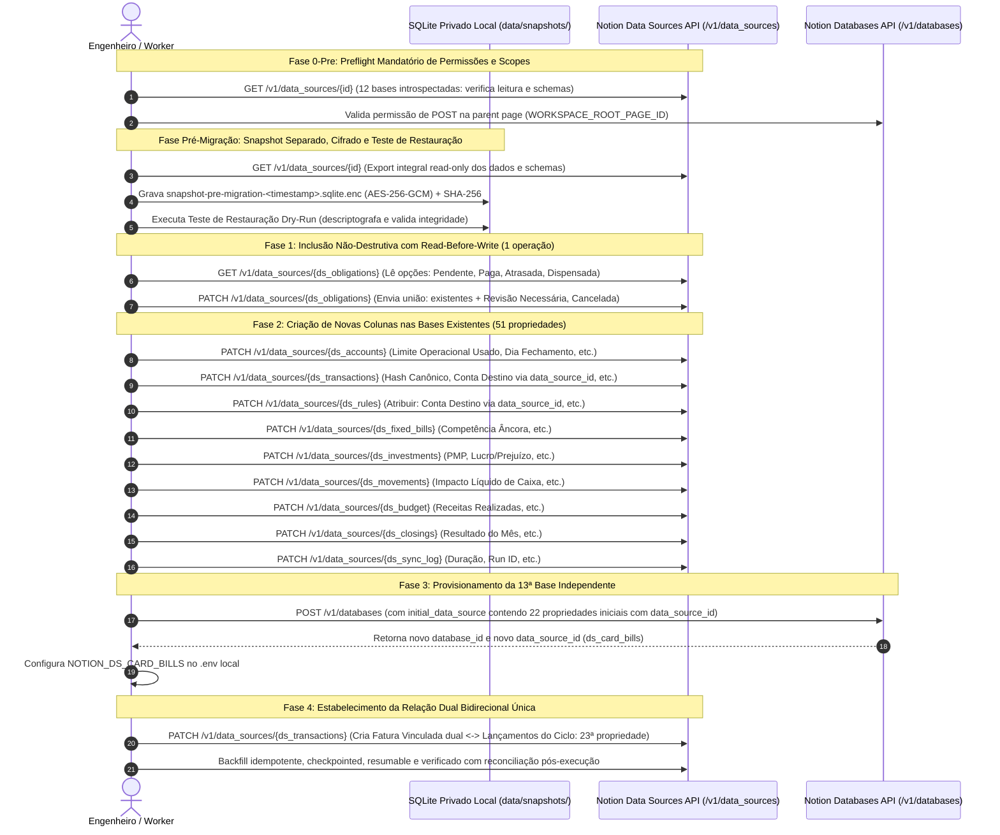

# Plano de Migração de Schema: Notion vs. Modelo de Domínio (V2.3 - Patch Operacional Final Pré-Execução)

> **Status:** Plano Técnico de Migração e Conformidade (Fase 1 - Homologado para Execução)  
> **Baseline de Referência:** `0b657453b274793b79a8343502f69a64f21c6277` (Fase 0 encerrada e aprovada)  
> **Notion API Version:** `2026-03-11` (Data Sources API)  
> **Diretriz Operacional:** Nenhuma mutação executada no Notion durante esta etapa de planejamento. Zero ingestão de produção.

---

## 1. Resumo Executivo e Princípios Norteadores da Migração

Este documento define o plano arquitetural, executável e estritamente auditado para a migração de schemas entre o workspace Notion atual (12 bases introspectadas na Fase 0) e o modelo de domínio canônico V2.3, estabelecendo também o design técnico e operacional da 13ª base (*Faturas / Ciclos de Cartão*).

### 1.1 Princípios de Governança, Risco Residual Controlado e Salvaguardas

1. **Snapshot Financeiro Pré-Migração Separado, Imutável, Cifrado e Testado:**  
   Substitui-se qualquer suposição ingênua de "risco nulo" por governança de risco residual estritamente controlada. Nenhuma mutação de schema ou ingestão/backfill será autorizada sem a geração prévia de um **arquivo de snapshot integral read-only de schema e dados transacionais/patrimoniais**, imutável, cifrado com AES-256-GCM e timestampado: `data/snapshots/snapshot-pre-migration-<timestamp>.sqlite.enc` (acompanhado de seu hash SHA-256 no arquivo `snapshot-pre-migration-<timestamp>.sha256`).  
   *Diretriz mandatória:* O arquivo `financial.db` operacional **não conta sozinho como snapshot**. É compulsório executar e aprovar um teste mandatório de restauração em dry-run (descriptografia para banco temporário e verificação da integridade das tabelas restauradas) antes de disparar qualquer chamada mutante contra a API do Notion. É terminantemente vedado o uso de diretórios de artifacts públicos ou versionamento no Git para dados financeiros reais.
2. **Inexistência de Transação Distribuída (Notion + SQLite) e Backfill Idempotente, Checkpointed, Resumable e Verificado:**  
   Não existe transação atômica distribuída (2PC) conectando a API remota do Notion e o banco SQLite local. Toda operação de sincronização ou backfill de dados históricos deve ser concebida e executada como **processo estritamente idempotente, checkpointed, resumable e verificado com reconciliação pós-execução**.  
   O worker registra o cursor de processamento (batch checkpoint) de forma durável no SQLite a cada lote consumido. Em caso de interrupção abrupta (queda de rede, crash do processo ou HTTP 429 com esgotamento de quota), o pipeline é capaz de retomar exatamente do último cursor sem reprocessar entidades já confirmadas nem gerar registros duplicados. Todas as mutações utilizam chaves canônicas de idempotência e version hash (`canonicalHash` / `versionHash`), finalizando com um job de reconciliação de integridade que valida as contagens e somatórios nominais entre o Notion e o SQLite.
3. **Protocolo Mandatório de Read-Before-Write em Selects / Status:**  
   Na API do Notion, o envio de um array `options` no método `PATCH /v1/data_sources/{id}` substitui integralmente a lista de opções da propriedade. Portanto, **toda e qualquer alteração de select/status exige leitura prévia do schema (`GET /v1/data_sources/{id}`)** para preservar 100% das opções físicas preexistentes. No caso de *Obrigações Mensais.Status*, as opções existentes (incluindo `Pendente`, `Paga`, `Atrasada` e `Dispensada`) são preservadas, adicionando-se apenas as opções ausentes de ciclo de vida (`Revisão Necessária` e `Cancelada`).
4. **Uso Exclusivo de `data_source_id` nas Relações da API 2026-03-11:**  
   Em conformidade estrita com a arquitetura moderna de Data Sources da versão `2026-03-11`, todas as propriedades de relation devem apontar explicitamente para o `data_source_id` da base alvo dentro do bloco `relation` (ex: `"relation": { "data_source_id": "<ID>" }`), **sendo proibido o uso do obsoleto `database_id`**.
5. **Criação de Relação Dual Bidirecional Única (`dual_property`):**  
   A vinculação entre *Transações* e a 13ª base *Faturas / Ciclos de Cartão* é estabelecida através de **uma única relação bidirecional (dual)**. A relação é declarada uma única vez via `PATCH /v1/data_sources/{ds_transactions}` com o bloco `"dual_property": { "synced_property_name": "Lançamentos do Ciclo" }` apontando para o `data_source_id` de Faturas. Não devem ser criadas duas relações unidirecionais independentes.
6. **Notion Number como Projeção Contábil Visual:**  
   As propriedades do tipo `number` no Notion funcionam exclusivamente como **camada de projeção e visualização para o usuário**. A precisão matemática absoluta, invariantes monetários, frações de ativos e arredondamentos são mantidos e calculados de forma exata e canônica no ledger privado local (ponto fixo / inteiros escalados sem ponto flutuante IEEE-754).
7. **Prioridade Absoluta a `optionMappings` sobre `ALTER_SCHEMA`:**  
   Nenhuma opção física existente no Notion será rotulada como `ALTER_SCHEMA` se um valor existente já representar o conceito de domínio. Utiliza-se mapeamento semântico explícito em código (`optionMappings`), evitando mutações físicas desnecessárias, sinônimos redundantes ou conflitos léxicos. Com isso, as mutações físicas de select em bases existentes foram reduzidas a apenas **1 única propriedade** (*Obrigações Mensais.Status*).
8. **Precedência Hierárquica de Autoridade em Campos Bidirecionais (`both`):**  
   Nas propriedades com sincronização bidirecional (`direction: both`), os conflitos de autoridade na escrita são resolvidos estritamente pela seguinte precedência hierárquica imutável:  
   1º **`USUARIO`** (decisão humana manual no Notion ou aplicativo: bloqueio absoluto contra sobreescritas automatizadas);  
   2º **`REGRA_AUTOMATICA` / `DERIVADO`** (regras determinísticas de categorização, rateio e cálculos matemáticos do motor de reconciliação local);  
   3º **`UPSTREAM` / `FONTE_EXTERNA`** (dados brutos importados da instituição financeira ou conector open-finance).  
   Se um usuário categorizar manualmente um lançamento ou ajustar um teto operacional, nenhuma reexecução de sync ou regra poderá alterar esse valor, resguardando integralmente o controle do usuário.
9. **Desacoplamento Contextual de Aporte / Resgate em Transações:**  
   **Não mapear universalmente `Transações.Natureza = Aporte` para `CAPITAL_CONTRIBUTION`.** No extrato bancário ou cartão, lançamentos rotulados genericamente como "Aporte" ou "Resgate" frequentemente constituem transferências internas entre contas próprias, proventos ou cobertura de limite. O motor contábil do adapter avalia o contexto da transação (contas envolvidas, vinculação com investimentos) e, em caso de ambiguidade semântica, encaminha o registro para conferência com `Status de Revisão = PENDING_REVIEW` e `Motivo da Revisão = "Natureza legada de aporte/resgate ambígua requer validação de contexto contábil"`.
10. **Transferências Internas Próprias com Conta de Destino:**  
    Criação das propriedades `Transações.Conta Destino` (`relation` -> Contas) e `Regras.Atribuir: Conta Destino` (`relation` -> Contas), viabilizando o reconhecimento e conciliação de transferências entre contas do próprio titular (`INTERNAL_TRANSFER`).
11. **Faturas / Ciclos de Cartão: Conector vs. Instituição e Ciclos Abertos vs. Fechados:**  
    Em Faturas, a propriedade `Fonte` representa unicamente o conector ou sistema de proveniência (`PIERRE`, `MANUAL`, `MIGRATION`, `OTHER`), enquanto a instituição financeira (ex: Nubank, Itaú) é derivada dinamicamente através da relação `Cartão Vinculado` com a base `Contas`.  
    Para faturas abertas em andamento que ainda não possuam `bill_id` definitivo emitido pelo banco, adota-se a chave provisória `PERIOD_FALLBACK` (`source:source_account_id:period_start:period_end:currency`) com `Qualidade da Identidade = PERIOD_FALLBACK`. No momento do fechamento formal pelo emissor bancário e geração do identificador definitivo, o motor executa o protocolo de reconciliação e rekeying idempotente: localiza a fatura existente pelo ciclo e conta, atualiza `ID da Fatura na Fonte`, promove `Qualidade da Identidade` para `SOURCE_ID`, preserva a chave de fallback anterior como alias histórico e impede rigorosamente a criação de faturas duplicadas.  
    O campo `Valor da Fatura Fechada (Oficial)` **só pode ser preenchido quando o ciclo estiver formalmente fechado na fonte/banco**; enquanto o ciclo estiver aberto, o valor permanece estritamente `null` (vazio), utilizando-se unicamente o campo `Valor Estimado da Fatura Aberta` para a projeção dinâmica em tempo real. É expressamente vedado copiar ou promover o valor estimado aberto para o campo oficial fechado.
12. **Reconciliação Anti-Double-Count de Parcelas em Faturas:**  
    Na decomposição matemática da fatura:  
    $$\text{Valor da Fatura Fechada (Oficial)} = \text{Total de Compras no Ciclo} + \text{Componentes Adicionais da Fatura} + \text{Divergência Não Explicada}$$  
    Parcelas de compras efetuadas em competências anteriores **só entram em `Componentes Adicionais da Fatura` se NÃO existirem como transações individuais já contabilizadas no ciclo corrente**. Caso a parcela já tenha sido importada ou associada como lançamento individual no período corrente, ela compõe estritamente o `Total de Compras no Ciclo` e é terminantemente excluída de `Componentes Adicionais da Fatura`, impedindo a ocorrência de double-count contábil.
13. **Taxa de Poupança e Economia Realizada com Anti-Double-Count em Investimentos:**  
    `savingsRateTarget`, `savingsRate` e `Poupança Realizada` somam estritamente a propriedade `savingsGoalContribution`. Transações de aportes para investimentos só pontuam nessa métrica se representarem alocação primária originada do fluxo de caixa e renda da competência corrente (`allocationPurpose = INVESTMENT_RESERVE` ou poupança do mês). Transações de compra de ativos (`ASSET_PURCHASE` — ex: compra de ações/FIIs) executadas a partir de recursos já previamente alocados em saldo de caixa/reserva poupados em meses passados **NÃO pontuam novamente como poupança**, eliminando qualquer duplicidade entre a formação de reserva líquida e a posterior aquisição de ativos.
14. **Preflight Mandatório de Permissões da API Notion:**  
    Antes de executar a primeira mutação de schema ou provisionamento de base, o sistema executa um teste de preflight estrito:  
    a) Teste de capacidade de provisionamento (`POST /v1/databases`) na parent page do workspace (`WORKSPACE_ROOT_PAGE_ID`);  
    b) Teste de leitura estrutural e capacidade de atualização de schema (`PATCH /v1/data_sources/{id}`) em todas as 12 bases configuradas;  
    c) Validação de permissões e resolução de `data_source_id` para todas as bases que serão alvo de relações (`NOTION_DS_ACCOUNTS`, `NOTION_DS_TRANSACTIONS`, `NOTION_DS_CATEGORIES`, etc.).  
    Caso qualquer uma das validações falhe com erro de autenticação, escopo insuficiente (ex: integração sem permissão de inserção/edição) ou `403 Forbidden`, o processo é abortado imediatamente sem aplicar qualquer mutação parcial no workspace.
15. **Preservação de Campos Customizados e Tipos Livres:**  
    Propriedades criadas pelo usuário são preservadas integralmente. Os campos `Instituição` (em Contas e Investimentos) e `Liquidez` (em Investimentos) permanecem estritamente como `rich_text`, garantindo a flexibilidade de cadastrar novas instituições e prazos descritivos sem necessidade de alterar enums no Notion.
16. **Title Unívoco e Sem Duplicações:**  
    A propriedade `Movimentação` é mantida como o único `title` da base de Movimentações de Investimentos, sendo terminantemente proibida a criação de um segundo campo `title` ("Identificador").
17. **Desacoplamento Orçamentário sem Hardcode:**  
    Todo hardcode conceitual de frameworks rígidos (como 50/30/20) foi removido do domínio. Campos como `Necessidades planejadas` e `Desejos planejados` são preservados por retrocompatibilidade histórica, mas percentuais e agrupamentos são tratados como regras configuráveis.

---

## 2. Resumo Quantitativo Recalculado (Baseado nas Linhas Detalhadas)

O resumo abaixo foi recalculado estritamente a partir das linhas detalhadas das 13 tabelas da Seção 3.  
Todas as divergências onde uma opção física existente no Notion representa o conceito canônico foram consolidadas como **`MAP_ALIAS`** via `optionMappings`, reduzindo as mutações físicas de schema ao mínimo absoluto (`ALTER_SCHEMA` = 1).

### 2.1 Visão Geral Consolidada

| Ação de Migração | Quantidade | Percentual | Descrição Operacional |
| :--- | :---: | :---: | :--- |
| **`KEEP_AS_IS`** | **91** | 37.3% | Propriedades mantidas exatamente como estão no Notion (tipos livres e campos legados preservados) |
| **`MAP_ALIAS`** | **78** | 32.0% | Mapeadas por alias ou `optionMappings` no adapter (zero mutação no Notion, zero impacto em views) |
| **`ALTER_SCHEMA`** | **1** | 0.4% | Inclusão não-destrutiva de opções em *Obrigações.Status* via *Read-Before-Write* (preserva `Pendente` e `Dispensada`) |
| **`CREATE_NEW`** | **74** | 30.3% | Novas propriedades essenciais (51 nas 12 bases existentes + 23 na 13ª base de Faturas) |
| **TOTAL GERAL** | **244** | **100%** | **Total de decisões mapeadas propriedade por propriedade** |

### 2.2 Distribuição Detalhada por Data Source

| Data Source | Env Key | Total | KEEP_AS_IS | MAP_ALIAS | ALTER_SCHEMA | CREATE_NEW |
| :--- | :--- | :---: | :---: | :---: | :---: | :---: |
| 1. Contas | `NOTION_DS_ACCOUNTS` | 19 | 8 | 7 | 0 | 4 |
| 2. Transações | `NOTION_DS_TRANSACTIONS` | 27 | 13 | 4 | 0 | 10 |
| 3. Categorias Financeiras | `NOTION_DS_CATEGORIES` | 9 | 6 | 3 | 0 | 0 |
| 4. Regras de Classificação | `NOTION_DS_RULES` | 28 | 11 | 14 | 0 | 3 |
| 5. Contas Fixas | `NOTION_DS_FIXED_BILLS` | 16 | 5 | 7 | 0 | 4 |
| 6. Obrigações Mensais | `NOTION_DS_MONTHLY_OBLIGATIONS` | 13 | 6 | 6 | 1 | 0 |
| 7. Investimentos | `NOTION_DS_INVESTMENTS` | 19 | 8 | 6 | 0 | 5 |
| 8. Movimentações de Investimentos | `NOTION_DS_INVESTMENT_MOVEMENTS` | 16 | 8 | 6 | 0 | 2 |
| 9. Planejamento Mensal | `NOTION_DS_MONTHLY_BUDGET` | 15 | 3 | 8 | 0 | 4 |
| 10. Metas Financeiras | `NOTION_DS_FINANCIAL_GOALS` | 10 | 8 | 2 | 0 | 0 |
| 11. Fechamentos Mensais | `NOTION_DS_MONTHLY_CLOSINGS` | 25 | 8 | 8 | 0 | 9 |
| 12. Log de Sincronização | `NOTION_DS_SYNC_LOG` | 24 | 7 | 7 | 0 | 10 |
| 13. Faturas / Ciclos de Cartão | `NOTION_DS_CARD_BILLS` | 23 | 0 | 0 | 0 | 23 |
| **TOTAL CONSOLIDADO** | — | **244** | **91** | **78** | **1** | **74** |

---

## 3. Diagnóstico e Plano Detalhado por Data Source

### 3.1 Contas (`NOTION_DS_ACCOUNTS`)
* **Data Source ID:** `a17455aa-4793-4001-9570-21b7f84ff4a2`
* **Finalidade:** Cadastro mestre de contas bancárias, cartões, poupanças e carteiras.
* **Mapeamento Semântico de Tipos:** Mapear opções físicas existentes (`Corretora` -> `INVESTMENT`, `Dinheiro` / `Carteira` -> `CASH`, `Conta Corrente` -> `CHECKING_ACCOUNT`, `Cartão de Crédito` -> `CREDIT_CARD`, `Poupança` -> `SAVINGS`, `Outro` -> `OTHER`). Não adicionar opções redundantes.
* **Mapeamento de Fonte:** Mapear opções físicas (`Pierre` -> `PIERRE`, `Manual` -> `MANUAL`, `Outra` -> `OTHER`). `allowExtraOptions: true` permite extensibilidade sem mutação física imediata.

| Propriedade | Estado Atual (Notion) | Estado Alvo (Domínio) | Ação | Justificativa Técnica e Mapeamento Semântico | Risco Residual | Backfill Necessário | Impacto em Views | Rollback Seguro |
| :--- | :--- | :--- | :---: | :--- | :---: | :--- | :--- | :--- |
| `Conta` | `title` | `title` (Nome da Conta) | `MAP_ALIAS` | Reutiliza o título existente `Conta` via alias. Zero mutação física. | Baixo | Não | Nenhum | Reverter mapeamento no adapter |
| `Fonte` | `select` | `select` | `MAP_ALIAS` | Mapeia opções físicas existentes (`Pierre`, `Manual`, `Outra`) via `optionMappings`. | Baixo | Não | Nenhum | Reverter adapter |
| `ID da fonte` | `rich_text` | `rich_text` | `KEEP_AS_IS` | Identificador unívoco existente e compatível. | Baixo | Não | Nenhum | N/A |
| `Moeda` | `select` | `select` | `KEEP_AS_IS` | Moedas ativas (`BRL`, `USD`) suficientes para as contas atuais. Não forçar EUR sem necessidade. | Baixo | Não | Nenhum | N/A |
| `Instituição` | `rich_text` | `rich_text` | `KEEP_AS_IS` | Mantido como `rich_text` conforme regra mandatória (evita enum rígido de bancos). | Baixo | Não | Nenhum | N/A |
| `Tipo` | `select` | `select` (Tipo de Conta) | `MAP_ALIAS` | Mapeia opções existentes (`Conta Corrente`, `Cartão de Crédito`, `Corretora`, `Dinheiro`, `Carteira`) sem criar opções redundantes. | Baixo | Não | Nenhum | Reverter adapter |
| `Saldo` | `number` | `number` (Saldo Atual) | `MAP_ALIAS` | Reutiliza `Saldo` via alias como projeção visual do saldo de caixa. | Baixo | Não | Nenhum | Reverter adapter |
| `Limite contratado` | `number` | `number` | `KEEP_AS_IS` | Nome e tipo exatos. | Baixo | Não | Nenhum | N/A |
| `Limite personalizado` | `number` | `number` | `KEEP_AS_IS` | Nome e tipo exatos. | Baixo | Não | Nenhum | N/A |
| `Limite disponível` | `number` | `number` | `KEEP_AS_IS` | Nome e tipo exatos. | Baixo | Não | Nenhum | N/A |
| `Atualizado em` | `date` | `date` (Última Sincronização) | `MAP_ALIAS` | Reutiliza data existente para registro de freshness. | Baixo | Não | Nenhum | Reverter adapter |
| `Inclui no caixa` | `checkbox` | `checkbox` (Incluir no Caixa) | `MAP_ALIAS` | Reutiliza campo existente sem duplicar coluna no Notion. | Baixo | Não | Nenhum | Reverter adapter |
| `Inclui no patrimônio` | `checkbox` | `checkbox` (Incluir no Patrimônio) | `MAP_ALIAS` | Reutiliza campo existente sem duplicar coluna no Notion. | Baixo | Não | Nenhum | Reverter adapter |
| `Ativa` | `checkbox` | `checkbox` | `KEEP_AS_IS` | Controle operacional preservado. | Baixo | Não | Nenhum | N/A |
| `Observações` | `rich_text` | `rich_text` | `KEEP_AS_IS` | Campo de texto livre do usuário preservado. | Baixo | Não | Nenhum | N/A |
| `Limite Operacional Usado` | Inexistente | `number` | `CREATE_NEW` | Saldo devedor operacional computado (`customizedCreditLimit - availableCreditLimit`). | Baixo | Sim: derivar dos limites | Nova coluna | Ocultar propriedade |
| `Limite Usado da Fonte (Bruto)` | Inexistente | `number` | `CREATE_NEW` | Valor bruto reportado pela instituição para auditoria de reconciliação de limite. | Baixo | Sim: preencher no sync | Nova coluna | Ocultar propriedade |
| `Dia de Fechamento` | Inexistente | `number` | `CREATE_NEW` | Dia do mês do corte da fatura (1 a 31). | Baixo | Sim: cadastro inicial | Nova coluna | Ocultar propriedade |
| `Dia de Vencimento` | Inexistente | `number` | `CREATE_NEW` | Dia do mês do vencimento da fatura (1 a 31). | Baixo | Sim: cadastro inicial | Nova coluna | Ocultar propriedade |

---

### 3.2 Transações (`NOTION_DS_TRANSACTIONS`)
* **Data Source ID:** `1fc274bd-b73a-45b1-a902-09aba993f199`
* **Finalidade:** Livro-razão projetado de entradas, saídas, estornos, pagamentos e transferências.
* **Mapeamento de Natureza:** Mapear opções físicas existentes com tratamento contextual:
  * `Receita` -> `OPERATING_REVENUE`
  * `Despesa` -> `OPERATING_EXPENSE`
  * `Reembolso` -> `REVERSAL_REFUND`
  * `Pagamento de fatura` -> `BILL_PAYMENT`
  * `Ajuste` -> `ACCOUNTING_ADJUSTMENT`
  * **Aporte / Resgate Legados:** Tratados com **dependência estrita de contexto contábil**. Não são mapeados cegamente para aporte de capital externo. Se houver vínculo com ativos/carteiras -> `CAPITAL_CONTRIBUTION` / `CAPITAL_WITHDRAWAL` ou `ASSET_PURCHASE` / `ASSET_SALE`. Se for entre contas próprias -> `INTERNAL_TRANSFER`. Se ambíguo -> manter provisório e sinalizar `Status de Revisão = PENDING_REVIEW`.
* **Mapeamento de Status:** Mapear `Confirmado` -> `POSTED`, `Pendente` -> `PENDING`, `Cancelado` -> `VOIDED`. Não adicionar `Liquidado` ou `Estornado` sem necessidade semântica comprovada.
* **Transferências Internas:** Inclusão de `Conta Destino` (`relation` -> Contas via `data_source_id`) para indicar a contraparte creditada em transferências próprias.

| Propriedade | Estado Atual (Notion) | Estado Alvo (Domínio) | Ação | Justificativa Técnica e Mapeamento Semântico | Risco Residual | Backfill Necessário | Impacto em Views | Rollback Seguro |
| :--- | :--- | :--- | :---: | :--- | :---: | :--- | :--- | :--- |
| `Lançamento` | `title` | `title` (Descrição) | `MAP_ALIAS` | Reutiliza `Lançamento` como título descritivo principal. | Baixo | Não | Nenhum | Reverter adapter |
| `Fonte` | `select` | `select` | `KEEP_AS_IS` | Conector ou origem aderente. | Baixo | Não | Nenhum | N/A |
| `ID da fonte` | `rich_text` | `rich_text` | `KEEP_AS_IS` | Identificador unívoco preservado. | Baixo | Não | Nenhum | N/A |
| `Moeda` | `select` | `select` | `KEEP_AS_IS` | Moedas ativas (`BRL`, `USD`) suficientes. | Baixo | Não | Nenhum | N/A |
| `Data` | `date` | `date` | `KEEP_AS_IS` | Nome e tipo exatos. | Baixo | Não | Nenhum | N/A |
| `Valor` | `number` | `number` | `KEEP_AS_IS` | Valor projetado no Notion (precisão matemática canônica mantida no SQLite). | Baixo | Não | Nenhum | N/A |
| `Movimento` | `select` | `select` | `KEEP_AS_IS` | Sentido físico (`Entrada` / `Saída`) preservado. | Baixo | Não | Nenhum | N/A |
| `Conta` | `relation` | `relation` | `KEEP_AS_IS` | Vínculo com a base de Contas (conta debitada/principal). | Baixo | Não | Nenhum | N/A |
| `Categoria` | `relation` | `relation` | `KEEP_AS_IS` | Vínculo com Categorias Financeiras. | Baixo | Não | Nenhum | N/A |
| `Categoria Pierre` | `rich_text` | `rich_text` (Categoria da Fonte) | `MAP_ALIAS` | Generalizado para conceito de upstream (`Categoria da Fonte`) mantendo o nome físico legado no Notion. | Baixo | Não | Nenhum | Reverter adapter |
| `Descrição original` | `rich_text` | `rich_text` | `KEEP_AS_IS` | Texto original bruto do extrato. | Baixo | Não | Nenhum | N/A |
| `Natureza` | `select` | `select` (Natureza Econômica) | `MAP_ALIAS` | Mapeia opções físicas (`Receita`, `Despesa`, `Aporte`, `Resgate`, `Reembolso`, `Pagamento de fatura`, `Ajuste`) sem mutação física e com resolução contextual de Aporte/Resgate. | Baixo | Não | Nenhum | Reverter adapter |
| `Status` | `select` | `select` (Status Banco) | `MAP_ALIAS` | Mapeia opções físicas (`Confirmado`, `Pendente`, `Cancelado`) aos enums canônicos. | Baixo | Não | Nenhum | Reverter adapter |
| `Conta no orçamento` | `checkbox` | `checkbox` | `KEEP_AS_IS` | Propriedade existente preservada. | Baixo | Não | Nenhum | N/A |
| `Conta como aporte` | `checkbox` | `checkbox` | `KEEP_AS_IS` | Propriedade existente preservada. | Baixo | Não | Nenhum | N/A |
| `Revisado` | `checkbox` | `checkbox` | `KEEP_AS_IS` | Flag de conferência manual preservada. | Baixo | Não | Nenhum | N/A |
| `Observações` | `rich_text` | `rich_text` | `KEEP_AS_IS` | Anotações do usuário preservadas. | Baixo | Não | Nenhum | N/A |
| `Hash Canônico` | Inexistente | `rich_text` | `CREATE_NEW` | Fingerprint SHA-256 (64 hex) para versionamento e detecção de mutações em lote. | Baixo | Sim: gerar para registros ativos | Nova coluna | Ocultar propriedade |
| `Valor Bruto da Fonte` | Inexistente | `number` | `CREATE_NEW` | Valor original bruto retornado pelo conector com sinal original. | Baixo | Sim: preencher nas novas runs | Nova coluna | Ocultar propriedade |
| `Efeito Orçamentário` | Inexistente | `select` | `CREATE_NEW` | Classificador de impacto: `INCOME`, `EXPENSE`, `REVERSAL`, `NEUTRAL`. | Baixo | Sim: inferir pelas naturezas | Nova coluna | Ocultar propriedade |
| `Propósito de Alocação` | Inexistente | `select` | `CREATE_NEW` | Destinação: `INVESTMENT_RESERVE`, `OPERATIONAL_CASH`, `TAX_RESERVE`, etc. | Baixo | Não | Nova coluna | Ocultar propriedade |
| `Contribuição Meta Poupança` | Inexistente | `number` | `CREATE_NEW` | Valor absoluto que pontua positivamente na meta de poupança/investimento. | Baixo | Sim: inferir para aportes | Nova coluna | Ocultar propriedade |
| `Fatura Vinculada` | Inexistente | `relation` | `CREATE_NEW` | Relação dual única conectada à 13ª base de Faturas (lado inverso de `Lançamentos do Ciclo`). | Baixo | Sim: vincular compras do cartão | Nova relação | Desvincular relação |
| `Conta Destino` | Inexistente | `relation` | `CREATE_NEW` | Relação com base Contas para identificar conta favorecida em transferências internas próprias. | Baixo | Sim: preencher nas transferências | Nova relação | Desvincular relação |
| `Status de Revisão` | Inexistente | `select` | `CREATE_NEW` | Enums: `AUTO_CONFIRMED`, `PENDING_REVIEW`, `MANUALLY_VALIDATED`, `LEGACY_UNVERIFIED`. | Baixo | Sim: marcar históricas como LEGACY | Nova coluna | Ocultar propriedade |
| `Motivo da Revisão` | Inexistente | `rich_text` | `CREATE_NEW` | Justificativa técnica do motor de regras quando exigir atenção humana (ex: aporte ambíguo). | Baixo | Não | Nova coluna | Ocultar propriedade |
| `HMAC Contraparte` | Inexistente | `rich_text` | `CREATE_NEW` | Hash HMAC-SHA256 truncado para identificação de fornecedor recorrente sem expor PII. | Baixo | Não | Nova coluna | Ocultar propriedade |

---

### 3.3 Categorias Financeiras (`NOTION_DS_CATEGORIES`)
* **Data Source ID:** `eb8ef2e3-cfd3-437e-b3f5-6a47dec913b4`
* **Finalidade:** Árvore de classificação orçamentária e direcionamento de gastos.
* **Mapeamento Exato de Natureza Padrão (Schema Real):** Mapear as opções físicas reais do Notion:
  * `Receita` -> `OPERATING_REVENUE`
  * `Despesa` -> `OPERATING_EXPENSE`
  * `Patrimonial` -> `CAPITAL_OR_EQUITY` (fluxos patrimoniais, aportes, investimentos)
  * `Mista` -> `MIXED_SPLIT` (categorias que exigem rateio entre despesa e investimento)
  Zero alteração física no Notion (`MAP_ALIAS`).
* **Mapeamento de Grupos:** Mapear opções físicas existentes via `optionMappings`: `Necessidade` -> `ESSENTIAL`, `Desejo` -> `LIFESTYLE`, `Poupança/Investimento` -> `INVESTMENT_GOALS`, `Fora do orçamento` -> `STRUCTURAL_NEUTRAL`. Zero grupos duplicados.

| Propriedade | Estado Atual (Notion) | Estado Alvo (Domínio) | Ação | Justificativa Técnica e Mapeamento Semântico | Risco Residual | Backfill Necessário | Impacto em Views | Rollback Seguro |
| :--- | :--- | :--- | :---: | :--- | :---: | :--- | :--- | :--- |
| `Categoria` | `title` | `title` (Nome da Categoria) | `MAP_ALIAS` | Reutiliza `Categoria` como título principal. | Baixo | Não | Nenhum | Reverter adapter |
| `Variabilidade` | `select` | `select` | `KEEP_AS_IS` | Opções físicas `Fixa` e `Variável` atendem ao domínio. Eventual "Ocasional" tratado no domínio. | Baixo | Não | Nenhum | N/A |
| `Natureza padrão` | `select` | `select` | `MAP_ALIAS` | Mapeia as 4 opções físicas reais (`Receita`, `Despesa`, `Patrimonial`, `Mista`) via `optionMappings`. Zero mutação física. | Baixo | Não | Nenhum | Reverter adapter |
| `Grupo` | `select` | `select` (Grupo Orçamentário) | `MAP_ALIAS` | Mapeia opções existentes (`Necessidade`, `Desejo`, `Poupança/Investimento`, `Fora do orçamento`) sem duplicar grupos. | Baixo | Não | Nenhum | Reverter adapter |
| `Ativa` | `checkbox` | `checkbox` | `KEEP_AS_IS` | Controle de uso da categoria preservado. | Baixo | Não | Nenhum | N/A |
| `Conta no orçamento` | `checkbox` | `checkbox` | `KEEP_AS_IS` | Flag orçamentária preservada. | Baixo | Não | Nenhum | N/A |
| `Observações` | `rich_text` | `rich_text` | `KEEP_AS_IS` | Anotações preservadas. | Baixo | Não | Nenhum | N/A |
| `Contas fixas` | `relation` | `relation` | `KEEP_AS_IS` | Relação com Contas Fixas preservada. | Baixo | Não | Nenhum | N/A |
| `Transações` | `relation` | `relation` | `KEEP_AS_IS` | Relação reversa com Transações preservada. | Baixo | Não | Nenhum | N/A |

---

### 3.4 Regras de Classificação (`NOTION_DS_RULES`)
* **Data Source ID:** `b36ba8da-9601-4456-a21f-5d9804110fbb`
* **Finalidade:** Automação determinística de conciliação e enriquecimento de transações.
* **Atribuição de Conta Destino:** Adicionada capacidade `Atribuir: Conta Destino` (`relation` -> Contas via `data_source_id`) para automatizar transferências próprias.

| Propriedade | Estado Atual (Notion) | Estado Alvo (Domínio) | Ação | Justificativa Técnica e Mapeamento Semântico | Risco Residual | Backfill Necessário | Impacto em Views | Rollback Seguro |
| :--- | :--- | :--- | :---: | :--- | :---: | :--- | :--- | :--- |
| `Regra` | `title` | `title` (Nome da Regra) | `MAP_ALIAS` | Reutiliza `Regra` como título via alias. | Baixo | Não | Nenhum | Reverter adapter |
| `Prioridade` | `number` | `number` | `KEEP_AS_IS` | Prioridade de avaliação (1 = maior). | Baixo | Não | Nenhum | N/A |
| `Ativa` | `checkbox` | `checkbox` | `KEEP_AS_IS` | Habilitação preservada. | Baixo | Não | Nenhum | N/A |
| `Auto aplicar` | `checkbox` | `checkbox` | `KEEP_AS_IS` | Flag de aplicação automática preservada. | Baixo | Não | Nenhum | N/A |
| `Exigir revisão` | `checkbox` | `checkbox` | `KEEP_AS_IS` | Flag de encaminhamento para conferência humana. | Baixo | Não | Nenhum | N/A |
| `Válida de` | `date` | `date` | `KEEP_AS_IS` | Início de vigência temporal. | Baixo | Não | Nenhum | N/A |
| `Válida até` | `date` | `date` | `KEEP_AS_IS` | Término de vigência temporal. | Baixo | Não | Nenhum | N/A |
| `Contraparte contém` | `rich_text` | `rich_text` (Condição: Contraparte) | `MAP_ALIAS` | Reutiliza campo existente via alias. | Baixo | Não | Nenhum | Reverter adapter |
| `Descrição contém` | `rich_text` | `rich_text` (Condição: Descrição) | `MAP_ALIAS` | Reutiliza campo existente via alias. | Baixo | Não | Nenhum | Reverter adapter |
| `Movimento esperado` | `select` | `select` (Condição: Movimento) | `MAP_ALIAS` | Reutiliza campo existente via alias. | Baixo | Não | Nenhum | Reverter adapter |
| `Conta origem` | `relation` | `relation` (Condição: Conta) | `MAP_ALIAS` | Reutiliza campo existente via alias. | Baixo | Não | Nenhum | Reverter adapter |
| `Categoria Pierre` | `rich_text` | `rich_text` (Condição: Categoria Fonte) | `MAP_ALIAS` | Generalizado para Categoria da Fonte via alias. | Baixo | Não | Nenhum | Reverter adapter |
| `Valor exato` | `number` | `number` (Condição: Valor Exato) | `MAP_ALIAS` | Reutiliza campo existente via alias. | Baixo | Não | Nenhum | Reverter adapter |
| `Tolerância` | `number` | `number` (Condição: Tolerância Valor) | `MAP_ALIAS` | Reutiliza campo existente via alias. | Baixo | Não | Nenhum | Reverter adapter |
| `Valor mínimo` | `number` | `number` (Condição: Valor Mínimo) | `MAP_ALIAS` | Reutiliza campo existente via alias. | Baixo | Não | Nenhum | Reverter adapter |
| `Valor máximo` | `number` | `number` (Condição: Valor Máximo) | `MAP_ALIAS` | Reutiliza campo existente via alias. | Baixo | Não | Nenhum | Reverter adapter |
| `Dia mínimo` | `number` | `number` (Condição: Dia Mês Início) | `MAP_ALIAS` | Reutiliza campo existente via alias. | Baixo | Não | Nenhum | Reverter adapter |
| `Dia máximo` | `number` | `number` (Condição: Dia Mês Fim) | `MAP_ALIAS` | Reutiliza campo existente via alias. | Baixo | Não | Nenhum | Reverter adapter |
| `Natureza resultante` | `select` | `select` (Atribuir: Natureza) | `MAP_ALIAS` | Mapeia opções físicas existentes (`Receita`, `Despesa`, etc.) via `optionMappings`. | Baixo | Não | Nenhum | Reverter adapter |
| `Categoria resultante` | `relation` | `relation` (Atribuir: Categoria) | `MAP_ALIAS` | Reutiliza campo existente via alias. | Baixo | Não | Nenhum | Reverter adapter |
| `Conta como aporte` | `checkbox` | `checkbox` | `KEEP_AS_IS` | Flag de controle preservada. | Baixo | Não | Nenhum | N/A |
| `Conta no orçamento` | `checkbox` | `checkbox` | `KEEP_AS_IS` | Flag de controle preservada. | Baixo | Não | Nenhum | N/A |
| `Destino / contexto` | `rich_text` | `rich_text` | `KEEP_AS_IS` | Campo de anotação de contexto preservado. | Baixo | Não | Nenhum | N/A |
| `Observações` | `rich_text` | `rich_text` | `KEEP_AS_IS` | Anotações preservadas. | Baixo | Não | Nenhum | N/A |
| `Tipo` | `select` | `select` | `KEEP_AS_IS` | Classificador existente preservado. | Baixo | Não | Nenhum | N/A |
| `Atribuir: Efeito Orçamento` | Inexistente | `select` | `CREATE_NEW` | Permite atribuir explicitamente `INCOME`, `EXPENSE`, `REVERSAL`, `NEUTRAL` pela regra. | Baixo | Não | Nova coluna | Ocultar propriedade |
| `Atribuir: Alocação` | Inexistente | `select` | `CREATE_NEW` | Permite atribuir a destinação da alocação via regra. | Baixo | Não | Nova coluna | Ocultar propriedade |
| `Atribuir: Conta Destino` | Inexistente | `relation` | `CREATE_NEW` | Permite atribuir automaticamente a conta favorecida em transferências próprias. | Baixo | Não | Nova relação | Desvincular relação |

---

### 3.5 Contas Fixas (`NOTION_DS_FIXED_BILLS`)
* **Data Source ID:** `49e909f9-7a08-4114-bc85-0bb500e3dfb9`
* **Finalidade:** Cadastro permanente de despesas recorrentes e compromissos contratuais.
* **Mapeamento de Forma de Pagamento:** Mapear opções físicas existentes (`Cartão` -> `CREDIT_CARD`, `Débito` / `Débito automático` -> `BANK_DEBIT`, `Boleto` -> `BOLETO`, `Pix` -> `PIX`). Não adicionar sinônimos redundantes.

| Propriedade | Estado Atual (Notion) | Estado Alvo (Domínio) | Ação | Justificativa Técnica e Mapeamento Semântico | Risco Residual | Backfill Necessário | Impacto em Views | Rollback Seguro |
| :--- | :--- | :--- | :---: | :--- | :---: | :--- | :--- | :--- |
| `Conta fixa` | `title` | `title` (Nome da Conta Fixa) | `MAP_ALIAS` | Reutiliza título existente via alias. | Baixo | Não | Nenhum | Reverter adapter |
| `Valor esperado` | `number` | `number` (Valor Previsto) | `MAP_ALIAS` | Reutiliza o campo existente `Valor esperado` sem criar propriedade duplicada. | Baixo | Não | Nenhum | Reverter adapter |
| `Dia do vencimento` | `number` | `number` (Dia de Vencimento) | `MAP_ALIAS` | Reutiliza o campo existente `Dia do vencimento` sem duplicar. | Baixo | Não | Nenhum | Reverter adapter |
| `Tolerância de valor` | `number` | `number` (Tolerância R$) | `MAP_ALIAS` | Reutiliza o campo existente `Tolerância de valor` sem duplicar. | Baixo | Não | Nenhum | Reverter adapter |
| `Regra de identificação` | `rich_text` | `rich_text` (Padrão Identificação) | `MAP_ALIAS` | Reutiliza o campo existente `Regra de identificação` para matching. | Baixo | Não | Nenhum | Reverter adapter |
| `Periodicidade` | `select` | `select` | `KEEP_AS_IS` | Enums existentes atendem integralmente. | Baixo | Não | Nenhum | N/A |
| `Forma de pagamento` | `select` | `select` | `MAP_ALIAS` | Mapeia opções físicas (`Cartão`, `Débito`, `Débito automático`, `Boleto`, `Pix`) sem criar sinônimos. | Baixo | Não | Nenhum | Reverter adapter |
| `Conta padrão` | `relation` | `relation` | `KEEP_AS_IS` | Relação com Contas preservada. | Baixo | Não | Nenhum | N/A |
| `Categoria` | `relation` | `relation` | `KEEP_AS_IS` | Relação com Categorias preservada. | Baixo | Não | Nenhum | N/A |
| `Ativa` | `checkbox` | `checkbox` | `KEEP_AS_IS` | Flag de geração preservada. | Baixo | Não | Nenhum | N/A |
| `Gerar obrigação` | `checkbox` | `checkbox` | `KEEP_AS_IS` | Automação de ciclo preservada. | Baixo | Não | Nenhum | N/A |
| `Observações` | `rich_text` | `rich_text` (Observações / Contrato) | `MAP_ALIAS` | Reutiliza `Observações` via alias. | Baixo | Não | Nenhum | Reverter adapter |
| `Competência Âncora` | Inexistente | `rich_text` | `CREATE_NEW` | Mês de referência inicial (ex: `2026-01`) para controle de ciclo. | Baixo | Sim: preencher competência atual | Nova coluna | Ocultar propriedade |
| `Última Competência Gerada` | Inexistente | `rich_text` | `CREATE_NEW` | Último mês gerado em Obrigações para idempotência de geração. | Baixo | Sim: registrar último ciclo | Nova coluna | Ocultar propriedade |
| `Data de Início` | Inexistente | `date` | `CREATE_NEW` | Vigência inicial do contrato. | Baixo | Não | Nova coluna | Ocultar propriedade |
| `Data de Término` | Inexistente | `date` | `CREATE_NEW` | Vigência final do contrato. | Baixo | Não | Nova coluna | Ocultar propriedade |

---

### 3.6 Obrigações Mensais (`NOTION_DS_MONTHLY_OBLIGATIONS`)
* **Data Source ID:** `5c59339c-7cfc-4f17-9355-803a4136f6b8`
* **Finalidade:** Instâncias mensais das contas fixas a pagar e conciliar.
* **Salvaguarda Obrigatória de Read-Before-Write em Status:** A alteração de schema em `Status` **não pode remover as opções físicas existentes** (`Pendente`, `Paga`, `Atrasada`, `Dispensada`). A chamada de `PATCH` deve efetuar leitura prévia e enviar a união integral das opções existentes com as novas (`Revisão Necessária`, `Cancelada`).

| Propriedade | Estado Atual (Notion) | Estado Alvo (Domínio) | Ação | Justificativa Técnica e Mapeamento Semântico | Risco Residual | Backfill Necessário | Impacto em Views | Rollback Seguro |
| :--- | :--- | :--- | :---: | :--- | :---: | :--- | :--- | :--- |
| `Obrigação` | `title` | `title` (Identificador) | `MAP_ALIAS` | Reutiliza `Obrigação` como título principal via alias. | Baixo | Não | Nenhum | Reverter adapter |
| `Conta fixa` | `relation` | `relation` | `KEEP_AS_IS` | Vínculo permanente com Contas Fixas preservado. | Baixo | Não | Nenhum | N/A |
| `Valor previsto` | `number` | `number` | `KEEP_AS_IS` | Valor esperado exato. | Baixo | Não | Nenhum | N/A |
| `Status` | `select` | `select` | `ALTER_SCHEMA` | **Read-Before-Write:** Adiciona `Revisão Necessária` e `Cancelada`, preservando estritamente `Pendente`, `Paga`, `Atrasada` e `Dispensada`. | Médio | Não | Nenhum | Manter opções sem uso |
| `Valor pago` | `number` | `number` | `KEEP_AS_IS` | Valor liquidado exato. | Baixo | Não | Nenhum | N/A |
| `Vencimento` | `date` | `date` (Data de Vencimento) | `MAP_ALIAS` | Reutiliza `Vencimento` via alias. | Baixo | Não | Nenhum | Reverter adapter |
| `Pago em` | `date` | `date` (Data do Pagamento) | `MAP_ALIAS` | Reutiliza `Pago em` via alias. | Baixo | Não | Nenhum | Reverter adapter |
| `Validado automaticamente` | `checkbox` | `checkbox` | `KEEP_AS_IS` | Flag de conferência inequívoca preservada. | Baixo | Não | Nenhum | N/A |
| `Observações` | `rich_text` | `rich_text` (Observações / Conflitos) | `MAP_ALIAS` | Reutiliza `Observações` via alias. | Baixo | Não | Nenhum | Reverter adapter |
| `Transação conciliada` | `relation` | `relation` (Transação Vinculada) | `MAP_ALIAS` | Reutiliza relação existente sem criar relação duplicada. | Baixo | Não | Nenhum | Reverter adapter |
| `Referência` | `date` | `rich_text` / `date` (Competência) | `MAP_ALIAS` | Reutiliza data existente para extração canônica de YYYY-MM. | Baixo | Não | Nenhum | Reverter adapter |
| `Conta` | `relation` | `relation` | `KEEP_AS_IS` | Conta de débito efetiva preservada. | Baixo | Não | Nenhum | N/A |
| `Origem` | `select` | `select` | `KEEP_AS_IS` | Origem do registro preservada. | Baixo | Não | Nenhum | N/A |

---

### 3.7 Investimentos (`NOTION_DS_INVESTMENTS`)
* **Data Source ID:** `db609202-8cb8-4ce9-8dd7-c01d9de6b6cb`
* **Finalidade:** Posições de custódia e carteiras de ativos patrimoniais.
* **Mapeamento de Classes:** Mapear opções físicas plurais existentes: `Ações` -> `EQUITY`, `FIIs` -> `REAL_ESTATE`, `ETFs` -> `ETF`, `Renda Fixa` -> `FIXED_INCOME`, `Cripto` -> `CRYPTO`, `Outro` -> `OTHER`. Não criar singularizações duplicadas.
* **Unidade de Ativo vs. Moeda de Valuation:** `BTC` é unidade física do ativo/quantidade (ex: 0.05 BTC), **não moeda de valuation contábil**. O valuation patrimonial ocorre estritamente em moeda fiduciária/funcional (`BRL`, `USD`). Portanto, `Moeda` permanece `KEEP_AS_IS` (`BRL`, `USD`).
* **Preservação de `rich_text`:** `Instituição` e `Liquidez` permanecem estritamente como `rich_text` conforme regras mandatórias.

| Propriedade | Estado Atual (Notion) | Estado Alvo (Domínio) | Ação | Justificativa Técnica e Mapeamento Semântico | Risco Residual | Backfill Necessário | Impacto em Views | Rollback Seguro |
| :--- | :--- | :--- | :---: | :--- | :---: | :--- | :--- | :--- |
| `Ativo` | `title` | `title` | `KEEP_AS_IS` | Identificador principal do ativo preservado. | Baixo | Não | Nenhum | N/A |
| `Moeda` | `select` | `select` | `KEEP_AS_IS` | Moeda contábil de valuation (`BRL`, `USD`). BTC é unidade de ativo, não moeda de valuation. | Baixo | Não | Nenhum | N/A |
| `Quantidade` | `number` | `number` | `KEEP_AS_IS` | Quantidade custodiada projetada (suporte fracionário mantido no ledger canônico). | Baixo | Não | Nenhum | N/A |
| `Data da avaliação` | `date` | `date` | `KEEP_AS_IS` | Timestamp da última cotação capturada. | Baixo | Não | Nenhum | N/A |
| `Instituição` | `rich_text` | `rich_text` (Instituição / Corretora) | `KEEP_AS_IS` | Mantido como `rich_text` conforme regra mandatória. | Baixo | Não | Nenhum | N/A |
| `Liquidez` | `rich_text` | `rich_text` | `KEEP_AS_IS` | Mantido como `rich_text` conforme regra mandatória (permite prazos livres e carências). | Baixo | Não | Nenhum | N/A |
| `Classe` | `select` | `select` (Classe do Ativo) | `MAP_ALIAS` | Mapeia opções físicas (`Ações`, `FIIs`, `ETFs`, `Renda Fixa`, `Cripto`, `Outro`) sem singularizações duplicadas. | Baixo | Não | Nenhum | Reverter adapter |
| `Custo acumulado` | `number` | `number` (Custo Base Total) | `MAP_ALIAS` | Reutiliza `Custo acumulado` como base contábil de aquisição via alias. | Baixo | Não | Nenhum | Reverter adapter |
| `Valor atual` | `number` | `number` (Valor de Mercado Atual) | `MAP_ALIAS` | Reutiliza `Valor atual` como projeção a mercado da posição. | Baixo | Não | Nenhum | Reverter adapter |
| `Fonte do preço` | `select` | `select` (Fonte da Avaliação) | `MAP_ALIAS` | Mapeia opções existentes (`Pierre` -> `UPSTREAM`, `Manual` -> `MANUAL`) via `optionMappings`. | Baixo | Não | Nenhum | Reverter adapter |
| `ID da fonte` | `rich_text` | `rich_text` (ID do Ativo na Fonte) | `MAP_ALIAS` | Reutiliza `ID da fonte` como chave externa do ativo. | Baixo | Não | Nenhum | Reverter adapter |
| `Inclui no patrimônio` | `checkbox` | `checkbox` (Incluir no Patrimônio) | `MAP_ALIAS` | Reutiliza propriedade existente via alias. | Baixo | Não | Nenhum | Reverter adapter |
| `Observações` | `rich_text` | `rich_text` | `KEEP_AS_IS` | Anotações preservadas. | Baixo | Não | Nenhum | N/A |
| `Movimentações` | `relation` | `relation` | `KEEP_AS_IS` | Relação reversa com histórico de ordens preservada. | Baixo | Não | Nenhum | N/A |
| `Custódia` | Inexistente | `select` | `CREATE_NEW` | Origem da custódia: `Custódia Conectada (Upstream)` ou `Custódia Externa (Manual)`. | Baixo | Sim: definir padrão | Nova coluna | Ocultar propriedade |
| `Preço Médio Unitário (PMP)` | Inexistente | `number` | `CREATE_NEW` | PMP derivado do motor de cost basis contábil exato. | Baixo | Sim: calcular pelo cost basis | Nova coluna | Ocultar propriedade |
| `Lucro / Prejuízo Não Realizado` | Inexistente | `number` | `CREATE_NEW` | Ganho de capital não realizado projetado (`Valor Atual - Custo Acumulado`). | Baixo | Sim: calcular pela posição | Nova coluna | Ocultar propriedade |
| `Retorno Não Realizado (%)` | Inexistente | `number` | `CREATE_NEW` | Rentabilidade percentual não realizada da posição. | Baixo | Sim: calcular pela posição | Nova coluna | Ocultar propriedade |
| `Conta Vinculada` | Inexistente | `relation` | `CREATE_NEW` | Vínculo opcional com conta corrente ou corretora em Contas. | Baixo | Não | Nova relação | Desvincular relação |

---

### 3.8 Movimentações de Investimentos (`NOTION_DS_INVESTMENT_MOVEMENTS`)
* **Data Source ID:** `b19f56a4-e34f-42ec-9437-c5165b8725af`
* **Finalidade:** Livro de ordens, histórico de transações de ativos, proventos e amortizações.
* **Title Unívoco:** A propriedade existente `Movimentação` é mantida como o único `title`. É terminantemente proibido criar um segundo title `Identificador`.
* **Mapeamento de Tipos:** Mapear todos os 8 tipos físicos existentes no Notion: `Aporte` -> `CAPITAL_CONTRIBUTION`, `Compra` -> `BUY`, `Venda` -> `SELL`, `Rendimento` -> `DIVIDEND_YIELD`, `Resgate` -> `CAPITAL_WITHDRAWAL`, `Taxa` -> `FEE_TAX`, `Transferência` -> `TRANSFER`, `Ajuste` -> `POSITION_ADJUSTMENT`.
* **Convenção Direcional de Caixa:**
  * Compra (`BUY`): `netCashEffect = -(grossAmount + feesAmount)` (saída de caixa total).
  * Venda (`SELL`): `netCashEffect = +(grossAmount - feesAmount)` (entrada de caixa líquida).
  * Rendimento / Provento: `netCashEffect = +(grossAmount - feesAmount)`.

| Propriedade | Estado Atual (Notion) | Estado Alvo (Domínio) | Ação | Justificativa Técnica e Mapeamento Semântico | Risco Residual | Backfill Necessário | Impacto em Views | Rollback Seguro |
| :--- | :--- | :--- | :---: | :--- | :---: | :--- | :--- | :--- |
| `Movimentação` | `title` | `title` | `KEEP_AS_IS` | **Regra Mandatória:** Título unívoco existente preservado. Proibido criar segundo title `Identificador`. | Baixo | Não | Nenhum | N/A |
| `Preço unitário` | `number` | `number` | `KEEP_AS_IS` | Preço de execução da cota/ativo preservado. | Baixo | Não | Nenhum | N/A |
| `Conta origem` | `relation` | `relation` | `KEEP_AS_IS` | Conta debitada ou associada. | Baixo | Não | Nenhum | N/A |
| `Ativo` | `relation` | `relation` (Ativo Vinculado) | `MAP_ALIAS` | Reutiliza a relação `Ativo` via alias. | Baixo | Não | Nenhum | Reverter adapter |
| `Tipo` | `select` | `select` (Tipo de Movimentação) | `MAP_ALIAS` | Mapeia os 8 tipos físicos existentes (`Aporte`, `Compra`, `Venda`, `Rendimento`, `Resgate`, `Taxa`, `Transferência`, `Ajuste`) sem mutação física. | Baixo | Não | Nenhum | Reverter adapter |
| `Data` | `date` | `date` (Data da Operação) | `MAP_ALIAS` | Reutiliza `Data` via alias. | Baixo | Não | Nenhum | Reverter adapter |
| `Quantidade` | `number` | `number` (Quantidade Negociada) | `MAP_ALIAS` | Reutiliza `Quantidade` via alias. | Baixo | Não | Nenhum | Reverter adapter |
| `Valor` | `number` | `number` (Valor Bruto da Operação) | `MAP_ALIAS` | Reutiliza o campo existente `Valor` como volume bruto (`grossAmount`) sem duplicar. | Baixo | Não | Nenhum | Reverter adapter |
| `Custos e taxas` | `number` | `number` (`feesAmount`) | `KEEP_AS_IS` | Custos operacionais e taxas preservados. | Baixo | Não | Nenhum | N/A |
| `Moeda` | `select` | `select` | `KEEP_AS_IS` | Moeda financeira da operação. | Baixo | Não | Nenhum | N/A |
| `Observações` | `rich_text` | `rich_text` | `KEEP_AS_IS` | Anotações preservadas. | Baixo | Não | Nenhum | N/A |
| `ID da fonte` | `rich_text` | `rich_text` | `KEEP_AS_IS` | Identificador da ordem na fonte. | Baixo | Não | Nenhum | N/A |
| `Fonte` | `select` | `select` | `KEEP_AS_IS` | Conector ou origem da ordem. | Baixo | Não | Nenhum | N/A |
| `Transação origem` | `relation` | `relation` (Transação Financeira) | `MAP_ALIAS` | Reutiliza relação existente para conciliação com extrato bancário. | Baixo | Não | Nenhum | Reverter adapter |
| `Impacto Líquido de Caixa` | Inexistente | `number` (`netCashEffect`) | `CREATE_NEW` | Efeito líquido de caixa com sinal econômico direcional (compra = negativo, venda = positivo). | Baixo | Sim: calcular pela regra direcional | Nova coluna | Ocultar propriedade |
| `Conta Destino / Caixa` | Inexistente | `relation` | `CREATE_NEW` | Relação opcional com conta creditada em vendas ou resgates. | Baixo | Não | Nova relação | Desvincular relação |

---

### 3.9 Planejamento Mensal (`NOTION_DS_MONTHLY_BUDGET`)
* **Data Source ID:** `0c14523b-9e22-483a-8e63-4b3d0c31c7d5`
* **Finalidade:** Metas orçamentárias mensais por macro-grupo e acompanhamento de execução.
* **Remoção de Hardcode 50/30/20:** As colunas `Necessidades planejadas`, `Desejos planejados` e `Aporte planejado` são mantidas por retrocompatibilidade histórica, mas as proporções orçamentárias são tratadas no domínio como parâmetros configuráveis pelo usuário, sem vínculos fixos a 50%, 30% ou 20%.

| Propriedade | Estado Atual (Notion) | Estado Alvo (Domínio) | Ação | Justificativa Técnica e Mapeamento Semântico | Risco Residual | Backfill Necessário | Impacto em Views | Rollback Seguro |
| :--- | :--- | :--- | :---: | :--- | :---: | :--- | :--- | :--- |
| `Mês` | `title` | `title` (Competência YYYY-MM) | `MAP_ALIAS` | Reutiliza `Mês` como competência temporal via alias. | Baixo | Não | Nenhum | Reverter adapter |
| `Renda planejada` | `number` | `number` (Renda Prevista) | `MAP_ALIAS` | Reutiliza o campo existente `Renda planejada` sem duplicar. | Baixo | Não | Nenhum | Reverter adapter |
| `Teto pessoal de crédito` | `number` | `number` (Teto Mensal Cartão) | `MAP_ALIAS` | Reutiliza o campo existente `Teto pessoal de crédito` sem duplicar. | Baixo | Não | Nenhum | Reverter adapter |
| `Aporte planejado` | `number` | `number` (Meta Poupança/Aporte) | `MAP_ALIAS` | Reutiliza o campo existente `Aporte planejado` sem duplicar. | Baixo | Não | Nenhum | Reverter adapter |
| `Meta de poupança %` | `number` | `number` (Meta Taxa Poupança %) | `MAP_ALIAS` | Reutiliza o campo existente sem duplicar. | Baixo | Não | Nenhum | Reverter adapter |
| `Necessidades planejadas` | `number` | `number` (Meta Essencial) | `MAP_ALIAS` | Mantém coluna existente como meta configurável do grupo Essencial (sem hardcode 50%). | Baixo | Não | Nenhum | Reverter adapter |
| `Desejos planejados` | `number` | `number` (Meta Estilo de Vida) | `MAP_ALIAS` | Mantém coluna existente como meta configurável do grupo Estilo de Vida (sem hardcode 30%). | Baixo | Não | Nenhum | Reverter adapter |
| `Reserva operacional` | `number` | `number` (Meta Reserva) | `MAP_ALIAS` | Mantém coluna existente como parâmetro de liquidez. | Baixo | Não | Nenhum | Reverter adapter |
| `Status` | `select` | `select` | `KEEP_AS_IS` | Status de planejamento do mês preservado. | Baixo | Não | Nenhum | N/A |
| `Referência` | `date` | `date` | `KEEP_AS_IS` | Data âncora preservada. | Baixo | Não | Nenhum | N/A |
| `Observações` | `rich_text` | `rich_text` | `KEEP_AS_IS` | Anotações do usuário preservadas. | Baixo | Não | Nenhum | N/A |
| `Receitas Realizadas` | Inexistente | `number` | `CREATE_NEW` | Total consolidado de receitas operacionais líquidas realizadas no mês. | Baixo | Sim: consolidar transações | Nova coluna | Ocultar propriedade |
| `Despesas Realizadas` | Inexistente | `number` | `CREATE_NEW` | Total consolidado de despesas operacionais realizadas no mês. | Baixo | Sim: consolidar transações | Nova coluna | Ocultar propriedade |
| `Poupança Realizada` | Inexistente | `number` | `CREATE_NEW` | Volume financeiro total poupado e aportado no mês. | Baixo | Sim: consolidar aportes | Nova coluna | Ocultar propriedade |
| `Compras Realizadas Cartão` | Inexistente | `number` | `CREATE_NEW` | Volume acumulado de compras realizadas no cartão no mês para monitorar o teto. | Baixo | Sim: consolidar compras | Nova coluna | Ocultar propriedade |

---

### 3.10 Metas Financeiras (`NOTION_DS_FINANCIAL_GOALS`)
* **Data Source ID:** `b62903fe-ee4e-411f-8828-fd465f9aed91`
* **Finalidade:** Metas financeiras de médio e longo prazo.

| Propriedade | Estado Atual (Notion) | Estado Alvo (Domínio) | Ação | Justificativa Técnica e Mapeamento Semântico | Risco Residual | Backfill Necessário | Impacto em Views | Rollback Seguro |
| :--- | :--- | :--- | :---: | :--- | :---: | :--- | :--- | :--- |
| `Meta` | `title` | `title` | `KEEP_AS_IS` | Nome da meta preservado. | Baixo | Não | Nenhum | N/A |
| `Valor alvo` | `number` | `number` | `KEEP_AS_IS` | Valor objetivo preservado. | Baixo | Não | Nenhum | N/A |
| `Prazo` | `date` | `date` (Prazo Alvo) | `MAP_ALIAS` | Reutiliza campo existente via alias. | Baixo | Não | Nenhum | Reverter adapter |
| `Valor atual` | `number` | `number` (Valor Atual Acumulado) | `MAP_ALIAS` | Reutiliza o campo existente `Valor atual` sem duplicar propriedade. | Baixo | Não | Nenhum | Reverter adapter |
| `Aporte mensal planejado` | `number` | `number` | `KEEP_AS_IS` | Parâmetro de disciplina mensal preservado. | Baixo | Não | Nenhum | N/A |
| `Tipo` | `select` | `select` | `KEEP_AS_IS` | Classificação da meta preservada. | Baixo | Não | Nenhum | N/A |
| `Liquidez necessária` | `select` | `select` | `KEEP_AS_IS` | Perfil de liquidez preservado. | Baixo | Não | Nenhum | N/A |
| `Prioridade` | `select` | `select` | `KEEP_AS_IS` | Nível de prioridade preservado. | Baixo | Não | Nenhum | N/A |
| `Status` | `select` | `select` | `KEEP_AS_IS` | Andamento da meta preservado. | Baixo | Não | Nenhum | N/A |
| `Observações` | `rich_text` | `rich_text` | `KEEP_AS_IS` | Anotações preservadas. | Baixo | Não | Nenhum | N/A |

---

### 3.11 Fechamentos Mensais (`NOTION_DS_MONTHLY_CLOSINGS`)
* **Data Source ID:** `74ff9360-514c-4fde-a366-d7a1b726b94c`
* **Finalidade:** DRE pessoal consolidada, balanço patrimonial e fechamento contábil.
* **Decisão Semântica de Status (Sem Alteração Física):** A opção física existente `Em revisão` representa exatamente o estado pretendido por `Pré-fechado` (`PRE_CLOSED` / `IN_REVIEW`). Adota-se o mapeamento via `optionMappings`: `Aberto` -> `OPEN`, `Em revisão` -> `PRE_CLOSED`, `Fechado` -> `CLOSED`. **Não há duplicação nem `ALTER_SCHEMA`** (`MAP_ALIAS`).
* **Separação de `Saldo livre final` e `Resultado do Mês`:** Não mapear `Saldo livre final` para `Resultado do Mês`. `Saldo livre final` é preservado como métrica de liquidez legada (`KEEP_AS_IS`). A propriedade `Resultado do Mês (Sobra Operacional)` é criada separadamente (`CREATE_NEW`).
* **Fórmula do Fluxo Residual:** `Fluxo Residual Não Alocado = Resultado Operacional - Poupança/Aportes`.
* **Escala de Qualidade dos Dados:** Mapear a escala existente de 3 níveis (`Alta` -> `HIGH`, `Média` -> `MEDIUM`, `Baixa` -> `LOW`). Não criar uma segunda escala conflitante.

| Propriedade | Estado Atual (Notion) | Estado Alvo (Domínio) | Ação | Justificativa Técnica e Mapeamento Semântico | Risco Residual | Backfill Necessário | Impacto em Views | Rollback Seguro |
| :--- | :--- | :--- | :---: | :--- | :---: | :--- | :--- | :--- |
| `Fechamento` | `title` | `title` (Mês de Referência) | `MAP_ALIAS` | Reutiliza título existente (`Fechamento` YYYY-MM) via alias. | Baixo | Não | Nenhum | Reverter adapter |
| `Status` | `select` | `select` (Status Fechamento) | `MAP_ALIAS` | **Decisão Semântica:** A opção física `Em revisão` já representa o estado pretendido por `Pré-fechado`. Mapeada via `optionMappings` sem duplicar e sem `ALTER_SCHEMA`. | Baixo | Não | Nenhum | Reverter adapter |
| `Qualidade dos dados` | `select` | `select` | `MAP_ALIAS` | Mapeia a escala física existente (`Alta`, `Média`, `Baixa`) via `optionMappings` sem criar escala redundante. | Baixo | Não | Nenhum | Reverter adapter |
| `Contas fixas pagas` | `number` | `number` | `KEEP_AS_IS` | Métrica existente preservada. | Baixo | Não | Nenhum | N/A |
| `Contas fixas pendentes` | `number` | `number` | `KEEP_AS_IS` | Métrica existente preservada. | Baixo | Não | Nenhum | N/A |
| `Itens para revisão` | `number` | `number` | `KEEP_AS_IS` | Métrica existente preservada. | Baixo | Não | Nenhum | N/A |
| `Fechado em` | `date` | `date` | `KEEP_AS_IS` | Timestamp de fechamento preservado. | Baixo | Não | Nenhum | N/A |
| `Aportes` | `number` | `number` (Poupança/Aportes Realizados) | `MAP_ALIAS` | Reutiliza campo existente `Aportes` via alias. | Baixo | Não | Nenhum | Reverter adapter |
| `Receitas` | `number` | `number` (Renda Consolidada) | `MAP_ALIAS` | Reutiliza campo existente `Receitas` via alias. | Baixo | Não | Nenhum | Reverter adapter |
| `Despesas` | `number` | `number` (Despesas Consolidadas) | `MAP_ALIAS` | Reutiliza campo existente `Despesas` via alias. | Baixo | Não | Nenhum | Reverter adapter |
| `Patrimônio final` | `number` | `number` (Patrimônio Líquido Final) | `MAP_ALIAS` | Reutiliza campo existente via alias. | Baixo | Não | Nenhum | Reverter adapter |
| `Saldo livre final` | `number` | `number` (Saldo Livre Legado) | `KEEP_AS_IS` | Preservado como metadado legado de liquidez de caixa. Não mapear para Resultado do Mês. | Baixo | Não | Nenhum | N/A |
| `Reconciliação OK` | `checkbox` | `checkbox` | `KEEP_AS_IS` | Flag histórica de conciliação preservada. | Baixo | Não | Nenhum | N/A |
| `Fatura em aberto` | `number` | `number` | `KEEP_AS_IS` | Métrica histórica preservada. | Baixo | Não | Nenhum | N/A |
| `Referência` | `date` | `date` | `KEEP_AS_IS` | Data do período preservada. | Baixo | Não | Nenhum | N/A |
| `Observações` | `rich_text` | `rich_text` (Observações do Fechamento) | `MAP_ALIAS` | Reutiliza anotações via alias. | Baixo | Não | Nenhum | Reverter adapter |
| `Resultado do Mês (Sobra Operacional)` | Inexistente | `number` | `CREATE_NEW` | Resultado financeiro operacional líquido (`Receitas - Despesas`). Criado separadamente de Saldo Livre. | Baixo | Sim: calcular nos fechados | Nova coluna | Ocultar propriedade |
| `Patrimônio Inicial` | Inexistente | `number` | `CREATE_NEW` | Patrimônio líquido consolidado no início da competência. | Baixo | Sim: herdar do fechamento anterior | Nova coluna | Ocultar propriedade |
| `Variação Patrimonial` | Inexistente | `number` | `CREATE_NEW` | Variação absoluta (`Patrimônio Final - Patrimônio Inicial`). | Baixo | Sim: calcular nos fechados | Nova coluna | Ocultar propriedade |
| `Taxa de Poupança (%)` | Inexistente | `number` | `CREATE_NEW` | Percentual da renda poupado (`(Aportes / Receitas) * 100`). | Baixo | Sim: calcular nos fechados | Nova coluna | Ocultar propriedade |
| `Fluxo Residual Não Alocado` | Inexistente | `number` | `CREATE_NEW` | Sobra operacional após aportes: `Resultado Operacional - Poupança/Aportes`. | Baixo | Sim: calcular nos fechados | Nova coluna | Ocultar propriedade |
| `Despesas Essenciais (Necessidades)` | Inexistente | `number` | `CREATE_NEW` | Gastos consolidados de subsistência e necessidades básicas. | Baixo | Sim: totalizar por categoria | Nova coluna | Ocultar propriedade |
| `Despesas Discricionárias (Desejos)` | Inexistente | `number` | `CREATE_NEW` | Gastos consolidados de estilo de vida e discricionários. | Baixo | Sim: totalizar por categoria | Nova coluna | Ocultar propriedade |
| `Rendimentos de Investimentos` | Inexistente | `number` | `CREATE_NEW` | Proventos, dividendos e juros auferidos no mês. | Baixo | Sim: totalizar movimentações | Nova coluna | Ocultar propriedade |
| `Status de Reconciliação` | Inexistente | `select` | `CREATE_NEW` | Enums: `Conciliado Integralmente`, `Divergências Pendentes`, `Reconciliação Manual Necessária`. | Baixo | Sim: definir padrão | Nova coluna | Ocultar propriedade |

---

### 3.12 Log de Sincronização (`NOTION_DS_SYNC_LOG`)
* **Data Source ID Real e Validado:** `2a6107e9-4ebb-456f-84f9-dba3bc573d20`
* **Finalidade:** Auditoria de execuções do worker e telemetria operacional.
* **Mapeamento Semântico de Status (Sem Alteração Física):** Mapear opções físicas reais via `optionMappings`: `Sucesso` -> `SUCCESS`, `Parcial` -> `PARTIAL_SUCCESS`, `Erro` -> `ERROR`. Bloqueios de concorrência são registrados com status `Erro` e `Código do Erro = CONCURRENCY_LOCKED`. Zero `ALTER_SCHEMA` (`MAP_ALIAS`).
* **Mapeamento de Fonte (Sem Alteração Física):** Mapear opções físicas reais: `Pierre` -> `PIERRE`, `Manual` -> `MANUAL`, `Migração` -> `MIGRATION`, `Outra` -> `OTHER`. Zero `ALTER_SCHEMA` (`MAP_ALIAS`).

| Propriedade | Estado Atual (Notion) | Estado Alvo (Domínio) | Ação | Justificativa Técnica e Mapeamento Semântico | Risco Residual | Backfill Necessário | Impacto em Views | Rollback Seguro |
| :--- | :--- | :--- | :---: | :--- | :---: | :--- | :--- | :--- |
| `Execução` | `title` | `title` | `KEEP_AS_IS` | Identificador da execução (`Sync - YYYY-MM-DD HH:mm:ss`). | Baixo | Não | Nenhum | N/A |
| `Status` | `select` | `select` | `MAP_ALIAS` | Mapeia `Parcial` -> `PARTIAL_SUCCESS`, `Sucesso` -> `SUCCESS`, `Erro` -> `ERROR` via `optionMappings`. Zero mutação física. | Baixo | Não | Nenhum | Reverter adapter |
| `Fonte` | `select` | `select` (Fonte de Sincronização) | `MAP_ALIAS` | Mapeia opções físicas existentes (`Migração` -> `MIGRATION`, `Pierre` -> `PIERRE`, `Manual` -> `MANUAL`, `Outra` -> `OTHER`). Zero mutação física. | Baixo | Não | Nenhum | Reverter adapter |
| `Transações recebidas` | `number` | `number` | `KEEP_AS_IS` | Métrica de telemetria exata. | Baixo | Não | Nenhum | N/A |
| `Transações novas` | `number` | `number` | `KEEP_AS_IS` | Métrica de inserções exata. | Baixo | Não | Nenhum | N/A |
| `Transações atualizadas` | `number` | `number` | `KEEP_AS_IS` | Métrica de mutações exata. | Baixo | Não | Nenhum | N/A |
| `Parcelas recebidas` | `number` | `number` | `KEEP_AS_IS` | Métrica de lançamentos futuros exata. | Baixo | Não | Nenhum | N/A |
| `Freshness da fonte` | `date` | `date` | `KEEP_AS_IS` | Timestamp da instituição preservado. | Baixo | Não | Nenhum | N/A |
| `Iniciada em` | `date` | `date` (Data Início) | `MAP_ALIAS` | Reutiliza o campo existente `Iniciada em` sem duplicar. | Baixo | Não | Nenhum | Reverter adapter |
| `Concluída em` | `date` | `date` (Data Fim) | `MAP_ALIAS` | Reutiliza o campo existente `Concluída em` sem duplicar. | Baixo | Não | Nenhum | Reverter adapter |
| `Contas recebidas` | `number` | `number` (Contas Processadas) | `MAP_ALIAS` | Reutiliza `Contas recebidas` como total de contas auditadas. | Baixo | Não | Nenhum | Reverter adapter |
| `Pendências de revisão` | `number` | `number` (Enviadas para Revisão) | `MAP_ALIAS` | Reutiliza `Pendências de revisão` sem duplicar. | Baixo | Não | Nenhum | Reverter adapter |
| `Erro / alerta` | `rich_text` | `rich_text` (Mensagem de Erro) | `MAP_ALIAS` | Reutiliza `Erro / alerta` para mensagem sanitizada de falha. | Baixo | Não | Nenhum | Reverter adapter |
| `Observações` | `rich_text` | `rich_text` | `KEEP_AS_IS` | Anotações operacionais preservadas. | Baixo | Não | Nenhum | N/A |
| `Duração (s)` | Inexistente | `number` | `CREATE_NEW` | Tempo total decorrido da execução em segundos inteiros. | Baixo | Não: apenas novas runs | Nova coluna | Ocultar propriedade |
| `Duração (ms)` | Inexistente | `number` | `CREATE_NEW` | Tempo total decorrido em milissegundos para auditoria de latência. | Baixo | Não: apenas novas runs | Nova coluna | Ocultar propriedade |
| `Transações Inalteradas` | Inexistente | `number` | `CREATE_NEW` | Lançamentos de entrada ignorados por correspondência exata de hash. | Baixo | Não: apenas novas runs | Nova coluna | Ocultar propriedade |
| `Erros Encontrados` | Inexistente | `number` | `CREATE_NEW` | Contagem de falhas não-fatais capturadas no lote. | Baixo | Não: apenas novas runs | Nova coluna | Ocultar propriedade |
| `Obrigações Conciliadas` | Inexistente | `number` | `CREATE_NEW` | Compromissos mensais quitados automaticamente nesta execução. | Baixo | Não: apenas novas runs | Nova coluna | Ocultar propriedade |
| `ID da Execução (Run ID)` | Inexistente | `rich_text` | `CREATE_NEW` | UUID unívoco da execução do worker para rastreabilidade de ponta a ponta. | Baixo | Não: apenas novas runs | Nova coluna | Ocultar propriedade |
| `Código do Erro` | Inexistente | `select` | `CREATE_NEW` | Código padronizado: `AUTH_EXPIRED`, `NETWORK_TIMEOUT`, `CONCURRENCY_LOCKED`, etc. | Baixo | Não: apenas novas runs | Nova coluna | Ocultar propriedade |
| `Referência do Log Privado` | Inexistente | `rich_text` | `CREATE_NEW` | ID/caminho do registro completo armazenado no cofre cifrado local. | Baixo | Não: apenas novas runs | Nova coluna | Ocultar propriedade |
| `Hash do Lote RAW` | Inexistente | `rich_text` | `CREATE_NEW` | SHA-256 do payload bruto salvo no cofre privado. | Baixo | Não: apenas novas runs | Nova coluna | Ocultar propriedade |
| `Versão do Worker / Commit` | Inexistente | `rich_text` | `CREATE_NEW` | Commit SHA da versão do worker em execução. | Baixo | Não: apenas novas runs | Nova coluna | Ocultar propriedade |

---

### 3.13 Faturas / Ciclos de Cartão (`NOTION_DS_CARD_BILLS`) — 13ª Base Proposta
* **Status Atual:** Inexistente no Notion (A ser criada na Fase 1)
* **Variável de Ambiente:** `NOTION_DS_CARD_BILLS`
* **Finalidade Arquitetural:** Desacoplar compras no cartão de crédito dos fechamentos mensais, assegurando ciclo de vida próprio para faturas abertas, fechadas e parcelamentos futuros.

#### Especificação Contratual Completa e Rastreabilidade de Upstream
1. **Campos Estruturados de Origem e Identidade Derivada:**
   * `Fonte` (`select`, `UPSTREAM`): Identifica o conector técnico ou sistema de proveniência (`PIERRE`, `MANUAL`, `MIGRATION`, `OTHER`). A instituição emissora (ex: Nubank, Itaú) é resolvida dinamicamente através do `Cartão Vinculado` (`relation` -> `Contas`).
   * `ID da Fatura na Fonte` (`rich_text`, `UPSTREAM`): Identificador primário bruto retornado pela API bancária quando a fatura for formalmente fechada/emitida.
   * `ID Estável da Fatura` (`rich_text`, `DERIVADO`): Chave canônica unívoca derivada desses componentes:  
     $$\text{Stable ID} = \text{source} + \text{":"} + \text{source\_account\_id} + \text{":"} + \text{bill\_id}$$
   * **Identidade Provisória e Rekeying Idempotente:** Para faturas abertas sem `bill_id`:  
     $$\text{Fallback ID} = \text{source} + \text{":"} + \text{source\_account\_id} + \text{":"} + \text{period\_start} + \text{":"} + \text{period\_end} + \text{":"} + \text{currency}$$
     A propriedade `Qualidade da Identidade` rastreia o estado (`SOURCE_ID` vs `PERIOD_FALLBACK`). Ao surgir a identidade oficial do emissor, o worker executa reconciliação e rekeying idempotente: atualiza `ID da Fatura na Fonte`, promove o status para `SOURCE_ID`, preserva a chave de fallback anterior como alias na rastreabilidade e impede a criação de registros duplicados no Notion.
2. **Distinção Estrita entre Valor Aberto vs. Valor Oficial Fechado:**  
   O campo `Valor da Fatura Fechada (Oficial)` **permanece estritamente nulo/vazio enquanto a fatura estiver aberta** (`status = Aberta em Curso` ou antes do corte bancário). Faturas em andamento utilizam exclusivamente o campo `Valor Estimado da Fatura Aberta` para a projeção dinâmica das compras correntes. É terminantemente proibido copiar ou promover estimativas abertas para o campo oficial.
3. **Data de Liquidação Estrita:** `Data de Liquidação` representa **exclusivamente a data da quitação integral da fatura**. Pagamentos parciais e amortizações intermediárias são rastreados como registros individuais na relação `Transações de Pagamento`.
4. **Relação Dual Única e Bidirecional:** A relação entre Faturas e as compras do ciclo é **estritamente uma única relação bidirecional (dual)** com `data_source_id`: `Faturas.Lançamentos do Ciclo` $\longleftrightarrow$ `Transações.Fatura Vinculada`.
5. **Reconciliação Anti-Double-Count de Parcelas:** Transações de compras efetuadas dentro do intervalo (`Início do Período` até `Fim do Período`) compõem exclusivamente o `Total de Compras no Ciclo`. Parcelas de compras de ciclos anteriores só entram em `Componentes Adicionais da Fatura` se **NÃO existirem como lançamentos já contabilizados individualmente no ciclo corrente**, prevenindo estritamente a dupla contagem contábil.
6. **Precedência Hierárquica de Autoridade:** Propriedades bidirecionais (`both`) seguem estritamente `USUARIO` (override manual) > `REGRA_AUTOMATICA` / `DERIVADO` > `UPSTREAM`.

#### Arquitetura de Criação da Base (23 Propriedades Finais)
A base é criada em duas fases sequenciais:
* **Fase 1 (Provisionamento Inicial no POST /v1/databases):** Criação da base com as **22 propriedades iniciais** independentes no bloco `initial_data_source` (compreendendo as 20 propriedades de negócio e rastreabilidade + as 2 relations unidirecionais `Cartão Vinculado` e `Transações de Pagamento`).
* **Fase 2 (Estabelecimento da Relação Dual via PATCH):** Após a recepção do novo `data_source_id` retornado pelo Notion, executa-se um único `PATCH /v1/data_sources/{ds_transactions}` criando a relação bidirecional `Transações.Fatura Vinculada` conectada a `Faturas.Lançamentos do Ciclo`, totalizando as **23 propriedades finais previstas**.

| Propriedade a Criar | Tipo no Notion | Ação | Direção | Autoridade | Justificativa e Finalidade |
| :--- | :--- | :---: | :---: | :---: | :--- |
| `Fatura / Ciclo` | `title` | `CREATE_NEW` | write | `DERIVADO` | Título unívoco: ex. `Nubank - Ciclo 2026-07 (Venc 22/07)`. |
| `Fonte` | `select` | `CREATE_NEW` | write | `UPSTREAM` | Conector ou proveniência técnica (`PIERRE`, `MANUAL`, `MIGRATION`, `OTHER`). Instituição vem de Cartão Vinculado. |
| `ID da Fatura na Fonte` | `rich_text` | `CREATE_NEW` | write | `UPSTREAM` | Identificador primário bruto emitido pelo banco/instituição quando fechada. |
| `ID Estável da Fatura` | `rich_text` | `CREATE_NEW` | write | `DERIVADO` | Chave de identidade canônica unívoca derivada (`source:account_id:bill_id` ou fallback completo). |
| `Qualidade da Identidade` | `select` | `CREATE_NEW` | write | `DERIVADO` | Enums: `SOURCE_ID`, `PERIOD_FALLBACK` (permite rastrear chave provisória e reconciliar rekeying sem duplicidade). |
| `Cartão Vinculado` | `relation` | `CREATE_NEW` | write | `DERIVADO` | Relação unidirecional com a conta do cartão em `Contas` (via `data_source_id`). |
| `Moeda` | `select` | `CREATE_NEW` | write | `UPSTREAM` | Código da moeda da fatura (`BRL`, `USD`, `EUR`). |
| `Início do Período` | `date` | `CREATE_NEW` | write | `DERIVADO` | Data inicial das compras elegíveis ao ciclo corrente. |
| `Fim do Período` | `date` | `CREATE_NEW` | write | `DERIVADO` | Data final de corte das compras elegíveis ao ciclo corrente. |
| `Data de Fechamento` | `date` | `CREATE_NEW` | write | `UPSTREAM` | Data oficial de corte da fatura emitida pelo banco. |
| `Data de Vencimento` | `date` | `CREATE_NEW` | write | `UPSTREAM` | Data oficial de vencimento da fatura emitida pelo banco. |
| `Tipo de Ciclo` | `select` | `CREATE_NEW` | write | `DERIVADO` | Enums: `Ciclo Real Banco`, `Ciclo Configurado`, `Ciclo Estimado`. |
| `Origem / Qualidade dos Dados` | `select` | `CREATE_NEW` | write | `DERIVADO` | Enums: `UPSTREAM_OFFICIAL`, `UPSTREAM_APPROXIMATE`, `DERIVED`, `MANUAL`. |
| `Status da Fatura` | `select` | `CREATE_NEW` | both | `REGRA_AUTOMATICA` | Enums: `Aberta em Curso`, `Fechada a Vencer`, `Vencida`, `Paga Integralmente`, `Paga Parcialmente`. |
| `Valor da Fatura Fechada (Oficial)` | `number` | `CREATE_NEW` | write | `UPSTREAM` | Valor consolidado oficial emitido pelo banco após o fechamento. Estritamente null enquanto fatura aberta. |
| `Valor Estimado da Fatura Aberta` | `number` | `CREATE_NEW` | write | `DERIVADO` | Projeção acumulada das compras correntes em tempo real antes do corte. |
| `Total de Compras no Ciclo` | `number` | `CREATE_NEW` | write | `DERIVADO` | Soma monetária real das transações de compras vinculadas a este ciclo. |
| `Componentes Adicionais da Fatura` | `number` | `CREATE_NEW` | write | `DERIVADO` | Soma de parcelas de compras passadas não contabilizadas no ciclo, IOF, juros, encargos e estornos (anti-double-count). |
| `Divergência Não Explicada` | `number` | `CREATE_NEW` | write | `DERIVADO` | Discrepância residual: `Valor Oficial Fechado - (Compras + Componentes Adicionais)`. |
| `Valor Pago` | `number` | `CREATE_NEW` | both | `REGRA_AUTOMATICA` | Total acumulado liquidado até o momento. |
| `Data de Liquidação` | `date` | `CREATE_NEW` | both | `REGRA_AUTOMATICA` | Data exclusiva da quitação integral da fatura. |
| `Transações de Pagamento` | `relation` | `CREATE_NEW` | both | `REGRA_AUTOMATICA` | Relação com os lançamentos bancários de débito/saída que pagaram ou amortizaram a fatura (via `data_source_id`). |
| `Lançamentos do Ciclo` | `relation` | `CREATE_NEW` | write | `DERIVADO` | Relação dual bidirecional única sincronizada com `Transações.Fatura Vinculada` (estabelecida via `data_source_id`). |

---

## 4. Dry-Run das Operações para Notion API `2026-03-11` (Modern Data Sources API)

Em conformidade estrita com a versão `2026-03-11` da API do Notion, as operações de schema devem seguir a semântica correta da arquitetura de Data Sources:

1. **Preflight Mandatório de Permissões:** Antes de qualquer alteração física, o worker executa checagens prévias de escrita e leitura (`GET /v1/data_sources/{id}` nas 12 bases, permissão de `POST /v1/databases` na parent page e verificação de targets de relation).
2. **Snapshot Pré-Migração Separado e Teste de Restauração Compulsório:** Geração de arquivo imutável `data/snapshots/snapshot-pre-migration-<timestamp>.sqlite.enc` (AES-256-GCM) com hash SHA-256 e teste de restauração dry-run imediato.
3. **Read-Before-Write Mandatório em Alterações de Select/Status:** Antes de qualquer `PATCH`, faz-se `GET /v1/data_sources/{id}` para carregar as opções físicas existentes e enviar a união completa.
4. **Alterações de Schema em Bases Existentes:** Realizadas via `PATCH /v1/data_sources/{data_source_id}`.
5. **Uso Exclusivo de `data_source_id` nas Relações:** Todo bloco `relation` referencia `data_source_id`, nunca `database_id`.
6. **Provisionamento em 2 Etapas da 13ª Base:** Realizada via `POST /v1/databases` com `initial_data_source` (22 propriedades iniciais) seguido por `PATCH /v1/data_sources/{ds_transactions}` para criar a relation dual única conectando `Fatura Vinculada` e `Lançamentos do Ciclo` (totalizando 23 propriedades).
7. **Backfill Idempotente, Checkpointed, Resumable e Verificado:** Execução em lotes com persistência contínua de cursor de progresso, retries com backoff exponencial + jitter para HTTP 429, dedup por `canonicalHash` e reconciliação matemática pós-execução.



### 4.1 Payloads Exatos de Exemplo (Data Sources API 2026-03-11)

#### 4.1.1 Read-Before-Write e Inclusão Não-Destrutiva em Obrigações Mensais (`ALTER_SCHEMA`)
* **Endpoint:** `PATCH https://api.notion.com/v1/data_sources/5c59339c-7cfc-4f17-9355-803a4136f6b8` (Obrigações Mensais)
* **Headers:** `Authorization: Bearer <TOKEN>`, `Notion-Version: 2026-03-11`, `Content-Type: application/json`
* **Payload (Preservando estritamente `Pendente` e `Dispensada` lidas previamente via GET):**
```json
{
  "properties": {
    "Status": {
      "select": {
        "options": [
          { "name": "Pendente" },
          { "name": "Prevista" },
          { "name": "Paga" },
          { "name": "Atrasada" },
          { "name": "Dispensada" },
          { "name": "Revisão Necessária", "color": "orange" },
          { "name": "Cancelada", "color": "gray" }
        ]
      }
    }
  }
}
```

#### 4.1.2 Adição de Novas Colunas em Transações (`CREATE_NEW`) com `data_source_id`
* **Endpoint:** `PATCH https://api.notion.com/v1/data_sources/1fc274bd-b73a-45b1-a902-09aba993f199` (Transações)
* **Payload Estruturado:**
```json
{
  "properties": {
    "Hash Canônico": {
      "rich_text": {}
    },
    "Valor Bruto da Fonte": {
      "number": {
        "format": "number"
      }
    },
    "Efeito Orçamentário": {
      "select": {
        "options": [
          { "name": "INCOME", "color": "green" },
          { "name": "EXPENSE", "color": "red" },
          { "name": "REVERSAL", "color": "blue" },
          { "name": "NEUTRAL", "color": "gray" }
        ]
      }
    },
    "Conta Destino": {
      "relation": {
        "data_source_id": "a17455aa-4793-4001-9570-21b7f84ff4a2"
      }
    },
    "Status de Revisão": {
      "select": {
        "options": [
          { "name": "AUTO_CONFIRMED", "color": "green" },
          { "name": "PENDING_REVIEW", "color": "yellow" },
          { "name": "MANUALLY_VALIDATED", "color": "blue" },
          { "name": "LEGACY_UNVERIFIED", "color": "gray" }
        ]
      }
    },
    "Motivo da Revisão": {
      "rich_text": {}
    },
    "HMAC Contraparte": {
      "rich_text": {}
    }
  }
}
```

#### 4.1.3 Provisionamento da 13ª Base Independente com Propriedades Iniciais (`POST /v1/databases`)
* **Endpoint:** `POST https://api.notion.com/v1/databases`
* **Payload Estruturado (22 propriedades iniciais, com `data_source_id` nas relations):**
```json
{
  "parent": {
    "type": "page_id",
    "page_id": "<WORKSPACE_ROOT_PAGE_ID>"
  },
  "title": [
    {
      "type": "text",
      "text": { "content": "Faturas / Ciclos de Cartão" }
    }
  ],
  "initial_data_source": {
    "properties": {
      "Fatura / Ciclo": { "title": {} },
      "Fonte": {
        "select": {
          "options": [
            { "name": "PIERRE" },
            { "name": "MANUAL" },
            { "name": "MIGRATION" },
            { "name": "OTHER" }
          ]
        }
      },
      "ID da Fatura na Fonte": { "rich_text": {} },
      "ID Estável da Fatura": { "rich_text": {} },
      "Qualidade da Identidade": {
        "select": {
          "options": [
            { "name": "SOURCE_ID" },
            { "name": "PERIOD_FALLBACK" }
          ]
        }
      },
      "Cartão Vinculado": {
        "relation": {
          "data_source_id": "a17455aa-4793-4001-9570-21b7f84ff4a2"
        }
      },
      "Moeda": {
        "select": {
          "options": [
            { "name": "BRL" },
            { "name": "USD" },
            { "name": "EUR" }
          ]
        }
      },
      "Início do Período": { "date": {} },
      "Fim do Período": { "date": {} },
      "Data de Fechamento": { "date": {} },
      "Data de Vencimento": { "date": {} },
      "Tipo de Ciclo": {
        "select": {
          "options": [
            { "name": "Ciclo Real Banco" },
            { "name": "Ciclo Configurado" },
            { "name": "Ciclo Estimado" }
          ]
        }
      },
      "Origem / Qualidade dos Dados": {
        "select": {
          "options": [
            { "name": "UPSTREAM_OFFICIAL" },
            { "name": "UPSTREAM_APPROXIMATE" },
            { "name": "DERIVED" },
            { "name": "MANUAL" }
          ]
        }
      },
      "Status da Fatura": {
        "select": {
          "options": [
            { "name": "Aberta em Curso" },
            { "name": "Fechada a Vencer" },
            { "name": "Vencida" },
            { "name": "Paga Integralmente" },
            { "name": "Paga Parcialmente" }
          ]
        }
      },
      "Valor da Fatura Fechada (Oficial)": { "number": { "format": "number" } },
      "Valor Estimado da Fatura Aberta": { "number": { "format": "number" } },
      "Total de Compras no Ciclo": { "number": { "format": "number" } },
      "Componentes Adicionais da Fatura": { "number": { "format": "number" } },
      "Divergência Não Explicada": { "number": { "format": "number" } },
      "Valor Pago": { "number": { "format": "number" } },
      "Data de Liquidação": { "date": {} },
      "Transações de Pagamento": {
        "relation": {
          "data_source_id": "1fc274bd-b73a-45b1-a902-09aba993f199"
        }
      }
    }
  }
}
```

#### 4.1.4 Estabelecimento da Relação Dual Bidirecional (`PATCH /v1/data_sources`)
Após a criação da 13ª base, obtém-se o novo `data_source_id` (ex: `f82a...91bc`) e executa-se a chamada única em Transações:
* **Endpoint:** `PATCH https://api.notion.com/v1/data_sources/1fc274bd-b73a-45b1-a902-09aba993f199` (Transações)
* **Payload:**
```json
{
  "properties": {
    "Fatura Vinculada": {
      "relation": {
        "data_source_id": "<NOVO_DATA_SOURCE_ID_FATURAS>",
        "dual_property": {
          "synced_property_name": "Lançamentos do Ciclo"
        }
      }
    }
  }
}
```
Esta chamada cria bidirecionalmente a propriedade `Fatura Vinculada` em Transações e a propriedade `Lançamentos do Ciclo` em Faturas, completando as 23 propriedades da 13ª base sem risco de relações órfãs ou duplicadas.

---

## 5. Matriz de Riscos Residuais Controlados e Salvaguardas

| Cenário de Risco Residual | Probabilidade | Impacto | Mecanismo Preventivo de Salvaguarda | Procedimento de Rollback Seguro |
| :--- | :---: | :---: | :--- | :--- |
| **Perda de Dados por Falha em Backup** | Muito Baixa | Crítico | **Backup Durável, Imutável e Cifrado com Teste de Restauração:** Snapshot integral read-only salvo em arquivo separado `data/snapshots/snapshot-pre-migration-<timestamp>.sqlite.enc` (AES-256-GCM) com SHA-256 e teste de restauração dry-run mandatório aprovado antes de mutações. `financial.db` operacional não conta sozinho. Proibido usar artifacts públicos. | Restaurar dados diretamente do snapshot verificado e testado. |
| **Exclusão Acidental de Opções de Select** | Baixa | Alto | **Read-Before-Write Mandatório:** Leitura prévia obrigatória (`GET`) para preservar todas as opções físicas preexistentes (como `Pendente` e `Dispensada` em Obrigações). | Jamais apagar opções em uso. Manter opções históricas desativadas em novos cadastros. |
| **Quebra de Visualizações ou Fórmulas do Notion** | Quase Nula | Alto | **Nenhum rename físico** de propriedade no Notion; 78 propriedades são resolvidas exclusivamente em memória via aliases no adapter. | Desativar mapeamento de aliases no código sem qualquer alteração no Notion. |
| **Ambiguidade em Aporte / Resgate Legados** | Média | Médio | **Classificação Contextual Segura:** Lançamentos legados com `Aporte` ou `Resgate` não são mapeados cegamente para aporte de capital; se houver ambiguidade, são marcados com `Status de Revisão = PENDING_REVIEW`. | Revisão humana pontual via views filtradas do Notion. |
| **Double-Count de Parcelas em Faturas** | Baixa | Médio | **Reconciliação Anti-Double-Count:** Parcelas anteriores só entram em `Componentes Adicionais` se NÃO constarem como transações individuais já importadas no ciclo corrente. | Re-executar cálculo idempotente de reconciliação de ciclo. |
| **Duplicação por Falta de bill_id em Ciclos Abertos** | Baixa | Médio | **Identidade Provisória e Rekeying Idempotente:** Faturas abertas usam `Qualidade da Identidade = PERIOD_FALLBACK`. Ao surgir `bill_id`, executa-se rekeying idempotente atualizando `SOURCE_ID` e preservando aliases. | Reconciliar registros via chave de período e fundir duplicidades caso detectadas. |
| **Divergência entre Valor Aberto e Oficial Fechado** | Baixa | Baixo | **Segregação Estrita de Valores:** `Valor da Fatura Fechada (Oficial)` permanece estritamente `null` enquanto o ciclo estiver aberto; usa-se exclusivamente `Valor Estimado da Fatura Aberta`. Proibido copiar estimativa para oficial. | Limpar campo oficial se preenchido indevidamente durante ciclo aberto. |
| **Sobrescrita de Decisão Manual do Usuário** | Baixa | Médio | **Precedência de Autoridade:** Propriedades bidirecionais seguem estritamente `USUARIO` > `REGRA_AUTOMATICA` / `DERIVADO` > `UPSTREAM`. | Edições manuais do usuário são preservadas contra regravações automáticas. |
| **Double-Count em Metas de Poupança vs. Compra de Ativos** | Baixa | Médio | **Anti-Double-Count de Investimentos:** `savingsRate` soma estritamente `savingsGoalContribution`; compras de ativos (`ASSET_PURCHASE`) custeadas com caixa já poupado não pontuam novamente. | Recomputar agregados mensais a partir de transações com `savingsGoalContribution`. |
| **Rate Limit (HTTP 429) ou Falha de Rede no Backfill** | Média | Baixo | **Backfill Idempotente, Checkpointed e Resumable:** Persistência durável de cursor no SQLite por lote, retry com backoff exponencial + jitter. Zero transação distribuída fictícia. | Pausar execução do worker e retomar a partir do último checkpoint registrado. |
| **Inconsistência no Provisionamento da 13ª Base** | Baixa | Baixo | Preflight de permissões (`POST /v1/databases`), provisionamento isolado com chave estável e relation dual bidirecional com `data_source_id`. | Se a base contiver dados, não excluir: marcar registros como cancelados ou reconfigurar chave de apontamento no `.env`. |

---

## 6. Critérios de Homologação da Fase 1

A homologação da Fase 1 será considerada concluída quando:
1. **Contratos e Testes:** Os contratos em `src/domain/schema-contract.ts` e os testes unitários cobrirem integralmente as 244 decisões (incluindo os 78 aliases mapeados, `Conta Destino` em Transações e Regras, optionMappings refinados de Categorias, Investimentos, Movimentações e Log, e as 23 propriedades de Faturas com `Fonte` como conector e relation dual via `data_source_id`).
2. **Preflight Aprovado:** Execução e aprovação de teste de preflight verificando permissões de leitura/escrita nas 12 bases e na parent page antes de qualquer chamada mutante.
3. **Snapshot Privado com Teste de Restauração:** O snapshot read-only preparatório for gravado em arquivo separado imutável cifrado (`data/snapshots/snapshot-pre-migration-<timestamp>.sqlite.enc`), com hash SHA-256 e teste de restauração dry-run aprovado.
4. **Read-Before-Write Homologado:** A única operação física de `ALTER_SCHEMA` (*Obrigações Mensais.Status*) for executada seguindo o protocolo de *Read-Before-Write*, preservando `Pendente` e `Dispensada`.
5. **Criação de Colunas:** As 51 propriedades novas nas 12 bases existentes forem adicionadas via Data Sources API.
6. **Provisionamento da 13ª Base:** A 13ª base for provisionada via `POST /v1/databases` (22 propriedades iniciais) e a relation dual bidirecional `Transações.Fatura Vinculada <-> Faturas.Lançamentos do Ciclo` for estabelecida via `PATCH`, totalizando as 23 propriedades.
7. **Gate de Schema Verificado:** A execução de `pnpm notion:check-schema` certificar **13/13 bases verificadas**, com zero `MISSING` e zero `STRUCTURAL_MISMATCH` não homologado.
