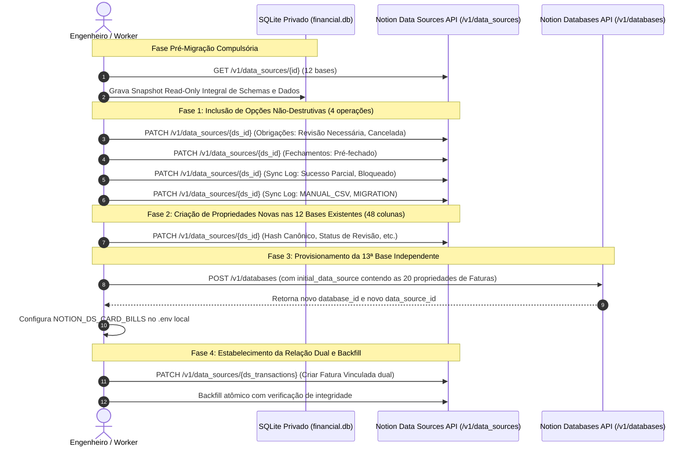

# Plano de Migração de Schema: Notion vs. Modelo de Domínio (V2.1 - Revisado)

> **Status:** Plano Técnico de Migração e Conformidade (Fase 1)  
> **Baseline de Referência:** `0b657453b274793b79a8343502f69a64f21c6277` (Fase 0 encerrada e aprovada)  
> **Notion API Version:** `2026-03-11` (Data Sources API)  
> **Diretriz Operacional:** Nenhuma mutação executada no Notion durante esta fase de planejamento. Zero ingestão de produção.

---

## 1. Resumo Executivo e Princípios Norteadores da Migração

Este documento define o plano arquitetural, executável e estritamente auditado para migração de schemas entre o workspace Notion atual (12 bases introspectadas na Fase 0) e o modelo de domínio canônico V2.1, estabelecendo também o design técnico da 13ª base (*Faturas / Ciclos de Cartão*).

### 1.1 Princípios de Risco Residual Controlado e Governança
1. **Governança de Risco Residual Controlado:** Substitui-se qualquer suposição de "risco nulo" ou "idempotência absoluta" por um modelo formal de risco residual controlado. Nenhuma mutação de schema ou de dados será iniciada sem a realização prévia de um **snapshot integral read-only de schema e dados essenciais** persistido no storage técnico privado local (SQLite / `financial.db`).
2. **Salvaguarda de Rollback Não-Destrutivo:** O procedimento de rollback **nunca** dependerá da exclusão de opções de select que já estejam em uso em registros históricos, nem da exclusão de bancos de dados que já contenham dados vinculados. Toda ação corretiva de reversão será não-destrutiva (manutenção de metadados, arquivamento ou desacoplamento lógico via adapter).
3. **Notion Number como Projeção Contábil:** As propriedades do tipo `number` no Notion atuam exclusivamente como **camada de projeção e visualização para o usuário**. A precisão matemática absoluta, invariantes monetários e arredondamentos são mantidos e calculados de forma exata e canônica no storage privado local (inteiros escalados / aritmética de ponto fixo sem IEEE-754).
4. **Prioridade Absoluta a `optionMappings` sobre `ALTER_SCHEMA`:** Nenhuma opção física existente no Notion será rotulada como `ALTER_SCHEMA` caso um valor existente já represente adequadamente o conceito de domínio. Utiliza-se mapeamento semântico explícito em código (`optionMappings`), evitando mutações físicas, sinônimos desnecessários ou conflitos entre singular/plural.
5. **Preservação de Campos Customizados e Tipos Livres:** Propriedades criadas pelo usuário são preservadas integralmente. Os campos `Instituição` (em Contas e Investimentos) e `Liquidez` (em Investimentos) permanecem estritamente como `rich_text`, garantindo a flexibilidade de cadastrar novas instituições e prazos descritivos sem necessidade de alterar enums no Notion.
6. **Title Unívoco e Sem Duplicações:** A propriedade `Movimentação` é mantida como o único `title` da base de Movimentações de Investimentos, sendo terminantemente proibida a criação de um segundo campo `title` ("Identificador").
7. **Desacoplamento Orçamentário sem Hardcode:** Todo hardcode conceitual de frameworks rígidos (como 50/30/20) foi removido do domínio. Campos como `Necessidades planejadas` e `Desejos planejados` são preservados por retrocompatibilidade histórica, mas percentuais e agrupamentos são tratados como regras configuráveis.

---

## 2. Resumo Quantitativo Recalculado (Baseado nas Linhas Detalhadas)

O resumo abaixo foi recalculado estritamente a partir das linhas detalhadas das 13 tabelas da Seção 3. 
Todas as divergências onde uma opção física existente no Notion representa o conceito canônico foram consolidadas como **`MAP_ALIAS`** via `optionMappings`, reduzindo as mutações de schema ao mínimo estritamente indispensável.

### 2.1 Visão Geral Consolidada

| Ação de Migração | Quantidade | Percentual | Descrição Operacional |
| :--- | :---: | :---: | :--- |
| **`KEEP_AS_IS`** | **91** | 38.1% | Propriedades mantidas exatamente como estão no Notion (inclui tipos livres e campos legados preservados) |
| **`MAP_ALIAS`** | **75** | 31.4% | Mapeadas por alias ou `optionMappings` no adapter (zero mutação no Notion, zero impacto em views) |
| **`ALTER_SCHEMA`** | **4** | 1.7% | Inclusão controlada de novas opções de status/telemetria no Notion sem remover opções em uso |
| **`CREATE_NEW`** | **69** | 28.8% | Novas propriedades essenciais (49 nas 12 bases existentes + 20 na 13ª base de Faturas) |
| **TOTAL GERAL** | **239** | **100%** | **Total de decisões mapeadas propriedade por propriedade** |

### 2.2 Distribuição Detalhada por Data Source

| Data Source | Env Key | Total | KEEP_AS_IS | MAP_ALIAS | ALTER_SCHEMA | CREATE_NEW |
| :--- | :--- | :---: | :---: | :---: | :---: | :---: |
| 1. Contas | `NOTION_DS_ACCOUNTS` | 19 | 8 | 7 | 0 | 4 |
| 2. Transações | `NOTION_DS_TRANSACTIONS` | 26 | 13 | 4 | 0 | 9 |
| 3. Categorias Financeiras | `NOTION_DS_CATEGORIES` | 9 | 6 | 3 | 0 | 0 |
| 4. Regras de Classificação | `NOTION_DS_RULES` | 27 | 11 | 14 | 0 | 2 |
| 5. Contas Fixas | `NOTION_DS_FIXED_BILLS` | 16 | 5 | 7 | 0 | 4 |
| 6. Obrigações Mensais | `NOTION_DS_MONTHLY_OBLIGATIONS` | 13 | 6 | 6 | 1 | 0 |
| 7. Investimentos | `NOTION_DS_INVESTMENTS` | 19 | 8 | 6 | 0 | 5 |
| 8. Movimentações de Investimentos | `NOTION_DS_INVESTMENT_MOVEMENTS` | 16 | 8 | 6 | 0 | 2 |
| 9. Planejamento Mensal | `NOTION_DS_MONTHLY_BUDGET` | 15 | 3 | 8 | 0 | 4 |
| 10. Metas Financeiras | `NOTION_DS_FINANCIAL_GOALS` | 10 | 8 | 2 | 0 | 0 |
| 11. Fechamentos Mensais | `NOTION_DS_MONTHLY_CLOSINGS` | 25 | 8 | 7 | 1 | 9 |
| 12. Log de Sincronização | `NOTION_DS_SYNC_LOG` | 24 | 7 | 5 | 2 | 10 |
| 13. Faturas / Ciclos de Cartão | `NOTION_DS_CARD_BILLS` | 20 | 0 | 0 | 0 | 20 |
| **TOTAL CONSOLIDADO** | — | **239** | **91** | **75** | **4** | **69** |

---

## 3. Diagnóstico e Plano Detalhado por Data Source

### 3.1 Contas (`NOTION_DS_ACCOUNTS`)
* **Data Source ID:** `a17455aa-4793-4001-9570-21b7f84ff4a2`
* **Finalidade:** Cadastro mestre de contas bancárias, cartões, poupanças e carteiras.
* **Política de Opções de Tipo:** Mapear opções físicas existentes (`Corretora` -> `INVESTMENT`, `Dinheiro` / `Carteira` -> `CASH`, `Conta Corrente` -> `CHECKING_ACCOUNT`, `Cartão de Crédito` -> `CREDIT_CARD`, `Poupança` -> `SAVINGS`, `Outro` -> `OTHER`). Não adicionar opções redundantes.
* **Política de Fonte:** Mapear opções físicas (`Pierre` -> `PIERRE`, `Manual` -> `MANUAL`, `Outra` -> `OTHER`). `allowExtraOptions: true` permite extensibilidade sem mutação física imediata.

| Propriedade | Estado Atual (Notion) | Estado Alvo (Domínio) | Ação | Justificativa Técnica e Mapeamento Semântico | Risco Residual | Backfill Necessário | Impacto em Views | Rollback Seguro |
| :--- | :--- | :--- | :---: | :--- | :---: | :--- | :--- | :--- |
| `Conta` | `title` | `title` (Nome da Conta) | `MAP_ALIAS` | Reutiliza o título existente `Conta` via alias. Zero mutação física. | Baixo | Não | Nenhum | Reverter mapeamento no adapter |
| `Fonte` | `select` | `select` | `MAP_ALIAS` | Mapeia opções físicas existentes (`Pierre`, `Manual`, `Outra`) via `optionMappings`. | Baixo | Não | Nenhum | Reverter adapter |
| `ID da fonte` | `rich_text` | `rich_text` | `KEEP_AS_IS` | Identificador unívoco existente e compatível. | Baixo | Não | Nenhum | N/A |
| `Moeda` | `select` | `select` | `KEEP_AS_IS` | Moedas ativas (`BRL`, `USD`) suficientes para as contas atuais. Não forçar EUR sem necessidade. | Baixo | Não | Nenhum | N/A |
| `Instituição` | `rich_text` | `rich_text` | `KEEP_AS_IS` | Mantido como `rich_text` conforme regra mandatória (evita enum rígido de bancos). | Baixo | Não | Nenhum | N/A |
| `Tipo` | `select` | `select` (Tipo de Conta) | `MAP_ALIAS` | Mapeia opções existentes (`Conta Corrente`, `Cartão de Crédito`, `Corretora`, `Dinheiro`, `Carteira`) sem criar opções redundantes. | Baixo | Não | Nenhum | Reverter adapter |
| `Saldo` | `number` | `number` (Saldo Atual) | `MAP_ALIAS` | Reutiliza `Saldo` via alias como projeção visual do saldo de caixa. | Baixo | Não | Nenhum | Reverter adapter |
| `Limite contratado` | `number` | `number` | `KEEP_AS_IS` | Nome e tipo exatos. | Baixo | Não | Nenhum | N/A |
| `Limite personalizado` | `number` | `number` | `KEEP_AS_IS` | Nome e tipo exatos. | Baixo | Não | Nenhum | N/A |
| `Limite disponível` | `number` | `number` | `KEEP_AS_IS` | Nome e tipo exatos. | Baixo | Não | Nenhum | N/A |
| `Atualizado em` | `date` | `date` (Última Sincronização) | `MAP_ALIAS` | Reutiliza data existente para registro de freshness. | Baixo | Não | Nenhum | Reverter adapter |
| `Inclui no caixa` | `checkbox` | `checkbox` (Incluir no Caixa) | `MAP_ALIAS` | Reutiliza campo existente sem duplicar coluna no Notion. | Baixo | Não | Nenhum | Reverter adapter |
| `Inclui no patrimônio` | `checkbox` | `checkbox` (Incluir no Patrimônio) | `MAP_ALIAS` | Reutiliza campo existente sem duplicar coluna no Notion. | Baixo | Não | Nenhum | Reverter adapter |
| `Ativa` | `checkbox` | `checkbox` | `KEEP_AS_IS` | Controle operacional preservado. | Baixo | Não | Nenhum | N/A |
| `Observações` | `rich_text` | `rich_text` | `KEEP_AS_IS` | Campo de texto livre do usuário preservado. | Baixo | Não | Nenhum | N/A |
| `Limite Operacional Usado` | Inexistente | `number` | `CREATE_NEW` | Saldo devedor operacional computado (`customizedCreditLimit - availableCreditLimit`). | Baixo | Sim: derivar dos limites | Nova coluna | Ocultar propriedade |
| `Limite Usado da Fonte (Bruto)` | Inexistente | `number` | `CREATE_NEW` | Valor bruto reportado pela instituição para auditoria de reconciliação de limite. | Baixo | Sim: preencher no sync | Nova coluna | Ocultar propriedade |
| `Dia de Fechamento` | Inexistente | `number` | `CREATE_NEW` | Dia do mês do corte da fatura (1 a 31). | Baixo | Sim: cadastro inicial | Nova coluna | Ocultar propriedade |
| `Dia de Vencimento` | Inexistente | `number` | `CREATE_NEW` | Dia do mês do vencimento da fatura (1 a 31). | Baixo | Sim: cadastro inicial | Nova coluna | Ocultar propriedade |

---

### 3.2 Transações (`NOTION_DS_TRANSACTIONS`)
* **Data Source ID:** `1fc274bd-b73a-45b1-a902-09aba993f199`
* **Finalidade:** Livro-razão projetado de entradas, saídas, estornos e transferências.
* **Mapeamento de Natureza:** Mapear opções físicas existentes:
  * `Receita` -> `OPERATING_REVENUE`
  * `Despesa` -> `OPERATING_EXPENSE`
  * `Aporte` -> `CAPITAL_CONTRIBUTION`
  * `Resgate` -> `CAPITAL_WITHDRAWAL`
  * `Reembolso` -> `REVERSAL_REFUND`
  * `Pagamento de fatura` -> `BILL_PAYMENT`
  * `Ajuste` -> `ACCOUNTING_ADJUSTMENT`
  Não criar opções canônicas duplicadas (ex: não criar `Despesa Operacional` quando `Despesa` já existe).
* **Mapeamento de Status:** Mapear `Confirmado` -> `POSTED`, `Pendente` -> `PENDING`, `Cancelado` -> `VOIDED`. Não adicionar `Liquidado` ou `Estornado` sem necessidade semântica comprovada.

| Propriedade | Estado Atual (Notion) | Estado Alvo (Domínio) | Ação | Justificativa Técnica e Mapeamento Semântico | Risco Residual | Backfill Necessário | Impacto em Views | Rollback Seguro |
| :--- | :--- | :--- | :---: | :--- | :---: | :--- | :--- | :--- |
| `Lançamento` | `title` | `title` (Descrição) | `MAP_ALIAS` | Reutiliza `Lançamento` como título descritivo principal. | Baixo | Não | Nenhum | Reverter adapter |
| `Fonte` | `select` | `select` | `KEEP_AS_IS` | Conector ou origem aderente. | Baixo | Não | Nenhum | N/A |
| `ID da fonte` | `rich_text` | `rich_text` | `KEEP_AS_IS` | Identificador unívoco preservado. | Baixo | Não | Nenhum | N/A |
| `Moeda` | `select` | `select` | `KEEP_AS_IS` | Moedas ativas (`BRL`, `USD`) suficientes. | Baixo | Não | Nenhum | N/A |
| `Data` | `date` | `date` | `KEEP_AS_IS` | Nome e tipo exatos. | Baixo | Não | Nenhum | N/A |
| `Valor` | `number` | `number` | `KEEP_AS_IS` | Valor projetado no Notion (precisão matemática canônica mantida no SQLite). | Baixo | Não | Nenhum | N/A |
| `Movimento` | `select` | `select` | `KEEP_AS_IS` | Sentido físico (`Entrada` / `Saída`) preservado. | Baixo | Não | Nenhum | N/A |
| `Conta` | `relation` | `relation` | `KEEP_AS_IS` | Vínculo com a base de Contas. | Baixo | Não | Nenhum | N/A |
| `Categoria` | `relation` | `relation` | `KEEP_AS_IS` | Vínculo com Categorias Financeiras. | Baixo | Não | Nenhum | N/A |
| `Categoria Pierre` | `rich_text` | `rich_text` (Categoria da Fonte) | `MAP_ALIAS` | Generalizado para conceito de upstream (`Categoria da Fonte`) mantendo o nome físico legado no Notion. | Baixo | Não | Nenhum | Reverter adapter |
| `Descrição original` | `rich_text` | `rich_text` | `KEEP_AS_IS` | Texto original bruto do extrato. | Baixo | Não | Nenhum | N/A |
| `Natureza` | `select` | `select` (Natureza Econômica) | `MAP_ALIAS` | Mapeia opções físicas (`Receita`, `Despesa`, `Aporte`, `Resgate`, `Reembolso`, `Pagamento de fatura`, `Ajuste`) sem mutação física. | Baixo | Não | Nenhum | Reverter adapter |
| `Status` | `select` | `select` (Status Banco) | `MAP_ALIAS` | Mapeia opções físicas (`Confirmado`, `Pendente`, `Cancelado`) aos enums canônicos. | Baixo | Não | Nenhum | Reverter adapter |
| `Conta no orçamento` | `checkbox` | `checkbox` | `KEEP_AS_IS` | Propriedade existente preservada. | Baixo | Não | Nenhum | N/A |
| `Conta como aporte` | `checkbox` | `checkbox` | `KEEP_AS_IS` | Propriedade existente preservada. | Baixo | Não | Nenhum | N/A |
| `Revisado` | `checkbox` | `checkbox` | `KEEP_AS_IS` | Flag de conferência manual preservada. | Baixo | Não | Nenhum | N/A |
| `Observações` | `rich_text` | `rich_text` | `KEEP_AS_IS` | Anotações do usuário preservadas. | Baixo | Não | Nenhum | N/A |
| `Hash Canônico` | Inexistente | `rich_text` | `CREATE_NEW` | Fingerprint SHA-256 (64 hex) para versionamento e detecção de mutações em lote. | Baixo | Sim: gerar para registros ativos | Nova coluna | Ocultar propriedade |
| `Valor Bruto da Fonte` | Inexistente | `number` | `CREATE_NEW` | Valor original bruto retornado pelo conector com sinal original. | Baixo | Sim: preencher nas novas runs | Nova coluna | Ocultar propriedade |
| `Efeito Orçamentário` | Inexistente | `select` | `CREATE_NEW` | Classificador de impacto: `INCOME`, `EXPENSE`, `REVERSAL`, `NEUTRAL`. | Baixo | Sim: inferir pelas naturezas | Nova coluna | Ocultar propriedade |
| `Propósito de Alocação` | Inexistente | `select` | `CREATE_NEW` | Destinação: `INVESTMENT_RESERVE`, `OPERATIONAL_CASH`, `TAX_RESERVE`, etc. | Baixo | Não | Nova coluna | Ocultar propriedade |
| `Contribuição Meta Poupança` | Inexistente | `number` | `CREATE_NEW` | Valor absoluto que pontua positivamente na meta de poupança/investimento. | Baixo | Sim: inferir para aportes | Nova coluna | Ocultar propriedade |
| `Fatura Vinculada` | Inexistente | `relation` | `CREATE_NEW` | Relação dual única conectada à 13ª base de Faturas (lado inverso de `Lançamentos do Ciclo`). | Baixo | Sim: vincular compras do cartão | Nova relação | Desvincular relação |
| `Status de Revisão` | Inexistente | `select` | `CREATE_NEW` | Enums: `AUTO_CONFIRMED`, `PENDING_REVIEW`, `MANUALLY_VALIDATED`, `LEGACY_UNVERIFIED`. | Baixo | Sim: marcar históricas como LEGACY | Nova coluna | Ocultar propriedade |
| `Motivo da Revisão` | Inexistente | `rich_text` | `CREATE_NEW` | Justificativa técnica do motor de regras quando exigir atenção humana. | Baixo | Não | Nova coluna | Ocultar propriedade |
| `HMAC Contraparte` | Inexistente | `rich_text` | `CREATE_NEW` | Hash HMAC-SHA256 truncado para identificação de fornecedor recorrente sem expor PII. | Baixo | Não | Nova coluna | Ocultar propriedade |

---

### 3.3 Categorias Financeiras (`NOTION_DS_CATEGORIES`)
* **Data Source ID:** `eb8ef2e3-cfd3-437e-b3f5-6a47dec913b4`
* **Finalidade:** Árvore de classificação orçamentária e direcionamento de gastos.
* **Mapeamento de Grupos:** Mapear opções físicas existentes via `optionMappings`:
  * `Necessidade` -> `ESSENTIAL`
  * `Desejo` -> `LIFESTYLE`
  * `Poupança/Investimento` -> `INVESTMENT_GOALS`
  * `Fora do orçamento` -> `STRUCTURAL_NEUTRAL`
  Não criar grupos duplicados (ex: não criar `Essencial (Necessidades)` ou `Estilo de Vida (Desejos)`).

| Propriedade | Estado Atual (Notion) | Estado Alvo (Domínio) | Ação | Justificativa Técnica e Mapeamento Semântico | Risco Residual | Backfill Necessário | Impacto em Views | Rollback Seguro |
| :--- | :--- | :--- | :---: | :--- | :---: | :--- | :--- | :--- |
| `Categoria` | `title` | `title` (Nome da Categoria) | `MAP_ALIAS` | Reutiliza `Categoria` como título principal. | Baixo | Não | Nenhum | Reverter adapter |
| `Variabilidade` | `select` | `select` | `KEEP_AS_IS` | Opções físicas `Fixa` e `Variável` atendem ao domínio. Eventual "Ocasional" tratado no domínio. | Baixo | Não | Nenhum | N/A |
| `Natureza padrão` | `select` | `select` | `MAP_ALIAS` | Mapeia opções existentes (`Receita`, `Despesa`, `Aporte`, etc.) via `optionMappings`. | Baixo | Não | Nenhum | Reverter adapter |
| `Grupo` | `select` | `select` (Grupo Orçamentário) | `MAP_ALIAS` | Mapeia opções existentes (`Necessidade`, `Desejo`, `Poupança/Investimento`, `Fora do orçamento`) sem duplicar grupos. | Baixo | Não | Nenhum | Reverter adapter |
| `Ativa` | `checkbox` | `checkbox` | `KEEP_AS_IS` | Controle de uso da categoria preservado. | Baixo | Não | Nenhum | N/A |
| `Conta no orçamento` | `checkbox` | `checkbox` | `KEEP_AS_IS` | Flag orçamentária preservada. | Baixo | Não | Nenhum | N/A |
| `Observações` | `rich_text` | `rich_text` | `KEEP_AS_IS` | Anotações preservadas. | Baixo | Não | Nenhum | N/A |
| `Contas fixas` | `relation` | `relation` | `KEEP_AS_IS` | Relação com Contas Fixas preservada. | Baixo | Não | Nenhum | N/A |
| `Transações` | `relation` | `relation` | `KEEP_AS_IS` | Relação reversa com Transações preservada. | Baixo | Não | Nenhum | N/A |

---

### 3.4 Regras de Classificação (`NOTION_DS_RULES`)
* **Data Source ID:** `b36ba8da-9601-4456-a21f-5d9804110fbb`
* **Finalidade:** Automação determinística de conciliação e enriquecimento de transações.

| Propriedade | Estado Atual (Notion) | Estado Alvo (Domínio) | Ação | Justificativa Técnica e Mapeamento Semântico | Risco Residual | Backfill Necessário | Impacto em Views | Rollback Seguro |
| :--- | :--- | :--- | :---: | :--- | :---: | :--- | :--- | :--- |
| `Regra` | `title` | `title` (Nome da Regra) | `MAP_ALIAS` | Reutiliza `Regra` como título via alias. | Baixo | Não | Nenhum | Reverter adapter |
| `Prioridade` | `number` | `number` | `KEEP_AS_IS` | Prioridade de avaliação (1 = maior). | Baixo | Não | Nenhum | N/A |
| `Ativa` | `checkbox` | `checkbox` | `KEEP_AS_IS` | Habilitação preservada. | Baixo | Não | Nenhum | N/A |
| `Auto aplicar` | `checkbox` | `checkbox` | `KEEP_AS_IS` | Flag de aplicação automática preservada. | Baixo | Não | Nenhum | N/A |
| `Exigir revisão` | `checkbox` | `checkbox` | `KEEP_AS_IS` | Flag de encaminhamento para conferência humana. | Baixo | Não | Nenhum | N/A |
| `Válida de` | `date` | `date` | `KEEP_AS_IS` | Início de vigência temporal. | Baixo | Não | Nenhum | N/A |
| `Válida até` | `date` | `date` | `KEEP_AS_IS` | Término de vigência temporal. | Baixo | Não | Nenhum | N/A |
| `Contraparte contém` | `rich_text` | `rich_text` (Condição: Contraparte) | `MAP_ALIAS` | Reutiliza campo existente via alias. | Baixo | Não | Nenhum | Reverter adapter |
| `Descrição contém` | `rich_text` | `rich_text` (Condição: Descrição) | `MAP_ALIAS` | Reutiliza campo existente via alias. | Baixo | Não | Nenhum | Reverter adapter |
| `Movimento esperado` | `select` | `select` (Condição: Movimento) | `MAP_ALIAS` | Reutiliza campo existente via alias. | Baixo | Não | Nenhum | Reverter adapter |
| `Conta origem` | `relation` | `relation` (Condição: Conta) | `MAP_ALIAS` | Reutiliza campo existente via alias. | Baixo | Não | Nenhum | Reverter adapter |
| `Categoria Pierre` | `rich_text` | `rich_text` (Condição: Categoria Fonte) | `MAP_ALIAS` | Generalizado para Categoria da Fonte via alias. | Baixo | Não | Nenhum | Reverter adapter |
| `Valor exato` | `number` | `number` (Condição: Valor Exato) | `MAP_ALIAS` | Reutiliza campo existente via alias. | Baixo | Não | Nenhum | Reverter adapter |
| `Tolerância` | `number` | `number` (Condição: Tolerância Valor) | `MAP_ALIAS` | Reutiliza campo existente via alias. | Baixo | Não | Nenhum | Reverter adapter |
| `Valor mínimo` | `number` | `number` (Condição: Valor Mínimo) | `MAP_ALIAS` | Reutiliza campo existente via alias. | Baixo | Não | Nenhum | Reverter adapter |
| `Valor máximo` | `number` | `number` (Condição: Valor Máximo) | `MAP_ALIAS` | Reutiliza campo existente via alias. | Baixo | Não | Nenhum | Reverter adapter |
| `Dia mínimo` | `number` | `number` (Condição: Dia Mês Início) | `MAP_ALIAS` | Reutiliza campo existente via alias. | Baixo | Não | Nenhum | Reverter adapter |
| `Dia máximo` | `number` | `number` (Condição: Dia Mês Fim) | `MAP_ALIAS` | Reutiliza campo existente via alias. | Baixo | Não | Nenhum | Reverter adapter |
| `Natureza resultante` | `select` | `select` (Atribuir: Natureza) | `MAP_ALIAS` | Mapeia opções físicas existentes (`Receita`, `Despesa`, etc.) via `optionMappings`. | Baixo | Não | Nenhum | Reverter adapter |
| `Categoria resultante` | `relation` | `relation` (Atribuir: Categoria) | `MAP_ALIAS` | Reutiliza campo existente via alias. | Baixo | Não | Nenhum | Reverter adapter |
| `Conta como aporte` | `checkbox` | `checkbox` | `KEEP_AS_IS` | Flag de controle preservada. | Baixo | Não | Nenhum | N/A |
| `Conta no orçamento` | `checkbox` | `checkbox` | `KEEP_AS_IS` | Flag de controle preservada. | Baixo | Não | Nenhum | N/A |
| `Destino / contexto` | `rich_text` | `rich_text` | `KEEP_AS_IS` | Campo de anotação de contexto preservado. | Baixo | Não | Nenhum | N/A |
| `Observações` | `rich_text` | `rich_text` | `KEEP_AS_IS` | Anotações preservadas. | Baixo | Não | Nenhum | N/A |
| `Tipo` | `select` | `select` | `KEEP_AS_IS` | Classificador existente preservado. | Baixo | Não | Nenhum | N/A |
| `Atribuir: Efeito Orçamento` | Inexistente | `select` | `CREATE_NEW` | Permite atribuir explicitamente `INCOME`, `EXPENSE`, `REVERSAL`, `NEUTRAL` pela regra. | Baixo | Não | Nova coluna | Ocultar propriedade |
| `Atribuir: Alocação` | Inexistente | `select` | `CREATE_NEW` | Permite atribuir a destinação da alocação via regra. | Baixo | Não | Nova coluna | Ocultar propriedade |

---

### 3.5 Contas Fixas (`NOTION_DS_FIXED_BILLS`)
* **Data Source ID:** `49e909f9-7a08-4114-bc85-0bb500e3dfb9`
* **Finalidade:** Cadastro permanente de despesas recorrentes e compromissos contratuais.
* **Mapeamento de Forma de Pagamento:** Mapear opções físicas existentes:
  * `Cartão` -> `CREDIT_CARD`
  * `Débito` / `Débito automático` -> `BANK_DEBIT`
  * `Boleto` -> `BOLETO`
  * `Pix` -> `PIX`
  Não adicionar sinônimos redundantes como `Cartão de Crédito` ou `Débito em Conta`.

| Propriedade | Estado Atual (Notion) | Estado Alvo (Domínio) | Ação | Justificativa Técnica e Mapeamento Semântico | Risco Residual | Backfill Necessário | Impacto em Views | Rollback Seguro |
| :--- | :--- | :--- | :---: | :--- | :---: | :--- | :--- | :--- |
| `Conta fixa` | `title` | `title` (Nome da Conta Fixa) | `MAP_ALIAS` | Reutiliza título existente via alias. | Baixo | Não | Nenhum | Reverter adapter |
| `Valor esperado` | `number` | `number` (Valor Previsto) | `MAP_ALIAS` | Reutiliza o campo existente `Valor esperado` sem criar propriedade duplicada. | Baixo | Não | Nenhum | Reverter adapter |
| `Dia do vencimento` | `number` | `number` (Dia de Vencimento) | `MAP_ALIAS` | Reutiliza o campo existente `Dia do vencimento` sem duplicar. | Baixo | Não | Nenhum | Reverter adapter |
| `Tolerância de valor` | `number` | `number` (Tolerância R$) | `MAP_ALIAS` | Reutiliza o campo existente `Tolerância de valor` sem duplicar. | Baixo | Não | Nenhum | Reverter adapter |
| `Regra de identificação` | `rich_text` | `rich_text` (Padrão Identificação) | `MAP_ALIAS` | Reutiliza o campo existente `Regra de identificação` para matching. | Baixo | Não | Nenhum | Reverter adapter |
| `Periodicidade` | `select` | `select` | `KEEP_AS_IS` | Enums existentes atendem integralmente. | Baixo | Não | Nenhum | N/A |
| `Forma de pagamento` | `select` | `select` | `MAP_ALIAS` | Mapeia opções físicas (`Cartão`, `Débito`, `Débito automático`, `Boleto`, `Pix`) sem criar sinônimos. | Baixo | Não | Nenhum | Reverter adapter |
| `Conta padrão` | `relation` | `relation` | `KEEP_AS_IS` | Relação com Contas preservada. | Baixo | Não | Nenhum | N/A |
| `Categoria` | `relation` | `relation` | `KEEP_AS_IS` | Relação com Categorias preservada. | Baixo | Não | Nenhum | N/A |
| `Ativa` | `checkbox` | `checkbox` | `KEEP_AS_IS` | Flag de geração preservada. | Baixo | Não | Nenhum | N/A |
| `Gerar obrigação` | `checkbox` | `checkbox` | `KEEP_AS_IS` | Automação de ciclo preservada. | Baixo | Não | Nenhum | N/A |
| `Observações` | `rich_text` | `rich_text` (Observações / Contrato) | `MAP_ALIAS` | Reutiliza `Observações` via alias. | Baixo | Não | Nenhum | Reverter adapter |
| `Competência Âncora` | Inexistente | `rich_text` | `CREATE_NEW` | Mês de referência inicial (ex: `2026-01`) para controle de ciclo. | Baixo | Sim: preencher competência atual | Nova coluna | Ocultar propriedade |
| `Última Competência Gerada` | Inexistente | `rich_text` | `CREATE_NEW` | Último mês gerado em Obrigações para idempotência de geração. | Baixo | Sim: registrar último ciclo | Nova coluna | Ocultar propriedade |
| `Data de Início` | Inexistente | `date` | `CREATE_NEW` | Vigência inicial do contrato. | Baixo | Não | Nova coluna | Ocultar propriedade |
| `Data de Término` | Inexistente | `date` | `CREATE_NEW` | Vigência final do contrato. | Baixo | Não | Nova coluna | Ocultar propriedade |

---

### 3.6 Obrigações Mensais (`NOTION_DS_MONTHLY_OBLIGATIONS`)
* **Data Source ID:** `5c59339c-7cfc-4f17-9355-803a4136f6b8`
* **Finalidade:** Instâncias mensais das contas fixas a pagar e conciliar.

| Propriedade | Estado Atual (Notion) | Estado Alvo (Domínio) | Ação | Justificativa Técnica e Mapeamento Semântico | Risco Residual | Backfill Necessário | Impacto em Views | Rollback Seguro |
| :--- | :--- | :--- | :---: | :--- | :---: | :--- | :--- | :--- |
| `Obrigação` | `title` | `title` (Identificador) | `MAP_ALIAS` | Reutiliza `Obrigação` como título principal via alias. | Baixo | Não | Nenhum | Reverter adapter |
| `Conta fixa` | `relation` | `relation` | `KEEP_AS_IS` | Vínculo permanente com Contas Fixas preservado. | Baixo | Não | Nenhum | N/A |
| `Valor previsto` | `number` | `number` | `KEEP_AS_IS` | Valor esperado exato. | Baixo | Não | Nenhum | N/A |
| `Status` | `select` | `select` | `ALTER_SCHEMA` | Adicionar opções ausentes de ciclo de vida (`Revisão Necessária` e `Cancelada`) via Data Sources API. | Baixo | Não | Nenhum | Manter opções sem uso |
| `Valor pago` | `number` | `number` | `KEEP_AS_IS` | Valor liquidado exato. | Baixo | Não | Nenhum | N/A |
| `Vencimento` | `date` | `date` (Data de Vencimento) | `MAP_ALIAS` | Reutiliza `Vencimento` via alias. | Baixo | Não | Nenhum | Reverter adapter |
| `Pago em` | `date` | `date` (Data do Pagamento) | `MAP_ALIAS` | Reutiliza `Pago em` via alias. | Baixo | Não | Nenhum | Reverter adapter |
| `Validado automaticamente` | `checkbox` | `checkbox` | `KEEP_AS_IS` | Flag de conferência inequívoca preservada. | Baixo | Não | Nenhum | N/A |
| `Observações` | `rich_text` | `rich_text` (Observações / Conflitos) | `MAP_ALIAS` | Reutiliza `Observações` via alias. | Baixo | Não | Nenhum | Reverter adapter |
| `Transação conciliada` | `relation` | `relation` (Transação Vinculada) | `MAP_ALIAS` | Reutiliza relação existente sem criar relação duplicada. | Baixo | Não | Nenhum | Reverter adapter |
| `Referência` | `date` | `rich_text` / `date` (Competência) | `MAP_ALIAS` | Reutiliza data existente para extração canônica de YYYY-MM. | Baixo | Não | Nenhum | Reverter adapter |
| `Conta` | `relation` | `relation` | `KEEP_AS_IS` | Conta de débito efetiva preservada. | Baixo | Não | Nenhum | N/A |
| `Origem` | `select` | `select` | `KEEP_AS_IS` | Origem do registro preservada. | Baixo | Não | Nenhum | N/A |

---

### 3.7 Investimentos (`NOTION_DS_INVESTMENTS`)
* **Data Source ID:** `db609202-8cb8-4ce9-8dd7-c01d9de6b6cb`
* **Finalidade:** Posições de custódia e carteiras de ativos patrimoniais.
* **Mapeamento de Classes:** Mapear opções físicas plurais existentes:
  * `Ações` -> `EQUITY`
  * `FIIs` -> `REAL_ESTATE`
  * `ETFs` -> `ETF`
  * `Renda Fixa` -> `FIXED_INCOME`
  * `Cripto` -> `CRYPTO`
  * `Outro` -> `OTHER`
  Não criar singularizações duplicadas (ex: não criar `Ação`, `FII`, `ETF`). *Caixa Reservado NÃO é classe de ativo.*
* **Unidade de Ativo vs. Moeda de Valuation:** `BTC` é unidade física do ativo/quantidade (ex: 0.05 BTC), **não moeda de valuation contábil**. O valuation patrimonial ocorre estritamente em moeda fiduciária/funcional (`BRL`, `USD`). Portanto, `Moeda` permanece `KEEP_AS_IS` (`BRL`, `USD`).
* **Preservação de `rich_text`:** `Instituição` e `Liquidez` permanecem estritamente como `rich_text` conforme regras mandatórias.

| Propriedade | Estado Atual (Notion) | Estado Alvo (Domínio) | Ação | Justificativa Técnica e Mapeamento Semântico | Risco Residual | Backfill Necessário | Impacto em Views | Rollback Seguro |
| :--- | :--- | :--- | :---: | :--- | :---: | :--- | :--- | :--- |
| `Ativo` | `title` | `title` | `KEEP_AS_IS` | Identificador principal do ativo preservado. | Baixo | Não | Nenhum | N/A |
| `Moeda` | `select` | `select` | `KEEP_AS_IS` | Moeda contábil de valuation (`BRL`, `USD`). BTC é unidade de ativo, não moeda de valuation. | Baixo | Não | Nenhum | N/A |
| `Quantidade` | `number` | `number` | `KEEP_AS_IS` | Quantidade custodiada projetada (suporte fracionário mantido no ledger canônico). | Baixo | Não | Nenhum | N/A |
| `Data da avaliação` | `date` | `date` | `KEEP_AS_IS` | Timestamp da última cotação capturada. | Baixo | Não | Nenhum | N/A |
| `Instituição` | `rich_text` | `rich_text` (Instituição / Corretora) | `KEEP_AS_IS` | Mantido como `rich_text` conforme regra mandatória. | Baixo | Não | Nenhum | N/A |
| `Liquidez` | `rich_text` | `rich_text` | `KEEP_AS_IS` | Mantido como `rich_text` conforme regra mandatória (permite prazos livres e carências). | Baixo | Não | Nenhum | N/A |
| `Classe` | `select` | `select` (Classe do Ativo) | `MAP_ALIAS` | Mapeia opções físicas (`Ações`, `FIIs`, `ETFs`, `Renda Fixa`, `Cripto`, `Outro`) sem singularizações duplicadas. | Baixo | Não | Nenhum | Reverter adapter |
| `Custo acumulado` | `number` | `number` (Custo Base Total) | `MAP_ALIAS` | Reutiliza `Custo acumulado` como base contábil de aquisição via alias. | Baixo | Não | Nenhum | Reverter adapter |
| `Valor atual` | `number` | `number` (Valor de Mercado Atual) | `MAP_ALIAS` | Reutiliza `Valor atual` como projeção a mercado da posição. | Baixo | Não | Nenhum | Reverter adapter |
| `Fonte do preço` | `select` | `select` (Fonte da Avaliação) | `MAP_ALIAS` | Mapeia opções existentes (`Pierre` -> `UPSTREAM`, `Manual` -> `MANUAL`) via `optionMappings`. | Baixo | Não | Nenhum | Reverter adapter |
| `ID da fonte` | `rich_text` | `rich_text` (ID do Ativo na Fonte) | `MAP_ALIAS` | Reutiliza `ID da fonte` como chave externa do ativo. | Baixo | Não | Nenhum | Reverter adapter |
| `Inclui no patrimônio` | `checkbox` | `checkbox` (Incluir no Patrimônio) | `MAP_ALIAS` | Reutiliza propriedade existente via alias. | Baixo | Não | Nenhum | Reverter adapter |
| `Observações` | `rich_text` | `rich_text` | `KEEP_AS_IS` | Anotações preservadas. | Baixo | Não | Nenhum | N/A |
| `Movimentações` | `relation` | `relation` | `KEEP_AS_IS` | Relação reversa com histórico de ordens preservada. | Baixo | Não | Nenhum | N/A |
| `Custódia` | Inexistente | `select` | `CREATE_NEW` | Origem da custódia: `Custódia Conectada (Upstream)` ou `Custódia Externa (Manual)`. | Baixo | Sim: definir padrão | Nova coluna | Ocultar propriedade |
| `Preço Médio Unitário (PMP)` | Inexistente | `number` | `CREATE_NEW` | PMP derivado do motor de cost basis contábil exato. | Baixo | Sim: calcular pelo cost basis | Nova coluna | Ocultar propriedade |
| `Lucro / Prejuízo Não Realizado` | Inexistente | `number` | `CREATE_NEW` | Ganho de capital não realizado projetado (`Valor Atual - Custo Acumulado`). | Baixo | Sim: calcular pela posição | Nova coluna | Ocultar propriedade |
| `Retorno Não Realizado (%)` | Inexistente | `number` | `CREATE_NEW` | Rentabilidade percentual não realizada da posição. | Baixo | Sim: calcular pela posição | Nova coluna | Ocultar propriedade |
| `Conta Vinculada` | Inexistente | `relation` | `CREATE_NEW` | Vínculo opcional com conta corrente ou corretora em Contas. | Baixo | Não | Nova relação | Desvincular relação |

---

### 3.8 Movimentações de Investimentos (`NOTION_DS_INVESTMENT_MOVEMENTS`)
* **Data Source ID:** `b19f56a4-e34f-42ec-9437-c5165b8725af`
* **Finalidade:** Livro de ordens, histórico de transações de ativos, proventos e amortizações.
* **Title Unívoco:** A propriedade existente `Movimentação` é mantida como o único `title`. É terminantemente proibido criar um segundo title `Identificador`.
* **Mapeamento de Tipos:** Mapear todos os 8 tipos físicos existentes no Notion para os enums canônicos:
  * `Aporte` -> `CAPITAL_CONTRIBUTION`
  * `Compra` -> `BUY`
  * `Venda` -> `SELL`
  * `Rendimento` -> `DIVIDEND_YIELD`
  * `Resgate` -> `CAPITAL_WITHDRAWAL`
  * `Taxa` -> `FEE_TAX`
  * `Transferência` -> `TRANSFER` (preservar `Transferência`!)
  * `Ajuste` -> `POSITION_ADJUSTMENT`
* **Convenção Explícita de Fluxo de Caixa (Direcional):**
  * **Compra (`BUY`):** `netCashEffect = -(grossAmount + feesAmount)` (saída de caixa total).
  * **Venda (`SELL`):** `netCashEffect = +(grossAmount - feesAmount)` (entrada de caixa líquida).
  * **Rendimento / Provento:** `netCashEffect = +(grossAmount - feesAmount)`.
  * **Aporte de Capital:** `netCashEffect = +grossAmount`.
  * **Resgate de Capital:** `netCashEffect = -grossAmount`.
  * É vedada a definição universal simplista de "Valor Líquido = Valor Bruto - Custos".

| Propriedade | Estado Atual (Notion) | Estado Alvo (Domínio) | Ação | Justificativa Técnica e Mapeamento Semântico | Risco Residual | Backfill Necessário | Impacto em Views | Rollback Seguro |
| :--- | :--- | :--- | :---: | :--- | :---: | :--- | :--- | :--- |
| `Movimentação` | `title` | `title` | `KEEP_AS_IS` | **Regra Mandatória:** Título unívoco existente preservado. Proibido criar segundo title `Identificador`. | Baixo | Não | Nenhum | N/A |
| `Preço unitário` | `number` | `number` | `KEEP_AS_IS` | Preço de execução da cota/ativo preservado. | Baixo | Não | Nenhum | N/A |
| `Conta origem` | `relation` | `relation` | `KEEP_AS_IS` | Conta debitada ou associada. | Baixo | Não | Nenhum | N/A |
| `Ativo` | `relation` | `relation` (Ativo Vinculado) | `MAP_ALIAS` | Reutiliza a relação `Ativo` via alias. | Baixo | Não | Nenhum | Reverter adapter |
| `Tipo` | `select` | `select` (Tipo de Movimentação) | `MAP_ALIAS` | Mapeia os 8 tipos físicos existentes (`Aporte`, `Compra`, `Venda`, `Rendimento`, `Resgate`, `Taxa`, `Transferência`, `Ajuste`) sem mutação física. | Baixo | Não | Nenhum | Reverter adapter |
| `Data` | `date` | `date` (Data da Operação) | `MAP_ALIAS` | Reutiliza `Data` via alias. | Baixo | Não | Nenhum | Reverter adapter |
| `Quantidade` | `number` | `number` (Quantidade Negociada) | `MAP_ALIAS` | Reutiliza `Quantidade` via alias. | Baixo | Não | Nenhum | Reverter adapter |
| `Valor` | `number` | `number` (Valor Bruto da Operação) | `MAP_ALIAS` | Reutiliza o campo existente `Valor` como volume bruto (`grossAmount`) sem duplicar. | Baixo | Não | Nenhum | Reverter adapter |
| `Custos e taxas` | `number` | `number` (`feesAmount`) | `KEEP_AS_IS` | Custos operacionais e taxas preservados. | Baixo | Não | Nenhum | N/A |
| `Moeda` | `select` | `select` | `KEEP_AS_IS` | Moeda financeira da operação. | Baixo | Não | Nenhum | N/A |
| `Observações` | `rich_text` | `rich_text` | `KEEP_AS_IS` | Anotações preservadas. | Baixo | Não | Nenhum | N/A |
| `ID da fonte` | `rich_text` | `rich_text` | `KEEP_AS_IS` | Identificador da ordem na fonte. | Baixo | Não | Nenhum | N/A |
| `Fonte` | `select` | `select` | `KEEP_AS_IS` | Conector ou origem da ordem. | Baixo | Não | Nenhum | N/A |
| `Transação origem` | `relation` | `relation` (Transação Financeira) | `MAP_ALIAS` | Reutiliza relação existente para conciliação com extrato bancário. | Baixo | Não | Nenhum | Reverter adapter |
| `Impacto Líquido de Caixa` | Inexistente | `number` (`netCashEffect`) | `CREATE_NEW` | Efeito líquido de caixa com sinal econômico direcional (compra = negativo, venda = positivo). | Baixo | Sim: calcular pela regra direcional | Nova coluna | Ocultar propriedade |
| `Conta Destino / Caixa` | Inexistente | `relation` | `CREATE_NEW` | Relação opcional com conta creditada em vendas ou resgates. | Baixo | Não | Nova relação | Desvincular relação |

---

### 3.9 Planejamento Mensal (`NOTION_DS_MONTHLY_BUDGET`)
* **Data Source ID:** `0c14523b-9e22-483a-8e63-4b3d0c31c7d5`
* **Finalidade:** Metas orçamentárias mensais por macro-grupo e acompanhamento de execução.
* **Remoção de Hardcode 50/30/20:** As colunas `Necessidades planejadas`, `Desejos planejados` e `Aporte planejado` são mantidas por conveniência e retrocompatibilidade histórica, mas as proporções orçamentárias são tratadas no domínio como parâmetros configuráveis pelo usuário, sem vínculos fixos a 50%, 30% ou 20%.

| Propriedade | Estado Atual (Notion) | Estado Alvo (Domínio) | Ação | Justificativa Técnica e Mapeamento Semântico | Risco Residual | Backfill Necessário | Impacto em Views | Rollback Seguro |
| :--- | :--- | :--- | :---: | :--- | :---: | :--- | :--- | :--- |
| `Mês` | `title` | `title` (Competência YYYY-MM) | `MAP_ALIAS` | Reutiliza `Mês` como competência temporal via alias. | Baixo | Não | Nenhum | Reverter adapter |
| `Renda planejada` | `number` | `number` (Renda Prevista) | `MAP_ALIAS` | Reutiliza o campo existente `Renda planejada` sem duplicar. | Baixo | Não | Nenhum | Reverter adapter |
| `Teto pessoal de crédito` | `number` | `number` (Teto Mensal Cartão) | `MAP_ALIAS` | Reutiliza o campo existente `Teto pessoal de crédito` sem duplicar. | Baixo | Não | Nenhum | Reverter adapter |
| `Aporte planejado` | `number` | `number` (Meta Poupança/Aporte) | `MAP_ALIAS` | Reutiliza o campo existente `Aporte planejado` sem duplicar. | Baixo | Não | Nenhum | Reverter adapter |
| `Meta de poupança %` | `number` | `number` (Meta Taxa Poupança %) | `MAP_ALIAS` | Reutiliza o campo existente sem duplicar. | Baixo | Não | Nenhum | Reverter adapter |
| `Necessidades planejadas` | `number` | `number` (Meta Essencial) | `MAP_ALIAS` | Mantém coluna existente como meta configurável do grupo Essencial (sem hardcode 50%). | Baixo | Não | Nenhum | Reverter adapter |
| `Desejos planejados` | `number` | `number` (Meta Estilo de Vida) | `MAP_ALIAS` | Mantém coluna existente como meta configurável do grupo Estilo de Vida (sem hardcode 30%). | Baixo | Não | Nenhum | Reverter adapter |
| `Reserva operacional` | `number` | `number` (Meta Reserva) | `MAP_ALIAS` | Mantém coluna existente como parâmetro de liquidez. | Baixo | Não | Nenhum | Reverter adapter |
| `Status` | `select` | `select` | `KEEP_AS_IS` | Status de planejamento do mês preservado. | Baixo | Não | Nenhum | N/A |
| `Referência` | `date` | `date` | `KEEP_AS_IS` | Data âncora preservada. | Baixo | Não | Nenhum | N/A |
| `Observações` | `rich_text` | `rich_text` | `KEEP_AS_IS` | Anotações do usuário preservadas. | Baixo | Não | Nenhum | N/A |
| `Receitas Realizadas` | Inexistente | `number` | `CREATE_NEW` | Total consolidado de receitas operacionais líquidas realizadas no mês. | Baixo | Sim: consolidar transações | Nova coluna | Ocultar propriedade |
| `Despesas Realizadas` | Inexistente | `number` | `CREATE_NEW` | Total consolidado de despesas operacionais realizadas no mês. | Baixo | Sim: consolidar transações | Nova coluna | Ocultar propriedade |
| `Poupança Realizada` | Inexistente | `number` | `CREATE_NEW` | Volume financeiro total poupado e aportado no mês. | Baixo | Sim: consolidar aportes | Nova coluna | Ocultar propriedade |
| `Compras Realizadas Cartão` | Inexistente | `number` | `CREATE_NEW` | Volume acumulado de compras realizadas no cartão no mês para monitorar o teto. | Baixo | Sim: consolidar compras | Nova coluna | Ocultar propriedade |

---

### 3.10 Metas Financeiras (`NOTION_DS_FINANCIAL_GOALS`)
* **Data Source ID:** `b62903fe-ee4e-411f-8828-fd465f9aed91`
* **Finalidade:** Metas financeiras de médio e longo prazo.

| Propriedade | Estado Atual (Notion) | Estado Alvo (Domínio) | Ação | Justificativa Técnica e Mapeamento Semântico | Risco Residual | Backfill Necessário | Impacto em Views | Rollback Seguro |
| :--- | :--- | :--- | :---: | :--- | :---: | :--- | :--- | :--- |
| `Meta` | `title` | `title` | `KEEP_AS_IS` | Nome da meta preservado. | Baixo | Não | Nenhum | N/A |
| `Valor alvo` | `number` | `number` | `KEEP_AS_IS` | Valor objetivo preservado. | Baixo | Não | Nenhum | N/A |
| `Prazo` | `date` | `date` (Prazo Alvo) | `MAP_ALIAS` | Reutiliza campo existente via alias. | Baixo | Não | Nenhum | Reverter adapter |
| `Valor atual` | `number` | `number` (Valor Atual Acumulado) | `MAP_ALIAS` | Reutiliza o campo existente `Valor atual` sem duplicar propriedade. | Baixo | Não | Nenhum | Reverter adapter |
| `Aporte mensal planejado` | `number` | `number` | `KEEP_AS_IS` | Parâmetro de disciplina mensal preservado. | Baixo | Não | Nenhum | N/A |
| `Tipo` | `select` | `select` | `KEEP_AS_IS` | Classificação da meta preservada. | Baixo | Não | Nenhum | N/A |
| `Liquidez necessária` | `select` | `select` | `KEEP_AS_IS` | Perfil de liquidez preservado. | Baixo | Não | Nenhum | N/A |
| `Prioridade` | `select` | `select` | `KEEP_AS_IS` | Nível de prioridade preservado. | Baixo | Não | Nenhum | N/A |
| `Status` | `select` | `select` | `KEEP_AS_IS` | Andamento da meta preservado. | Baixo | Não | Nenhum | N/A |
| `Observações` | `rich_text` | `rich_text` | `KEEP_AS_IS` | Anotações preservadas. | Baixo | Não | Nenhum | N/A |

---

### 3.11 Fechamentos Mensais (`NOTION_DS_MONTHLY_CLOSINGS`)
* **Data Source ID:** `74ff9360-514c-4fde-a366-d7a1b726b94c`
* **Finalidade:** DRE pessoal consolidada, balanço patrimonial e fechamento contábil.
* **Separação de `Saldo livre final` e `Resultado do Mês`:** Não mapear `Saldo livre final` para `Resultado do Mês`. `Saldo livre final` é preservado como métrica de liquidez legada (`KEEP_AS_IS`). A propriedade `Resultado do Mês (Sobra Operacional)` é criada separadamente (`CREATE_NEW`).
* **Fórmula do Fluxo Residual:** `Fluxo Residual Não Alocado = Resultado Operacional - Poupança/Aportes`.
* **Escala de Qualidade dos Dados:** Mapear a escala existente de 3 níveis (`Alta` -> `HIGH`, `Média` -> `MEDIUM`, `Baixa` -> `LOW`). Não criar uma segunda escala conflitante de 4 níveis.

| Propriedade | Estado Atual (Notion) | Estado Alvo (Domínio) | Ação | Justificativa Técnica e Mapeamento Semântico | Risco Residual | Backfill Necessário | Impacto em Views | Rollback Seguro |
| :--- | :--- | :--- | :---: | :--- | :---: | :--- | :--- | :--- |
| `Fechamento` | `title` | `title` (Mês de Referência) | `MAP_ALIAS` | Reutiliza título existente (`Fechamento` YYYY-MM) via alias. | Baixo | Não | Nenhum | Reverter adapter |
| `Status` | `select` | `select` (Status Fechamento) | `ALTER_SCHEMA` | Adicionar opção `Pré-fechado` mantendo as existentes (`Aberto`, `Fechado`). | Baixo | Não | Nenhum | Manter opções sem uso |
| `Qualidade dos dados` | `select` | `select` | `MAP_ALIAS` | Mapeia a escala física existente (`Alta`, `Média`, `Baixa`) via `optionMappings` sem criar escala redundante. | Baixo | Não | Nenhum | Reverter adapter |
| `Contas fixas pagas` | `number` | `number` | `KEEP_AS_IS` | Métrica existente preservada. | Baixo | Não | Nenhum | N/A |
| `Contas fixas pendentes` | `number` | `number` | `KEEP_AS_IS` | Métrica existente preservada. | Baixo | Não | Nenhum | N/A |
| `Itens para revisão` | `number` | `number` | `KEEP_AS_IS` | Métrica existente preservada. | Baixo | Não | Nenhum | N/A |
| `Fechado em` | `date` | `date` | `KEEP_AS_IS` | Timestamp de fechamento preservado. | Baixo | Não | Nenhum | N/A |
| `Aportes` | `number` | `number` (Poupança/Aportes Realizados) | `MAP_ALIAS` | Reutiliza campo existente `Aportes` via alias. | Baixo | Não | Nenhum | Reverter adapter |
| `Receitas` | `number` | `number` (Renda Consolidada) | `MAP_ALIAS` | Reutiliza campo existente `Receitas` via alias. | Baixo | Não | Nenhum | Reverter adapter |
| `Despesas` | `number` | `number` (Despesas Consolidadas) | `MAP_ALIAS` | Reutiliza campo existente `Despesas` via alias. | Baixo | Não | Nenhum | Reverter adapter |
| `Patrimônio final` | `number` | `number` (Patrimônio Líquido Final) | `MAP_ALIAS` | Reutiliza campo existente via alias. | Baixo | Não | Nenhum | Reverter adapter |
| `Saldo livre final` | `number` | `number` (Saldo Livre Legado) | `KEEP_AS_IS` | Preservado como metadado legado de liquidez de caixa. Não mapear para Resultado do Mês. | Baixo | Não | Nenhum | N/A |
| `Reconciliação OK` | `checkbox` | `checkbox` | `KEEP_AS_IS` | Flag histórica de conciliação preservada. | Baixo | Não | Nenhum | N/A |
| `Fatura em aberto` | `number` | `number` | `KEEP_AS_IS` | Métrica histórica preservada. | Baixo | Não | Nenhum | N/A |
| `Referência` | `date` | `date` | `KEEP_AS_IS` | Data do período preservada. | Baixo | Não | Nenhum | N/A |
| `Observações` | `rich_text` | `rich_text` (Observações do Fechamento) | `MAP_ALIAS` | Reutiliza anotações via alias. | Baixo | Não | Nenhum | Reverter adapter |
| `Resultado do Mês (Sobra Operacional)` | Inexistente | `number` | `CREATE_NEW` | Resultado financeiro operacional líquido (`Receitas - Despesas`). Criado separadamente de Saldo Livre. | Baixo | Sim: calcular nos fechados | Nova coluna | Ocultar propriedade |
| `Patrimônio Inicial` | Inexistente | `number` | `CREATE_NEW` | Patrimônio líquido consolidado no início da competência. | Baixo | Sim: herdar do fechamento anterior | Nova coluna | Ocultar propriedade |
| `Variação Patrimonial` | Inexistente | `number` | `CREATE_NEW` | Variação absoluta (`Patrimônio Final - Patrimônio Inicial`). | Baixo | Sim: calcular nos fechados | Nova coluna | Ocultar propriedade |
| `Taxa de Poupança (%)` | Inexistente | `number` | `CREATE_NEW` | Percentual da renda poupado (`(Aportes / Receitas) * 100`). | Baixo | Sim: calcular nos fechados | Nova coluna | Ocultar propriedade |
| `Fluxo Residual Não Alocado` | Inexistente | `number` | `CREATE_NEW` | Sobra operacional após aportes: `Resultado Operacional - Poupança/Aportes`. | Baixo | Sim: calcular nos fechados | Nova coluna | Ocultar propriedade |
| `Despesas Essenciais (Necessidades)` | Inexistente | `number` | `CREATE_NEW` | Gastos consolidados de subsistência e necessidades básicas. | Baixo | Sim: totalizar por categoria | Nova coluna | Ocultar propriedade |
| `Despesas Discricionárias (Desejos)` | Inexistente | `number` | `CREATE_NEW` | Gastos consolidados de estilo de vida e discricionários. | Baixo | Sim: totalizar por categoria | Nova coluna | Ocultar propriedade |
| `Rendimentos de Investimentos` | Inexistente | `number` | `CREATE_NEW` | Proventos, dividendos e juros auferidos no mês. | Baixo | Sim: totalizar movimentações | Nova coluna | Ocultar propriedade |
| `Status de Reconciliação` | Inexistente | `select` | `CREATE_NEW` | Enums: `Conciliado Integralmente`, `Divergências Pendentes`, `Reconciliação Manual Necessária`. | Baixo | Sim: definir padrão | Nova coluna | Ocultar propriedade |

---

### 3.12 Log de Sincronização (`NOTION_DS_SYNC_LOG`)
* **Data Source ID:** `2a61d195-2aa0-449e-afb8-500b5bb03d20`
* **Finalidade:** Auditoria de execuções do worker e telemetria operacional.

| Propriedade | Estado Atual (Notion) | Estado Alvo (Domínio) | Ação | Justificativa Técnica e Mapeamento Semântico | Risco Residual | Backfill Necessário | Impacto em Views | Rollback Seguro |
| :--- | :--- | :--- | :---: | :--- | :---: | :--- | :--- | :--- |
| `Execução` | `title` | `title` | `KEEP_AS_IS` | Identificador da execução (`Sync - YYYY-MM-DD HH:mm:ss`). | Baixo | Não | Nenhum | N/A |
| `Status` | `select` | `select` | `ALTER_SCHEMA` | Adicionar opções ausentes de telemetria (`Sucesso Parcial` e `Bloqueado por Concorrência`). | Baixo | Não | Nenhum | Manter opções sem uso |
| `Fonte` | `select` | `select` (Fonte de Sincronização) | `ALTER_SCHEMA` | Mapeado via alias `Fonte`; adicionar opções `MANUAL_CSV` e `MIGRATION` mantendo `PIERRE`. | Baixo | Não | Nenhum | Manter opções sem uso |
| `Transações recebidas` | `number` | `number` | `KEEP_AS_IS` | Métrica de telemetria exata. | Baixo | Não | Nenhum | N/A |
| `Transações novas` | `number` | `number` | `KEEP_AS_IS` | Métrica de inserções exata. | Baixo | Não | Nenhum | N/A |
| `Transações atualizadas` | `number` | `number` | `KEEP_AS_IS` | Métrica de mutações exata. | Baixo | Não | Nenhum | N/A |
| `Parcelas recebidas` | `number` | `number` | `KEEP_AS_IS` | Métrica de lançamentos futuros exata. | Baixo | Não | Nenhum | N/A |
| `Freshness da fonte` | `date` | `date` | `KEEP_AS_IS` | Timestamp da instituição preservado. | Baixo | Não | Nenhum | N/A |
| `Iniciada em` | `date` | `date` (Data Início) | `MAP_ALIAS` | Reutiliza o campo existente `Iniciada em` sem duplicar. | Baixo | Não | Nenhum | Reverter adapter |
| `Concluída em` | `date` | `date` (Data Fim) | `MAP_ALIAS` | Reutiliza o campo existente `Concluída em` sem duplicar. | Baixo | Não | Nenhum | Reverter adapter |
| `Contas recebidas` | `number` | `number` (Contas Processadas) | `MAP_ALIAS` | Reutiliza `Contas recebidas` como total de contas auditadas. | Baixo | Não | Nenhum | Reverter adapter |
| `Pendências de revisão` | `number` | `number` (Enviadas para Revisão) | `MAP_ALIAS` | Reutiliza `Pendências de revisão` sem duplicar. | Baixo | Não | Nenhum | Reverter adapter |
| `Erro / alerta` | `rich_text` | `rich_text` (Mensagem de Erro) | `MAP_ALIAS` | Reutiliza `Erro / alerta` para mensagem sanitizada de falha. | Baixo | Não | Nenhum | Reverter adapter |
| `Observações` | `rich_text` | `rich_text` | `KEEP_AS_IS` | Anotações operacionais preservadas. | Baixo | Não | Nenhum | N/A |
| `Duração (s)` | Inexistente | `number` | `CREATE_NEW` | Tempo total decorrido da execução em segundos inteiros. | Baixo | Não: apenas novas runs | Nova coluna | Ocultar propriedade |
| `Duração (ms)` | Inexistente | `number` | `CREATE_NEW` | Tempo total decorrido em milissegundos para auditoria de latência. | Baixo | Não: apenas novas runs | Nova coluna | Ocultar propriedade |
| `Transações Inalteradas` | Inexistente | `number` | `CREATE_NEW` | Lançamentos de entrada ignorados por correspondência exata de hash. | Baixo | Não: apenas novas runs | Nova coluna | Ocultar propriedade |
| `Erros Encontrados` | Inexistente | `number` | `CREATE_NEW` | Contagem de falhas não-fatais capturadas no lote. | Baixo | Não: apenas novas runs | Nova coluna | Ocultar propriedade |
| `Obrigações Conciliadas` | Inexistente | `number` | `CREATE_NEW` | Compromissos mensais quitados automaticamente nesta execução. | Baixo | Não: apenas novas runs | Nova coluna | Ocultar propriedade |
| `ID da Execução (Run ID)` | Inexistente | `rich_text` | `CREATE_NEW` | UUID unívoco da execução do worker para rastreabilidade de ponta a ponta. | Baixo | Não: apenas novas runs | Nova coluna | Ocultar propriedade |
| `Código do Erro` | Inexistente | `select` | `CREATE_NEW` | Código padronizado: `AUTH_EXPIRED`, `NETWORK_TIMEOUT`, `CONCURRENCY_LOCKED`, etc. | Baixo | Não: apenas novas runs | Nova coluna | Ocultar propriedade |
| `Referência do Log Privado` | Inexistente | `rich_text` | `CREATE_NEW` | ID/caminho do registro completo armazenado no cofre cifrado local. | Baixo | Não: apenas novas runs | Nova coluna | Ocultar propriedade |
| `Hash do Lote RAW` | Inexistente | `rich_text` | `CREATE_NEW` | SHA-256 do payload bruto salvo no cofre privado. | Baixo | Não: apenas novas runs | Nova coluna | Ocultar propriedade |
| `Versão do Worker / Commit` | Inexistente | `rich_text` | `CREATE_NEW` | Commit SHA da versão do worker em execução. | Baixo | Não: apenas novas runs | Nova coluna | Ocultar propriedade |

---

### 3.13 Faturas / Ciclos de Cartão (`NOTION_DS_CARD_BILLS`) — 13ª Base Proposta
* **Status Atual:** Inexistente no Notion (A ser criada na Fase 1)
* **Variável de Ambiente:** `NOTION_DS_CARD_BILLS`
* **Finalidade Arquitetural:** Desacoplar compras no cartão de crédito dos fechamentos mensais, assegurando ciclo de vida próprio para faturas abertas, fechadas e parcelamentos futuros.

#### Especificação Contratual Completa (Atendimento às Regras Mandatórias)
1. **Identidade Estável com Provedor (`source`):** A chave canônica primária contém estritamente o conector de origem:  
   $$\text{Stable ID} = \text{source} + \text{":"} + \text{source\_account\_id} + \text{":"} + \text{bill\_id}$$
2. **Identidade Fallback Abrangente:** Quando a instituição financeira não fornecer `bill_id` persistente, o fallback compõe **período completo + moeda + source**:  
   $$\text{Fallback ID} = \text{source} + \text{":"} + \text{source\_account\_id} + \text{":"} + \text{period\_start} + \text{":"} + \text{period\_end} + \text{":"} + \text{currency}$$
   *(É vedado o uso isolado de `closing_date` como chave de identidade).*
3. **Data de Liquidação Estrita:** `Data de Liquidação` representa **exclusivamente a data da quitação integral da fatura**. Pagamentos parciais e amortizações intermediárias são rastreados como registros individuais na relação `Transações de Pagamento`.
4. **Relação Dual Única:** A relação entre Faturas e Transações de compras do ciclo é **estritamente uma única relação bidirecional (dual)**: `Faturas.Lançamentos do Ciclo` $\longleftrightarrow$ `Transações.Fatura Vinculada`.
5. **Distinção de Valores Aberto vs. Fechado:** Propriedades separadas para o valor oficial consolidado após o corte (`Valor da Fatura Fechada (Oficial)`) e a projeção acumulada em tempo real enquanto a fatura está em curso (`Valor Estimado da Fatura Aberta`).
6. **Prevenção de Double-Count de Parcelas:** Transações de compras efetuadas dentro do intervalo (`Início do Período` até `Fim do Período`) compõem exclusivamente o `Total de Compras no Ciclo`. Parcelas de compras de ciclos anteriores, encargos, juros, IOF e estornos compõem exclusivamente os `Componentes Adicionais da Fatura`, impedindo contagem duplicada.

| Propriedade a Criar | Tipo no Notion | Ação | Direção | Autoridade | Justificativa e Finalidade |
| :--- | :--- | :---: | :---: | :---: | :--- |
| `Fatura / Ciclo` | `title` | `CREATE_NEW` | write | `DERIVADO` | Título unívoco: ex. `Nubank - Ciclo 2026-07 (Venc 22/07)`. |
| `ID Estável da Fatura` | `rich_text` | `CREATE_NEW` | write | `DERIVADO` | Chave de identidade unívoca (`source:account_id:bill_id` ou fallback completo). |
| `Cartão Vinculado` | `relation` | `CREATE_NEW` | write | `DERIVADO` | Relação unidirecional com a conta do cartão em `Contas`. |
| `Moeda` | `select` | `CREATE_NEW` | write | `UPSTREAM` | Código da moeda da fatura (`BRL`, `USD`, `EUR`). |
| `Início do Período` | `date` | `CREATE_NEW` | write | `DERIVADO` | Data inicial das compras elegíveis ao ciclo corrente. |
| `Fim do Período` | `date` | `CREATE_NEW` | write | `DERIVADO` | Data final de corte das compras elegíveis ao ciclo corrente. |
| `Data de Fechamento` | `date` | `CREATE_NEW` | write | `UPSTREAM` | Data oficial de corte da fatura emitida pelo banco. |
| `Data de Vencimento` | `date` | `CREATE_NEW` | write | `UPSTREAM` | Data oficial de vencimento da fatura emitida pelo banco. |
| `Tipo de Ciclo` | `select` | `CREATE_NEW` | write | `DERIVADO` | Enums: `Ciclo Real Banco`, `Ciclo Configurado`, `Ciclo Estimado`. |
| `Origem / Qualidade dos Dados` | `select` | `CREATE_NEW` | write | `DERIVADO` | Enums: `REAL_BANK_STATEMENT`, `ESTIMATED_CUTOFF`, `MANUAL_OVERRIDE`. |
| `Status da Fatura` | `select` | `CREATE_NEW` | both | `REGRA_AUTOMATICA` | Enums: `Aberta em Curso`, `Fechada a Vencer`, `Vencida`, `Paga Integralmente`, `Paga Parcialmente`. |
| `Valor da Fatura Fechada (Oficial)` | `number` | `CREATE_NEW` | write | `UPSTREAM` | Valor consolidado oficial emitido pelo banco após o fechamento. |
| `Valor Estimado da Fatura Aberta` | `number` | `CREATE_NEW` | write | `DERIVADO` | Projeção acumulada das compras correntes antes do corte. |
| `Total de Compras no Ciclo` | `number` | `CREATE_NEW` | write | `DERIVADO` | Soma monetária real das transações de compras vinculadas a este ciclo. |
| `Componentes Adicionais da Fatura` | `number` | `CREATE_NEW` | write | `DERIVADO` | Soma de parcelas de compras passadas, IOF, juros, encargos e estornos (sem double-count). |
| `Divergência Não Explicada` | `number` | `CREATE_NEW` | write | `DERIVADO` | Discrepância residual: `Valor Banco - (Compras + Componentes Adicionais)`. |
| `Valor Pago` | `number` | `CREATE_NEW` | both | `REGRA_AUTOMATICA` | Total acumulado liquidado até o momento. |
| `Data de Liquidação` | `date` | `CREATE_NEW` | both | `REGRA_AUTOMATICA` | Data exclusiva da quitação integral da fatura. |
| `Lançamentos do Ciclo` | `relation` | `CREATE_NEW` | write | `DERIVADO` | Relação dual única conectada a `Transações.Fatura Vinculada`. |
| `Transações de Pagamento` | `relation` | `CREATE_NEW` | both | `REGRA_AUTOMATICA` | Relação com os lançamentos bancários de débito/saída que pagaram ou amortizaram a fatura. |

---

## 4. Dry-Run das Operações para Notion API `2026-03-11` (Modern Data Sources API)

Em conformidade estrita com a versão `2026-03-11` da API do Notion, as operações de schema devem seguir a semântica correta da arquitetura de Data Sources:

1. **Alterações de Schema em Bases Existentes:** Realizadas via `PATCH /v1/data_sources/{data_source_id}`.
2. **Criação da 13ª Base Independente:** Realizada via `POST /v1/databases` informando o bloco `initial_data_source` (o endpoint `POST /v1/data_sources` isoladamente destina-se apenas a adicionar um novo data source a uma database preexistente).
3. **Prevenção de Corrupção:** Nenhuma opção existente é removida durante as adições de enums.



### 4.1 Payloads Exatos de Exemplo (Data Sources API 2026-03-11)

#### 4.1.1 Inclusão Não-Destrutiva de Opções em Data Source Existente (`ALTER_SCHEMA`)
* **Endpoint:** `PATCH https://api.notion.com/v1/data_sources/5c59339c-7cfc-4f17-9355-803a4136f6b8` (Obrigações Mensais)
* **Headers:** `Authorization: Bearer <TOKEN>`, `Notion-Version: 2026-03-11`, `Content-Type: application/json`
* **Payload:**
```json
{
  "properties": {
    "Status": {
      "select": {
        "options": [
          { "name": "Prevista" },
          { "name": "Paga" },
          { "name": "Atrasada" },
          { "name": "Revisão Necessária", "color": "orange" },
          { "name": "Cancelada", "color": "gray" }
        ]
      }
    }
  }
}
```

#### 4.1.2 Adição de Novas Colunas em Data Source Existente (`CREATE_NEW`)
* **Endpoint:** `PATCH https://api.notion.com/v1/data_sources/1fc274bd-b73a-45b1-a902-09aba993f199` (Transações)
* **Payload:**
```json
{
  "properties": {
    "Hash Canônico": {
      "rich_text": {}
    },
    "Valor Bruto da Fonte": {
      "number": {
        "format": "number"
      }
    },
    "Efeito Orçamentário": {
      "select": {
        "options": [
          { "name": "INCOME", "color": "green" },
          { "name": "EXPENSE", "color": "red" },
          { "name": "REVERSAL", "color": "blue" },
          { "name": "NEUTRAL", "color": "gray" }
        ]
      }
    },
    "Status de Revisão": {
      "select": {
        "options": [
          { "name": "AUTO_CONFIRMED", "color": "green" },
          { "name": "PENDING_REVIEW", "color": "yellow" },
          { "name": "MANUALLY_VALIDATED", "color": "blue" },
          { "name": "LEGACY_UNVERIFIED", "color": "gray" }
        ]
      }
    },
    "Motivo da Revisão": {
      "rich_text": {}
    },
    "HMAC Contraparte": {
      "rich_text": {}
    }
  }
}
```

#### 4.1.3 Criação da 13ª Base Independente com `initial_data_source`
* **Endpoint:** `POST https://api.notion.com/v1/databases`
* **Payload Estruturado:**
```json
{
  "parent": {
    "type": "page_id",
    "page_id": "<WORKSPACE_ROOT_PAGE_ID>"
  },
  "title": [
    {
      "type": "text",
      "text": { "content": "Faturas / Ciclos de Cartão" }
    }
  ],
  "initial_data_source": {
    "properties": {
      "Fatura / Ciclo": { "title": {} },
      "ID Estável da Fatura": { "rich_text": {} },
      "Cartão Vinculado": {
        "relation": {
          "database_id": "<DATABASE_ID_CONTAS>"
        }
      },
      "Moeda": {
        "select": {
          "options": [
            { "name": "BRL" },
            { "name": "USD" },
            { "name": "EUR" }
          ]
        }
      },
      "Início do Período": { "date": {} },
      "Fim do Período": { "date": {} },
      "Data de Fechamento": { "date": {} },
      "Data de Vencimento": { "date": {} },
      "Tipo de Ciclo": {
        "select": {
          "options": [
            { "name": "Ciclo Real Banco" },
            { "name": "Ciclo Configurado" },
            { "name": "Ciclo Estimado" }
          ]
        }
      },
      "Origem / Qualidade dos Dados": {
        "select": {
          "options": [
            { "name": "REAL_BANK_STATEMENT" },
            { "name": "ESTIMATED_CUTOFF" },
            { "name": "MANUAL_OVERRIDE" }
          ]
        }
      },
      "Status da Fatura": {
        "select": {
          "options": [
            { "name": "Aberta em Curso" },
            { "name": "Fechada a Vencer" },
            { "name": "Vencida" },
            { "name": "Paga Integralmente" },
            { "name": "Paga Parcialmente" }
          ]
        }
      },
      "Valor da Fatura Fechada (Oficial)": { "number": { "format": "number" } },
      "Valor Estimado da Fatura Aberta": { "number": { "format": "number" } },
      "Total de Compras no Ciclo": { "number": { "format": "number" } },
      "Componentes Adicionais da Fatura": { "number": { "format": "number" } },
      "Divergência Não Explicada": { "number": { "format": "number" } },
      "Valor Pago": { "number": { "format": "number" } },
      "Data de Liquidação": { "date": {} },
      "Transações de Pagamento": {
        "relation": {
          "database_id": "<DATABASE_ID_TRANSACOES>"
        }
      }
    }
  }
}
```

---

## 5. Matriz de Riscos Residuais Controlados e Salvaguardas

| Cenário de Risco Residual | Probabilidade | Impacto | Mecanismo Preventivo de Salvaguarda | Procedimento de Rollback Seguro |
| :--- | :---: | :---: | :--- | :--- |
| **Quebra de Visualizações ou Fórmulas do Notion** | Quase Nula | Alto | **Nenhum rename físico** de propriedade no Notion; 75 propriedades são resolvidas exclusivamente em memória via aliases no adapter. | Desativar mapeamento de aliases no código sem qualquer alteração no Notion. |
| **Corrupção de Opções de Select Existentes** | Baixa | Médio | As chamadas de `ALTER_SCHEMA` são limitadas a 4 propriedades e transmitem a lista completa das opções atuais concatenadas com as novas. | Jamais apagar opções em uso. Manter as opções sem atribuição ativa em novos registros. |
| **Divergência de Arredondamento em Projeções** | Baixa | Baixo | Propriedades numéricas do Notion são declaradas expressamente como projeção. Cálculos canônicos são executados em ponto fixo no SQLite privado. | N/A (a verdade canônica permanece inalterada no banco de dados local). |
| **Double-Count de Parcelas em Faturas** | Baixa | Médio | Segregação estrita no domínio: compras do período são computadas apenas em `Total de Compras`; parcelas anteriores em `Componentes Adicionais`. | Re-executar cálculo de reconciliação de ciclo idempotente. |
| **Falha de Conectividade ou Rate Limit (429) no Backfill** | Média | Baixo | Retry com exponential backoff e jitter já configurado no client do Notion. | Interromper lote e retomar a partir do último cursor processado no SQLite. |
| **Inconsistência no Provisionamento da 13ª Base** | Baixa | Baixo | Provisionamento isolado com chave estável `source:account_id:bill_id`. Dados históricos de transações e contas não são alterados. | Se a base contiver dados, não excluir: marcar registros como cancelados ou reconfigurar chave de apontamento no `.env`. |

---

## 6. Critérios de Homologação da Fase 1

A homologação da Fase 1 será considerada concluída quando:
1. Os contratos em `src/domain/schema-contract.ts` e os testes unitários refletirem exatamente os 75 aliases e a especificação de 20 propriedades de Faturas.
2. O snapshot read-only preparatório for concluído com sucesso no SQLite local.
3. As 4 operações de `ALTER_SCHEMA` e as adições de propriedades forem aplicadas via Data Sources API.
4. A 13ª base for provisionada e vinculada via `NOTION_DS_CARD_BILLS`.
5. A execução de `pnpm notion:check-schema` certificar **13/13 bases verificadas**, com zero `MISSING` e zero `STRUCTURAL_MISMATCH` não homologado.
