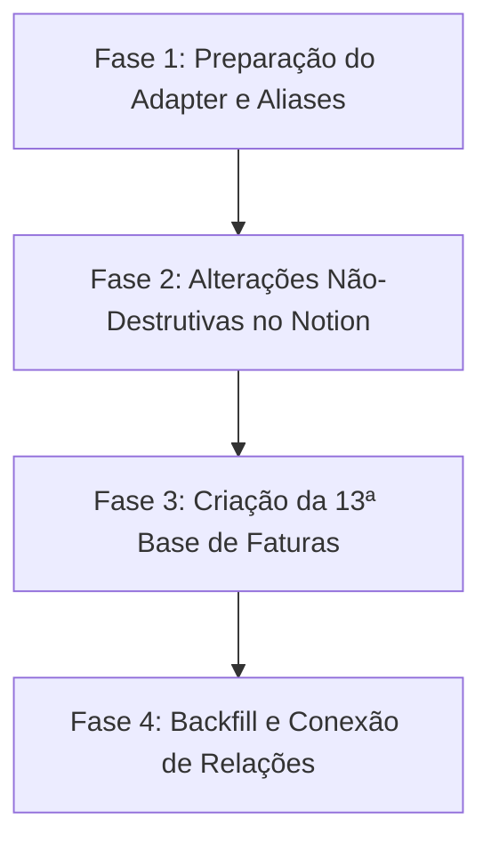

# Plano de Migração de Schema: Notion vs. Modelo de Domínio (V2.1)

> **Status:** Plano de Migração Arquitetural (Aprovado sobre o baseline `0b657453b274793b79a8343502f69a64f21c6277`)  
> **Modo de Operação:** Estritamente Planejado (Nenhuma mutação efetuada no Notion durante esta etapa)  
> **Estratégia de Risco:** Risco Zero de Perda de Dados (`Zero Data Loss`), Preservação de Campos Existentes e Tolerância a Aliases via Adapter.

---

## 1. Resumo Executivo e Princípios Norteadores

Este documento estabelece o plano formal e executável de migração e conformidade de schemas entre o workspace Notion atual (12 bases introspectadas + 1 base proposta) e o modelo de domínio canônico V2.1.

### 1.1 Princípios de Segurança e Integridade
1. **Preservação Absoluta de Dados (`Zero Data Loss`):** Nenhuma coluna, base ou registro existente será excluído ou sobrescrito de forma destrutiva. Propriedades customizadas criadas pelo usuário são preservadas integralmente via política de retenção.
2. **Desacoplamento via Adapter e Aliases (`MAP_ALIAS`):** Divergências cosméticas de nomenclatura (ex: `Conta` vs. `Nome da Conta`, `Lançamento` vs. `Descrição`) são resolvidas exclusivamente em memória e nos adapters da aplicação. Não é permitida a renomeação forçada no Notion, eliminando qualquer quebra em dashboards, rollups, fórmulas e visualizações do usuário.
3. **Generalização de Upstream (`UPSTREAM`):** Conceitos originalmente acoplados ao conector legado (ex: `Categoria Pierre`, `Valor Bruto Pierre`, `ID Pierre`) são generalizados no domínio para conceitos canônicos de provedor upstream (`Categoria da Fonte`, `Valor Bruto da Fonte`, `ID da Fonte`), mantendo compatibilidade bidirecional com os nomes físicos existentes.
4. **Preservação de Texto Livre (`rich_text`):** Conforme diretrizes mandatárias, os campos `Instituição` (em Contas e Investimentos) e `Liquidez` (em Investimentos) permanecem estritamente como `rich_text`, garantindo a flexibilidade de cadastrar novas instituições sem dependência de mutação de enums no Notion.
5. **Title Unívoco em Movimentações:** A propriedade `Movimentação` é mantida como o único `title` da base de Movimentações de Investimentos, sendo terminantemente vedada a criação de um segundo campo `title` redundante ("Identificador").
6. **Complemento Contratual Prévio da 13ª Base:** Antes de qualquer provisionamento da base de *Faturas / Ciclos de Cartão*, o contrato é estendido com delimitação explícita de início/fim de ciclo, moeda, chave única estável e metadados de confiabilidade/origem.

### 1.2 Taxonomia das Ações de Migração
Toda e qualquer propriedade das 13 bases é categorizada exclusivamente sob quatro ações:
* **`KEEP_AS_IS`:** O schema atual do Notion já atende perfeitamente ao domínio, ou a propriedade existente é mantida integralmente por conveniência técnica ou preferência de texto livre.
* **`MAP_ALIAS`:** A propriedade existente no Notion possui denominação diferente da nomenclatura canônica interna, mas compartilha o mesmo significado semântico e tipo compatível. O adapter do domínio absorve o mapeamento sem alterar o Notion.
* **`ALTER_SCHEMA`:** Alteração não-destrutiva de schema necessária diretamente no Notion, consistindo na inclusão de novas opções válidas em selects/multi-selects ou ampliação controlada de opções.
* **`CREATE_NEW`:** Criação de nova propriedade física no Notion, representando uma capacidade nova que inexiste no modelo atual e que é indispensável para auditoria, integridade matemática ou conciliação automatizada.

---

## 2. Resumo Quantitativo Consolidado

### 2.1 Visão Global por Ação

| Ação de Migração | Quantidade Total | Percentual | Descrição Operacional |
| :--- | :---: | :---: | :--- |
| **`KEEP_AS_IS`** | **86** | 33.2% | Propriedades inalteradas (compatibilidade nativa ou preservação de dados existentes) |
| **`MAP_ALIAS`** | **91** | 35.1% | Mapeadas por alias no adapter da aplicação (zero alteração no Notion) |
| **`ALTER_SCHEMA`** | **20** | 7.7% | Inclusão de novas opções em campos select/multi-select existentes |
| **`CREATE_NEW`** | **62** | 23.9% | Novas propriedades (43 em bases existentes + 19 na 13ª base de Faturas) |
| **TOTAL GERAL** | **259** | 100% | Total de mapeamentos auditados em 13 Data Sources |

### 2.2 Distribuição por Data Source

| Data Source | Env Key | Total | KEEP_AS_IS | MAP_ALIAS | ALTER_SCHEMA | CREATE_NEW |
| :--- | :--- | :---: | :---: | :---: | :---: | :---: |
| 1. Contas | `NOTION_DS_ACCOUNTS` | 21 | 7 | 7 | 3 | 4 |
| 2. Transações | `NOTION_DS_TRANSACTIONS` | 26 | 12 | 2 | 3 | 9 |
| 3. Categorias Financeiras | `NOTION_DS_CATEGORIES` | 9 | 5 | 1 | 3 | 0 |
| 4. Regras de Classificação | `NOTION_DS_RULES` | 27 | 11 | 13 | 1 | 2 |
| 5. Contas Fixas | `NOTION_DS_FIXED_BILLS` | 20 | 5 | 10 | 1 | 4 |
| 6. Obrigações Mensais | `NOTION_DS_MONTHLY_OBLIGATIONS` | 15 | 6 | 8 | 1 | 0 |
| 7. Investimentos | `NOTION_DS_INVESTMENTS` | 20 | 7 | 5 | 3 | 5 |
| 8. Movimentações de Investimentos | `NOTION_DS_INVESTMENT_MOVEMENTS` | 19 | 8 | 7 | 1 | 3 |
| 9. Planejamento Mensal | `NOTION_DS_MONTHLY_BUDGET` | 20 | 3 | 13 | 0 | 4 |
| 10. Metas Financeiras | `NOTION_DS_FINANCIAL_GOALS` | 11 | 8 | 3 | 0 | 0 |
| 11. Fechamentos Mensais | `NOTION_DS_MONTHLY_CLOSINGS` | 28 | 7 | 12 | 2 | 7 |
| 12. Log de Sincronização | `NOTION_DS_SYNC_LOG` | 29 | 7 | 10 | 2 | 10 |
| 13. Faturas / Ciclos de Cartão | `NOTION_DS_CARD_BILLS` | 19 | 0 | 0 | 0 | 19 |
| **TOTAL** | — | **259** | **86** | **91** | **20** | **62** |

---

## 3. Diagnóstico e Plano Detalhado por Data Source

### 3.1 Contas (`NOTION_DS_ACCOUNTS`)
* **Data Source ID:** `a17455aa-4793-4001-9570-21b7f84ff4a2`
* **Finalidade:** Cadastro mestre de contas bancárias, cartões, poupanças e carteiras.

| Propriedade | Estado Atual (Notion) | Estado Alvo (Domínio) | Ação | Justificativa Técnica | Risco de Perda | Backfill Necessário | Impacto em Views | Rollback |
| :--- | :--- | :--- | :---: | :--- | :---: | :--- | :--- | :--- |
| `Conta` | `title` | `title` (Nome da Conta) | `MAP_ALIAS` | Reutiliza o título existente `Conta` via alias sem alterar o Notion. | Nenhum | Não | Nenhum | Descartar alias no adapter |
| `Fonte` | `select` | `select` | `ALTER_SCHEMA` | Adicionar opção `Migração` ao select mantendo as existentes (`Pierre`, `Manual`, `Outra`). | Nenhum | Não | Nenhum | Remover opção `Migração` |
| `ID da fonte` | `rich_text` | `rich_text` | `KEEP_AS_IS` | Identificador unívoco existente e compatível. | Nenhum | Não | Nenhum | N/A |
| `Moeda` | `select` | `select` | `ALTER_SCHEMA` | Adicionar opção `EUR` ao select mantendo `BRL` e `USD`. | Nenhum | Não | Nenhum | Remover opção `EUR` |
| `Instituição` | `rich_text` | `rich_text` | `KEEP_AS_IS` | Mantido como `rich_text` conforme regra mandatória (flexibilidade para nomes livres). | Nenhum | Não | Nenhum | N/A |
| `Tipo` | `select` | `select` (Tipo de Conta) | `ALTER_SCHEMA` | Mapeado via alias `Tipo`; adicionar opções canônicas ausentes: `Conta Poupança`, `Conta de Investimento`, `Carteira Dinheiro`. | Nenhum | Não | Nenhum | Remover opções adicionadas |
| `Saldo` | `number` | `number` (Saldo Atual) | `MAP_ALIAS` | Mapeado via alias `Saldo` no adapter para saldo disponível. | Nenhum | Não | Nenhum | Reverter mapeamento de alias |
| `Limite contratado` | `number` | `number` | `KEEP_AS_IS` | Nome e tipo exatos. | Nenhum | Não | Nenhum | N/A |
| `Limite personalizado` | `number` | `number` | `KEEP_AS_IS` | Nome e tipo exatos. | Nenhum | Não | Nenhum | N/A |
| `Limite disponível` | `number` | `number` | `KEEP_AS_IS` | Nome e tipo exatos. | Nenhum | Não | Nenhum | N/A |
| `Atualizado em` | `date` | `date` (Última Sincronização) | `MAP_ALIAS` | Reutiliza `Atualizado em` via alias para registro temporal. | Nenhum | Não | Nenhum | Reverter alias |
| `Inclui no caixa` | `checkbox` | `checkbox` (Incluir no Caixa) | `MAP_ALIAS` | Reutiliza a propriedade existente `Inclui no caixa` via alias sem criar duplicata. | Nenhum | Não | Nenhum | Reverter alias |
| `Inclui no patrimônio` | `checkbox` | `checkbox` (Incluir no Patrimônio) | `MAP_ALIAS` | Reutiliza a propriedade existente `Inclui no patrimônio` via alias sem criar duplicata. | Nenhum | Não | Nenhum | Reverter alias |
| `Ativa` | `checkbox` | `checkbox` | `KEEP_AS_IS` | Campo de controle do usuário preservado integralmente. | Nenhum | Não | Nenhum | N/A |
| `Observações` | `rich_text` | `rich_text` | `KEEP_AS_IS` | Campo descritivo do usuário preservado. | Nenhum | Não | Nenhum | N/A |
| `Limite Operacional Usado` | Inexistente | `number` | `CREATE_NEW` | Saldo devedor operacional computado (`customizedCreditLimit - availableCreditLimit`). | Nenhum | Sim: calcular a partir dos limites | Criação de coluna | Ocultar ou remover propriedade |
| `Limite Usado da Fonte (Bruto)` | Inexistente | `number` | `CREATE_NEW` | Valor bruto original da fonte bancária para auditoria de divergência. | Nenhum | Sim: preenchimento no sync | Criação de coluna | Ocultar ou remover propriedade |
| `Dia de Fechamento` | Inexistente | `number` | `CREATE_NEW` | Dia do mês de corte da fatura (1 a 31). | Nenhum | Sim: preenchimento manual/sync | Criação de coluna | Ocultar ou remover propriedade |
| `Dia de Vencimento` | Inexistente | `number` | `CREATE_NEW` | Dia do mês de vencimento da fatura (1 a 31). | Nenhum | Sim: preenchimento manual/sync | Criação de coluna | Ocultar ou remover propriedade |

---

### 3.2 Transações (`NOTION_DS_TRANSACTIONS`)
* **Data Source ID:** `1fc274bd-b73a-45b1-a902-09aba993f199`
* **Finalidade:** Registro de todas as transações financeiras de entrada e saída.

| Propriedade | Estado Atual (Notion) | Estado Alvo (Domínio) | Ação | Justificativa Técnica | Risco de Perda | Backfill Necessário | Impacto em Views | Rollback |
| :--- | :--- | :--- | :---: | :--- | :---: | :--- | :--- | :--- |
| `Lançamento` | `title` | `title` (Descrição) | `MAP_ALIAS` | Reutiliza o título existente `Lançamento` como descrição principal via alias. | Nenhum | Não | Nenhum | Descartar alias |
| `Fonte` | `select` | `select` | `KEEP_AS_IS` | Conector ou sistema de origem perfeitamente aderente. | Nenhum | Não | Nenhum | N/A |
| `ID da fonte` | `rich_text` | `rich_text` | `KEEP_AS_IS` | Identificador unívoco de transação preservado. | Nenhum | Não | Nenhum | N/A |
| `Moeda` | `select` | `select` | `ALTER_SCHEMA` | Adicionar opção `EUR` ao select mantendo `BRL` e `USD`. | Nenhum | Não | Nenhum | Remover opção `EUR` |
| `Data` | `date` | `date` | `KEEP_AS_IS` | Nome e tipo exatos. | Nenhum | Não | Nenhum | N/A |
| `Valor` | `number` | `number` | `KEEP_AS_IS` | Valor absoluto em moeda decimal exata. | Nenhum | Não | Nenhum | N/A |
| `Movimento` | `select` | `select` | `KEEP_AS_IS` | Entrada e Saída de caixa preservados. | Nenhum | Não | Nenhum | N/A |
| `Conta` | `relation` | `relation` | `KEEP_AS_IS` | Vínculo estrutural com a base de Contas. | Nenhum | Não | Nenhum | N/A |
| `Categoria` | `relation` | `relation` | `KEEP_AS_IS` | Vínculo estrutural com a base de Categorias. | Nenhum | Não | Nenhum | N/A |
| `Categoria Pierre` | `rich_text` | `rich_text` (Categoria da Fonte) | `MAP_ALIAS` | Generaliza conceito para `Categoria da Fonte` mantendo o nome físico `Categoria Pierre` via alias. | Nenhum | Não | Nenhum | Reverter alias |
| `Descrição original` | `rich_text` | `rich_text` | `KEEP_AS_IS` | Texto bruto original do extrato. | Nenhum | Não | Nenhum | N/A |
| `Natureza` | `select` | `select` (Natureza Econômica) | `ALTER_SCHEMA` | Mapeado via alias `Natureza`; adicionar opções contábeis canônicas ausentes. | Nenhum | Não | Nenhum | Remover opções novas |
| `Status` | `select` | `select` (Status Banco) | `ALTER_SCHEMA` | Mapeado via alias `Status`; adicionar opções `Liquidado` e `Estornado`. | Nenhum | Não | Nenhum | Remover opções novas |
| `Conta no orçamento` | `checkbox` | `checkbox` | `KEEP_AS_IS` | Propriedade do usuário preservada integralmente. | Nenhum | Não | Nenhum | N/A |
| `Conta como aporte` | `checkbox` | `checkbox` | `KEEP_AS_IS` | Propriedade do usuário preservada integralmente. | Nenhum | Não | Nenhum | N/A |
| `Revisado` | `checkbox` | `checkbox` | `KEEP_AS_IS` | Flag de conferência manual preservada. | Nenhum | Não | Nenhum | N/A |
| `Observações` | `rich_text` | `rich_text` | `KEEP_AS_IS` | Anotações do usuário preservadas. | Nenhum | Não | Nenhum | N/A |
| `Hash Canônico` | Inexistente | `rich_text` | `CREATE_NEW` | Fingerprint SHA-256 (64 hex) para detecção atômica de mutação no payload. | Nenhum | Sim: gerar hash para transações ativas | Nova coluna de auditoria | Remover propriedade |
| `Valor Bruto da Fonte` | Inexistente | `number` | `CREATE_NEW` | Valor exato retornado pelo conector original com sinal. | Nenhum | Sim: preencher no sync | Nova coluna de auditoria | Remover propriedade |
| `Efeito Orçamentário` | Inexistente | `select` | `CREATE_NEW` | Enums: `INCOME`, `EXPENSE`, `REVERSAL`, `NEUTRAL`. | Nenhum | Sim: inferir pelas regras | Nova coluna | Remover propriedade |
| `Propósito de Alocação` | Inexistente | `select` | `CREATE_NEW` | Finalidade: `INVESTMENT_RESERVE`, `OPERATIONAL_CASH`, etc. | Nenhum | Não: preenchido nas novas | Nova coluna | Remover propriedade |
| `Contribuição Meta Poupança` | Inexistente | `number` | `CREATE_NEW` | Valor computável na meta de poupança (ex: aportes). | Nenhum | Sim: inferir para aportes | Nova coluna | Remover propriedade |
| `Fatura Vinculada` | Inexistente | `relation` | `CREATE_NEW` | Relação bidirecional com a 13ª base de Faturas (criada após provisionamento da base 13). | Nenhum | Sim: vincular compras aos ciclos | Nova relação | Desvincular relação |
| `Status de Revisão` | Inexistente | `select` | `CREATE_NEW` | Status: `AUTO_CONFIRMED`, `PENDING_REVIEW`, `MANUALLY_VALIDATED`, `LEGACY_UNVERIFIED`. | Nenhum | Sim: marcar históricas como LEGACY | Nova coluna | Remover propriedade |
| `Motivo da Revisão` | Inexistente | `rich_text` | `CREATE_NEW` | Justificativa técnica ou regra que disparou a exigência de revisão humana. | Nenhum | Não | Nova coluna | Remover propriedade |
| `HMAC Contraparte` | Inexistente | `rich_text` | `CREATE_NEW` | Hash HMAC-SHA256 do CPF/CNPJ para matching seguro sem expor PII. | Nenhum | Não | Nova coluna | Remover propriedade |

---

### 3.3 Categorias Financeiras (`NOTION_DS_CATEGORIES`)
* **Data Source ID:** `eb8ef2e3-cfd3-437e-b3f5-6a47dec913b4`
* **Finalidade:** Categorização de despesas e receitas do orçamento.

| Propriedade | Estado Atual (Notion) | Estado Alvo (Domínio) | Ação | Justificativa Técnica | Risco de Perda | Backfill Necessário | Impacto em Views | Rollback |
| :--- | :--- | :--- | :---: | :--- | :---: | :--- | :--- | :--- |
| `Categoria` | `title` | `title` (Nome da Categoria) | `MAP_ALIAS` | Reutiliza `Categoria` como título principal via alias. | Nenhum | Não | Nenhum | Descartar alias |
| `Variabilidade` | `select` | `select` | `ALTER_SCHEMA` | Adicionar opção `Ocasional` ao select mantendo `Fixa` e `Variável`. | Nenhum | Não | Nenhum | Remover opção `Ocasional` |
| `Natureza padrão` | `select` | `select` | `ALTER_SCHEMA` | Adicionar naturezas contábeis canônicas ao select. | Nenhum | Não | Nenhum | Remover opções novas |
| `Grupo` | `select` | `select` (Grupo Orçamentário) | `ALTER_SCHEMA` | Mapeado via alias `Grupo`; adicionar grupos macro: `Essencial (Necessidades)`, `Estilo de Vida (Desejos)`, `Investimentos / Metas`, `Estrutural / Neutro`. | Nenhum | Não | Nenhum | Remover opções novas |
| `Ativa` | `checkbox` | `checkbox` | `KEEP_AS_IS` | Propriedade existente preservada. | Nenhum | Não | Nenhum | N/A |
| `Conta no orçamento` | `checkbox` | `checkbox` | `KEEP_AS_IS` | Propriedade existente preservada. | Nenhum | Não | Nenhum | N/A |
| `Observações` | `rich_text` | `rich_text` | `KEEP_AS_IS` | Anotações do usuário preservadas. | Nenhum | Não | Nenhum | N/A |
| `Contas fixas` | `relation` | `relation` | `KEEP_AS_IS` | Relação reversa com Contas Fixas preservada. | Nenhum | Não | Nenhum | N/A |
| `Transações` | `relation` | `relation` | `KEEP_AS_IS` | Relação reversa com Transações preservada. | Nenhum | Não | Nenhum | N/A |

---

### 3.4 Regras de Classificação (`NOTION_DS_RULES`)
* **Data Source ID:** `b36ba8da-9601-4456-a21f-5d9804110fbb`
* **Finalidade:** Motor de regras determinísticas de reconciliação e auto-classificação.

| Propriedade | Estado Atual (Notion) | Estado Alvo (Domínio) | Ação | Justificativa Técnica | Risco de Perda | Backfill Necessário | Impacto em Views | Rollback |
| :--- | :--- | :--- | :---: | :--- | :---: | :--- | :--- | :--- |
| `Regra` | `title` | `title` (Nome da Regra) | `MAP_ALIAS` | Reutiliza `Regra` via alias. | Nenhum | Não | Nenhum | Descartar alias |
| `Prioridade` | `number` | `number` | `KEEP_AS_IS` | Ordem de execução (1 = máxima). | Nenhum | Não | Nenhum | N/A |
| `Ativa` | `checkbox` | `checkbox` | `KEEP_AS_IS` | Habilita/desabilita a regra. | Nenhum | Não | Nenhum | N/A |
| `Auto aplicar` | `checkbox` | `checkbox` | `KEEP_AS_IS` | Autorização de auto-aplicação. | Nenhum | Não | Nenhum | N/A |
| `Exigir revisão` | `checkbox` | `checkbox` | `KEEP_AS_IS` | Flag de revisão humana compulsória. | Nenhum | Não | Nenhum | N/A |
| `Válida de` | `date` | `date` | `KEEP_AS_IS` | Início de vigência. | Nenhum | Não | Nenhum | N/A |
| `Válida até` | `date` | `date` | `KEEP_AS_IS` | Término de vigência. | Nenhum | Não | Nenhum | N/A |
| `Contraparte contém` | `rich_text` | `rich_text` (Condição: Contraparte) | `MAP_ALIAS` | Mapeado via alias no adapter. | Nenhum | Não | Nenhum | Reverter alias |
| `Descrição contém` | `rich_text` | `rich_text` (Condição: Descrição) | `MAP_ALIAS` | Mapeado via alias no adapter. | Nenhum | Não | Nenhum | Reverter alias |
| `Movimento esperado` | `select` | `select` (Condição: Movimento) | `MAP_ALIAS` | Mapeado via alias no adapter. | Nenhum | Não | Nenhum | Reverter alias |
| `Conta origem` | `relation` | `relation` (Condição: Conta) | `MAP_ALIAS` | Mapeado via alias no adapter. | Nenhum | Não | Nenhum | Reverter alias |
| `Categoria Pierre` | `rich_text` | `rich_text` (Condição: Categoria da Fonte) | `MAP_ALIAS` | Generalizado para Categoria da Fonte mantendo o nome físico via alias. | Nenhum | Não | Nenhum | Reverter alias |
| `Valor exato` | `number` | `number` (Condição: Valor Exato) | `MAP_ALIAS` | Mapeado via alias no adapter. | Nenhum | Não | Nenhum | Reverter alias |
| `Tolerância` | `number` | `number` (Condição: Tolerância Valor) | `MAP_ALIAS` | Mapeado via alias no adapter. | Nenhum | Não | Nenhum | Reverter alias |
| `Valor mínimo` | `number` | `number` (Condição: Valor Mínimo) | `MAP_ALIAS` | Mapeado via alias no adapter. | Nenhum | Não | Nenhum | Reverter alias |
| `Valor máximo` | `number` | `number` (Condição: Valor Máximo) | `MAP_ALIAS` | Mapeado via alias no adapter. | Nenhum | Não | Nenhum | Reverter alias |
| `Dia mínimo` | `number` | `number` (Condição: Dia Mês Início) | `MAP_ALIAS` | Mapeado via alias no adapter. | Nenhum | Não | Nenhum | Reverter alias |
| `Dia máximo` | `number` | `number` (Condição: Dia Mês Fim) | `MAP_ALIAS` | Mapeado via alias no adapter. | Nenhum | Não | Nenhum | Reverter alias |
| `Natureza resultante` | `select` | `select` (Atribuir: Natureza) | `ALTER_SCHEMA` | Mapeado via alias `Natureza resultante`; adicionar opções canônicas de naturezas contábeis. | Nenhum | Não | Nenhum | Remover opções novas |
| `Categoria resultante` | `relation` | `relation` (Atribuir: Categoria) | `MAP_ALIAS` | Mapeado via alias no adapter. | Nenhum | Não | Nenhum | Reverter alias |
| `Conta como aporte` | `checkbox` | `checkbox` | `KEEP_AS_IS` | Campo de controle preservado. | Nenhum | Não | Nenhum | N/A |
| `Conta no orçamento` | `checkbox` | `checkbox` | `KEEP_AS_IS` | Campo de controle preservado. | Nenhum | Não | Nenhum | N/A |
| `Destino / contexto` | `rich_text` | `rich_text` | `KEEP_AS_IS` | Campo descritivo preservado. | Nenhum | Não | Nenhum | N/A |
| `Observações` | `rich_text` | `rich_text` | `KEEP_AS_IS` | Anotações preservadas. | Nenhum | Não | Nenhum | N/A |
| `Tipo` | `select` | `select` | `KEEP_AS_IS` | Classificador existente preservado. | Nenhum | Não | Nenhum | N/A |
| `Atribuir: Efeito Orçamento` | Inexistente | `select` | `CREATE_NEW` | Permite atribuir `INCOME`, `EXPENSE`, `REVERSAL`, `NEUTRAL` diretamente pela regra. | Nenhum | Não | Nova coluna | Remover propriedade |
| `Atribuir: Alocação` | Inexistente | `select` | `CREATE_NEW` | Permite atribuir a finalidade (ex: reserva ou operacional) via regra. | Nenhum | Não | Nova coluna | Remover propriedade |

---

### 3.5 Contas Fixas (`NOTION_DS_FIXED_BILLS`)
* **Data Source ID:** `49e909f9-7a08-4114-bc85-0bb500e3dfb9`
* **Finalidade:** Cadastro permanente de compromissos recorrentes e assinaturas.

| Propriedade | Estado Atual (Notion) | Estado Alvo (Domínio) | Ação | Justificativa Técnica | Risco de Perda | Backfill Necessário | Impacto em Views | Rollback |
| :--- | :--- | :--- | :---: | :--- | :---: | :--- | :--- | :--- |
| `Conta fixa` | `title` | `title` (Nome da Conta Fixa) | `MAP_ALIAS` | Reutiliza `Conta fixa` via alias no adapter. | Nenhum | Não | Nenhum | Descartar alias |
| `Valor esperado` | `number` | `number` (Valor Previsto) | `MAP_ALIAS` | Reutiliza o campo existente `Valor esperado` como equivalente de `Valor Previsto` sem duplicar. | Nenhum | Não | Nenhum | Reverter alias |
| `Dia do vencimento` | `number` | `number` (Dia de Vencimento) | `MAP_ALIAS` | Reutiliza o campo existente `Dia do vencimento` sem duplicar. | Nenhum | Não | Nenhum | Reverter alias |
| `Tolerância de valor` | `number` | `number` (Tolerância R$) | `MAP_ALIAS` | Reutiliza o campo existente `Tolerância de valor` sem duplicar. | Nenhum | Não | Nenhum | Reverter alias |
| `Regra de identificação` | `rich_text` | `rich_text` (Padrão Identificação) | `MAP_ALIAS` | Reutiliza o campo existente `Regra de identificação` para matching. | Nenhum | Não | Nenhum | Reverter alias |
| `Periodicidade` | `select` | `select` | `KEEP_AS_IS` | Mensal, Bimestral, etc. mantidos. | Nenhum | Não | Nenhum | N/A |
| `Forma de pagamento` | `select` | `select` | `ALTER_SCHEMA` | Adicionar opções ausentes: `Cartão de Crédito` e `Débito em Conta`. | Nenhum | Não | Nenhum | Remover opções novas |
| `Conta padrão` | `relation` | `relation` | `KEEP_AS_IS` | Conta de débito usual preservada. | Nenhum | Não | Nenhum | N/A |
| `Categoria` | `relation` | `relation` | `KEEP_AS_IS` | Categoria orçamentária preservada. | Nenhum | Não | Nenhum | N/A |
| `Ativa` | `checkbox` | `checkbox` | `KEEP_AS_IS` | Flag de geração no período preservada. | Nenhum | Não | Nenhum | N/A |
| `Gerar obrigação` | `checkbox` | `checkbox` | `KEEP_AS_IS` | Automação de ciclo preservada. | Nenhum | Não | Nenhum | N/A |
| `Observações` | `rich_text` | `rich_text` (Observações / Contrato) | `MAP_ALIAS` | Reutiliza `Observações` via alias. | Nenhum | Não | Nenhum | Reverter alias |
| `Competência Âncora` | Inexistente | `rich_text` | `CREATE_NEW` | Mês de referência inicial (ex: `2026-01`) para controle de ciclo. | Nenhum | Sim: preencher competência atual | Nova coluna | Remover propriedade |
| `Última Competência Gerada` | Inexistente | `rich_text` | `CREATE_NEW` | Último mês gerado em Obrigações para idempotência de geração. | Nenhum | Sim: registrar último ciclo | Nova coluna | Remover propriedade |
| `Data de Início` | Inexistente | `date` | `CREATE_NEW` | Vigência inicial do contrato. | Nenhum | Não | Nova coluna | Remover propriedade |
| `Data de Término` | Inexistente | `date` | `CREATE_NEW` | Vigência final do contrato. | Nenhum | Não | Nova coluna | Remover propriedade |

---

### 3.6 Obrigações Mensais (`NOTION_DS_MONTHLY_OBLIGATIONS`)
* **Data Source ID:** `5c59339c-7cfc-4f17-9355-803a4136f6b8`
* **Finalidade:** Instâncias mensais das contas fixas a pagar e conciliar.

| Propriedade | Estado Atual (Notion) | Estado Alvo (Domínio) | Ação | Justificativa Técnica | Risco de Perda | Backfill Necessário | Impacto em Views | Rollback |
| :--- | :--- | :--- | :---: | :--- | :---: | :--- | :--- | :--- |
| `Obrigação` | `title` | `title` (Identificador) | `MAP_ALIAS` | Reutiliza `Obrigação` como título principal via alias. | Nenhum | Não | Nenhum | Descartar alias |
| `Conta fixa` | `relation` | `relation` | `KEEP_AS_IS` | Relação com o cadastro permanente preservada. | Nenhum | Não | Nenhum | N/A |
| `Valor previsto` | `number` | `number` | `KEEP_AS_IS` | Valor esperado exato. | Nenhum | Não | Nenhum | N/A |
| `Status` | `select` | `select` | `ALTER_SCHEMA` | Adicionar opções ausentes: `Revisão Necessária` e `Cancelada`. | Nenhum | Não | Nenhum | Remover opções novas |
| `Valor pago` | `number` | `number` | `KEEP_AS_IS` | Valor liquidado exato. | Nenhum | Não | Nenhum | N/A |
| `Vencimento` | `date` | `date` (Data de Vencimento) | `MAP_ALIAS` | Reutiliza `Vencimento` via alias. | Nenhum | Não | Nenhum | Reverter alias |
| `Pago em` | `date` | `date` (Data do Pagamento) | `MAP_ALIAS` | Reutiliza `Pago em` via alias. | Nenhum | Não | Nenhum | Reverter alias |
| `Validado automaticamente` | `checkbox` | `checkbox` | `KEEP_AS_IS` | Flag de conferência inequívoca. | Nenhum | Não | Nenhum | N/A |
| `Observações` | `rich_text` | `rich_text` (Observações / Conflitos) | `MAP_ALIAS` | Reutiliza `Observações` via alias. | Nenhum | Não | Nenhum | Reverter alias |
| `Transação conciliada` | `relation` | `relation` (Transação Vinculada) | `MAP_ALIAS` | Reutiliza `Transação conciliada` sem criar relação duplicada. | Nenhum | Não | Nenhum | Reverter alias |
| `Referência` | `date` | `rich_text` / `date` (Competência) | `MAP_ALIAS` | Reutiliza a data existente `Referência` para extração canônica de YYYY-MM. | Nenhum | Não | Nenhum | Reverter alias |
| `Conta` | `relation` | `relation` | `KEEP_AS_IS` | Conta de débito efetiva preservada. | Nenhum | Não | Nenhum | N/A |
| `Origem` | `select` | `select` | `KEEP_AS_IS` | Origem do registro preservada. | Nenhum | Não | Nenhum | N/A |

---

### 3.7 Investimentos (`NOTION_DS_INVESTMENTS`)
* **Data Source ID:** `db609202-8cb8-4ce9-8dd7-c01d9de6b6cb`
* **Finalidade:** Posições patrimoniais custodiadas de ativos e investimentos.

| Propriedade | Estado Atual (Notion) | Estado Alvo (Domínio) | Ação | Justificativa Técnica | Risco de Perda | Backfill Necessário | Impacto em Views | Rollback |
| :--- | :--- | :--- | :---: | :--- | :---: | :--- | :--- | :--- |
| `Ativo` | `title` | `title` | `KEEP_AS_IS` | Nome identificador do ativo preservado. | Nenhum | Não | Nenhum | N/A |
| `Moeda` | `select` | `select` | `ALTER_SCHEMA` | Adicionar opções ausentes: `BTC` e `EUR`. | Nenhum | Não | Nenhum | Remover opções novas |
| `Quantidade` | `number` | `number` | `KEEP_AS_IS` | Quantidade custodiada com suporte decimal arbitrário. | Nenhum | Não | Nenhum | N/A |
| `Data da avaliação` | `date` | `date` | `KEEP_AS_IS` | Timestamp da cotação a mercado. | Nenhum | Não | Nenhum | N/A |
| `Instituição` | `rich_text` | `rich_text` (Instituição / Corretora) | `KEEP_AS_IS` | Mantido como `rich_text` conforme regra mandatória (flexibilidade para custodiantes sem enum rígido). | Nenhum | Não | Nenhum | N/A |
| `Liquidez` | `rich_text` | `rich_text` | `KEEP_AS_IS` | Mantido como `rich_text` conforme regra mandatória (prazos, carências e vencimentos livres). | Nenhum | Não | Nenhum | N/A |
| `Classe` | `select` | `select` (Classe do Ativo) | `ALTER_SCHEMA` | Mapeado via alias `Classe`; adicionar classes: `Ação`, `FII`, `ETF`, `Previdência Privada`, `Tesouro Direto`, `Outros`. *Caixa Reservado NÃO é incluído.* | Nenhum | Não | Nenhum | Remover opções novas |
| `Custo acumulado` | `number` | `number` (Custo Base Total) | `MAP_ALIAS` | Reutiliza `Custo acumulado` como base contábil de aquisição. | Nenhum | Não | Nenhum | Reverter alias |
| `Valor atual` | `number` | `number` (Valor de Mercado Atual) | `MAP_ALIAS` | Reutiliza `Valor atual` como valor a mercado da posição. | Nenhum | Não | Nenhum | Reverter alias |
| `Fonte do preço` | `select` | `select` (Fonte da Avaliação) | `ALTER_SCHEMA` | Mapeado via alias `Fonte do preço`; adicionar opções: `B3`, `Cripto API`, `Tesouro Direto`. | Nenhum | Não | Nenhum | Remover opções novas |
| `ID da fonte` | `rich_text` | `rich_text` (ID do Ativo na Fonte) | `MAP_ALIAS` | Reutiliza `ID da fonte` para chave de sincronização do ativo. | Nenhum | Não | Nenhum | Reverter alias |
| `Inclui no patrimônio` | `checkbox` | `checkbox` (Incluir no Patrimônio) | `MAP_ALIAS` | Reutiliza a propriedade existente `Inclui no patrimônio`. | Nenhum | Não | Nenhum | Reverter alias |
| `Observações` | `rich_text` | `rich_text` | `KEEP_AS_IS` | Anotações preservadas. | Nenhum | Não | Nenhum | N/A |
| `Movimentações` | `relation` | `relation` | `KEEP_AS_IS` | Relação reversa com histórico de ordens preservada. | Nenhum | Não | Nenhum | N/A |
| `Custódia` | Inexistente | `select` | `CREATE_NEW` | Origem da custódia: `Custódia Conectada (Upstream)` ou `Custódia Externa (Manual)`. | Nenhum | Sim: definir padrão | Nova coluna | Remover propriedade |
| `Preço Médio Unitário (PMP)` | Inexistente | `number` | `CREATE_NEW` | PMP contábil derivado do motor de cost basis exato. | Nenhum | Sim: computar pelo cost basis | Nova coluna | Remover propriedade |
| `Lucro / Prejuízo Não Realizado` | Inexistente | `number` | `CREATE_NEW` | Ganho de capital não realizado (`Valor Mercado - Custo Base`). | Nenhum | Sim: computar pela posição | Nova coluna | Remover propriedade |
| `Retorno Não Realizado (%)` | Inexistente | `number` | `CREATE_NEW` | Rentabilidade percentual não realizada da posição. | Nenhum | Sim: computar pela posição | Nova coluna | Remover propriedade |
| `Conta Vinculada` | Inexistente | `relation` | `CREATE_NEW` | Associação opcional com conta corrente ou corretora em Contas. | Nenhum | Não | Nova relação | Desvincular relação |

---

### 3.8 Movimentações de Investimentos (`NOTION_DS_INVESTMENT_MOVEMENTS`)
* **Data Source ID:** `b19f56a4-e34f-42ec-9437-c5165b8725af`
* **Finalidade:** Histórico transacional de ordens, aportes, resgates e rendimentos de investimentos.

| Propriedade | Estado Atual (Notion) | Estado Alvo (Domínio) | Ação | Justificativa Técnica | Risco de Perda | Backfill Necessário | Impacto em Views | Rollback |
| :--- | :--- | :--- | :---: | :--- | :---: | :--- | :--- | :--- |
| `Movimentação` | `title` | `title` | `KEEP_AS_IS` | **Regra Mandatória:** `Movimentação` é o título existente da base; é vedada a criação de segundo title `Identificador`. | Nenhum | Não | Nenhum | N/A |
| `Preço unitário` | `number` | `number` | `KEEP_AS_IS` | Preço de execução da ordem preservado. | Nenhum | Não | Nenhum | N/A |
| `Conta origem` | `relation` | `relation` | `KEEP_AS_IS` | Conta debitada ou associada. | Nenhum | Não | Nenhum | N/A |
| `Ativo` | `relation` | `relation` (Ativo Vinculado) | `MAP_ALIAS` | Reutiliza a relação `Ativo` via alias. | Nenhum | Não | Nenhum | Reverter alias |
| `Tipo` | `select` | `select` (Tipo de Movimentação) | `ALTER_SCHEMA` | Mapeado via alias `Tipo`; adicionar opções: `Aporte de Capital`, `Resgate de Capital`, `Compra de Ativo`, `Venda de Ativo`, `Rendimento / Provento`, `Taxas e Impostos`, `Ajuste de Posição`. | Nenhum | Não | Nenhum | Remover opções novas |
| `Data` | `date` | `date` (Data da Operação) | `MAP_ALIAS` | Reutiliza `Data` via alias. | Nenhum | Não | Nenhum | Reverter alias |
| `Quantidade` | `number` | `number` (Quantidade Negociada) | `MAP_ALIAS` | Reutiliza `Quantidade` via alias com suporte a escalas fracionárias. | Nenhum | Não | Nenhum | Reverter alias |
| `Valor` | `number` | `number` (Valor Bruto da Operação) | `MAP_ALIAS` | Reutiliza o campo existente `Valor` como volume bruto da transação sem duplicar. | Nenhum | Não | Nenhum | Reverter alias |
| `Custos e taxas` | `number` | `number` | `KEEP_AS_IS` | Custos operacionais e impostos preservados. | Nenhum | Não | Nenhum | N/A |
| `Moeda` | `select` | `select` | `KEEP_AS_IS` | Moeda da operação preservada. | Nenhum | Não | Nenhum | N/A |
| `Observações` | `rich_text` | `rich_text` | `KEEP_AS_IS` | Anotações preservadas. | Nenhum | Não | Nenhum | N/A |
| `ID da fonte` | `rich_text` | `rich_text` | `KEEP_AS_IS` | Identificador da ordem na corretora. | Nenhum | Não | Nenhum | N/A |
| `Fonte` | `select` | `select` | `KEEP_AS_IS` | Conector ou origem da ordem. | Nenhum | Não | Nenhum | N/A |
| `Transação origem` | `relation` | `relation` (Transação Financeira) | `MAP_ALIAS` | Reutiliza `Transação origem` como vínculo bancário no extrato financeiro. | Nenhum | Não | Nenhum | Reverter alias |
| `Valor Líquido` | Inexistente | `number` | `CREATE_NEW` | Montante líquido financeiro efetivo após taxas (`Valor Bruto - Custos`). | Nenhum | Sim: calcular (`Valor - Custos`) | Nova coluna | Remover propriedade |
| `Conta Destino / Caixa` | Inexistente | `relation` | `CREATE_NEW` | Relação opcional com a conta creditada em resgates ou proventos. | Nenhum | Não | Nova relação | Desvincular relação |

---

### 3.9 Planejamento Mensal (`NOTION_DS_MONTHLY_BUDGET`)
* **Data Source ID:** `0c14523b-9e22-483a-8e63-4b3d0c31c7d5`
* **Finalidade:** Metas orçamentárias mensais por categoria e diretrizes de gastos/poupança.

| Propriedade | Estado Atual (Notion) | Estado Alvo (Domínio) | Ação | Justificativa Técnica | Risco de Perda | Backfill Necessário | Impacto em Views | Rollback |
| :--- | :--- | :--- | :---: | :--- | :---: | :--- | :--- | :--- |
| `Mês` | `title` | `title` (Competência YYYY-MM) | `MAP_ALIAS` | Reutiliza `Mês` como competência do planejamento via alias. | Nenhum | Não | Nenhum | Descartar alias |
| `Renda planejada` | `number` | `number` (Renda Prevista) | `MAP_ALIAS` | Reutiliza o campo existente `Renda planejada` sem criar redundância. | Nenhum | Não | Nenhum | Reverter alias |
| `Teto pessoal de crédito` | `number` | `number` (Teto Mensal Cartão) | `MAP_ALIAS` | Reutiliza o campo existente `Teto pessoal de crédito` sem duplicar. | Nenhum | Não | Nenhum | Reverter alias |
| `Aporte planejado` | `number` | `number` (Meta de Poupança/Aporte) | `MAP_ALIAS` | Reutiliza o campo existente `Aporte planejado` sem duplicar. | Nenhum | Não | Nenhum | Reverter alias |
| `Meta de poupança %` | `number` | `number` (Meta Taxa de Poupança %) | `MAP_ALIAS` | Reutiliza o percentual existente `Meta de poupança %` sem duplicar. | Nenhum | Não | Nenhum | Reverter alias |
| `Necessidades planejadas` | `number` | `number` (Meta Essencial) | `MAP_ALIAS` | Mantém coluna dedicada ao orçamento 50/30/20 para gastos essenciais. | Nenhum | Não | Nenhum | Reverter alias |
| `Desejos planejados` | `number` | `number` (Meta Estilo de Vida) | `MAP_ALIAS` | Mantém coluna dedicada para gastos discricionários. | Nenhum | Não | Nenhum | Reverter alias |
| `Reserva operacional` | `number` | `number` (Meta Reserva) | `MAP_ALIAS` | Mantém coluna dedicada para liquidez de caixa. | Nenhum | Não | Nenhum | Reverter alias |
| `Status` | `select` | `select` | `KEEP_AS_IS` | Status de planejamento do mês preservado. | Nenhum | Não | Nenhum | N/A |
| `Referência` | `date` | `date` | `KEEP_AS_IS` | Data âncora preservada. | Nenhum | Não | Nenhum | N/A |
| `Observações` | `rich_text` | `rich_text` | `KEEP_AS_IS` | Anotações orçamentárias preservadas. | Nenhum | Não | Nenhum | N/A |
| `Receitas Realizadas` | Inexistente | `number` | `CREATE_NEW` | Total consolidado de receitas operacionais líquidas realizadas no mês. | Nenhum | Sim: consolidar transações | Nova coluna | Remover propriedade |
| `Despesas Realizadas` | Inexistente | `number` | `CREATE_NEW` | Total consolidado de despesas operacionais realizadas no mês. | Nenhum | Sim: consolidar transações | Nova coluna | Remover propriedade |
| `Poupança Realizada` | Inexistente | `number` | `CREATE_NEW` | Volume financeiro total poupado e aportado no mês. | Nenhum | Sim: consolidar aportes | Nova coluna | Remover propriedade |
| `Compras Realizadas Cartão` | Inexistente | `number` | `CREATE_NEW` | Volume acumulado de compras realizadas no cartão no mês para monitorar o teto. | Nenhum | Sim: consolidar compras | Nova coluna | Remover propriedade |

---

### 3.10 Metas Financeiras (`NOTION_DS_FINANCIAL_GOALS`)
* **Data Source ID:** `b62903fe-ee4e-411f-8828-fd465f9aed91`
* **Finalidade:** Objetivos de médio/longo prazo (reserva, compra, aposentadoria, viagem).

| Propriedade | Estado Atual (Notion) | Estado Alvo (Domínio) | Ação | Justificativa Técnica | Risco de Perda | Backfill Necessário | Impacto em Views | Rollback |
| :--- | :--- | :--- | :---: | :--- | :---: | :--- | :--- | :--- |
| `Meta` | `title` | `title` | `KEEP_AS_IS` | Nome do objetivo financeiro preservado. | Nenhum | Não | Nenhum | N/A |
| `Valor alvo` | `number` | `number` | `KEEP_AS_IS` | Meta monetária almejada preservada. | Nenhum | Não | Nenhum | N/A |
| `Prazo` | `date` | `date` (Prazo Alvo) | `MAP_ALIAS` | Reutiliza o campo existente `Prazo` via alias. | Nenhum | Não | Nenhum | Reverter alias |
| `Valor atual` | `number` | `number` (Valor Atual Acumulado) | `MAP_ALIAS` | Reutiliza o campo existente `Valor atual` sem duplicar a propriedade. | Nenhum | Não | Nenhum | Reverter alias |
| `Aporte mensal planejado` | `number` | `number` | `KEEP_AS_IS` | Parâmetro de disciplina mensal preservado. | Nenhum | Não | Nenhum | N/A |
| `Tipo` | `select` | `select` | `KEEP_AS_IS` | Classificação da meta preservada. | Nenhum | Não | Nenhum | N/A |
| `Liquidez necessária` | `select` | `select` | `KEEP_AS_IS` | Perfil de liquidez preservado. | Nenhum | Não | Nenhum | N/A |
| `Prioridade` | `select` | `select` | `KEEP_AS_IS` | Importância relativa da meta preservada. | Nenhum | Não | Nenhum | N/A |
| `Status` | `select` | `select` | `KEEP_AS_IS` | Andamento da meta preservado. | Nenhum | Não | Nenhum | N/A |
| `Observações` | `rich_text` | `rich_text` | `KEEP_AS_IS` | Anotações da meta preservadas. | Nenhum | Não | Nenhum | N/A |

---

### 3.11 Fechamentos Mensais (`NOTION_DS_MONTHLY_CLOSINGS`)
* **Data Source ID:** `74ff9360-514c-4fde-a366-d7a1b726b94c`
* **Finalidade:** DRE pessoal e consolidação patrimonial trancada a cada mês.

| Propriedade | Estado Atual (Notion) | Estado Alvo (Domínio) | Ação | Justificativa Técnica | Risco de Perda | Backfill Necessário | Impacto em Views | Rollback |
| :--- | :--- | :--- | :---: | :--- | :---: | :--- | :--- | :--- |
| `Fechamento` | `title` | `title` (Mês de Referência) | `MAP_ALIAS` | Reutiliza o título existente `Fechamento` (YYYY-MM) via alias. | Nenhum | Não | Nenhum | Descartar alias |
| `Status` | `select` | `select` (Status do Fechamento) | `ALTER_SCHEMA` | Mapeado via alias `Status`; adicionar opções: `Pré-fechado` e `Fechado Auditado`. | Nenhum | Não | Nenhum | Remover opções novas |
| `Qualidade dos dados` | `select` | `select` | `ALTER_SCHEMA` | Adicionar opções: `Excelente`, `Bom`, `Atenção Necessária`, `Crítico`. | Nenhum | Não | Nenhum | Remover opções novas |
| `Contas fixas pagas` | `number` | `number` | `KEEP_AS_IS` | Métrica existente preservada. | Nenhum | Não | Nenhum | N/A |
| `Contas fixas pendentes` | `number` | `number` | `KEEP_AS_IS` | Métrica existente preservada. | Nenhum | Não | Nenhum | N/A |
| `Itens para revisão` | `number` | `number` | `KEEP_AS_IS` | Métrica de pendências preservada. | Nenhum | Não | Nenhum | N/A |
| `Fechado em` | `date` | `date` | `KEEP_AS_IS` | Timestamp de consolidação preservado. | Nenhum | Não | Nenhum | N/A |
| `Aportes` | `number` | `number` (Poupança/Aportes Realizados) | `MAP_ALIAS` | Reutiliza o campo existente `Aportes` sem duplicar. | Nenhum | Não | Nenhum | Reverter alias |
| `Receitas` | `number` | `number` (Renda Consolidada) | `MAP_ALIAS` | Reutiliza o campo existente `Receitas` sem duplicar. | Nenhum | Não | Nenhum | Reverter alias |
| `Despesas` | `number` | `number` (Despesas Consolidadas) | `MAP_ALIAS` | Reutiliza o campo existente `Despesas` sem duplicar. | Nenhum | Não | Nenhum | Reverter alias |
| `Patrimônio final` | `number` | `number` (Patrimônio Líquido Final) | `MAP_ALIAS` | Reutiliza o campo existente `Patrimônio final` sem duplicar. | Nenhum | Não | Nenhum | Reverter alias |
| `Saldo livre final` | `number` | `number` (Sobra Operacional) | `MAP_ALIAS` | Reutiliza o campo existente `Saldo livre final` como sobra de caixa. | Nenhum | Não | Nenhum | Reverter alias |
| `Reconciliação OK` | `checkbox` | `checkbox` | `KEEP_AS_IS` | Flag histórica de conciliação preservada. | Nenhum | Não | Nenhum | N/A |
| `Fatura em aberto` | `number` | `number` | `KEEP_AS_IS` | Métrica histórica preservada. | Nenhum | Não | Nenhum | N/A |
| `Referência` | `date` | `date` | `KEEP_AS_IS` | Data do período preservada. | Nenhum | Não | Nenhum | N/A |
| `Observações` | `rich_text` | `rich_text` (Observações do Fechamento) | `MAP_ALIAS` | Reutiliza anotações via alias. | Nenhum | Não | Nenhum | Reverter alias |
| `Patrimônio Inicial` | Inexistente | `number` | `CREATE_NEW` | Patrimônio líquido consolidado no 1º dia da competência. | Nenhum | Sim: herdar do fechamento anterior | Nova coluna | Remover propriedade |
| `Variação Patrimonial` | Inexistente | `number` | `CREATE_NEW` | Variação absoluta (`Patrimônio Final - Patrimônio Inicial`). | Nenhum | Sim: calcular nos fechados | Nova coluna | Remover propriedade |
| `Taxa de Poupança (%)` | Inexistente | `number` | `CREATE_NEW` | Percentual da renda poupado (`(Aportes / Receitas) * 100`). | Nenhum | Sim: calcular nos fechados | Nova coluna | Remover propriedade |
| `Fluxo Residual Não Alocado` | Inexistente | `number` | `CREATE_NEW` | Diferença entre sobra operacional e aportes alocados. | Nenhum | Sim: calcular nos fechados | Nova coluna | Remover propriedade |
| `Despesas Essenciais (Necessidades)` | Inexistente | `number` | `CREATE_NEW` | Gastos consolidados de subsistência e necessidades básicas. | Nenhum | Sim: totalizar por categoria | Nova coluna | Remover propriedade |
| `Despesas Discricionárias (Desejos)` | Inexistente | `number` | `CREATE_NEW` | Gastos consolidados de estilo de vida e discricionários. | Nenhum | Sim: totalizar por categoria | Nova coluna | Remover propriedade |
| `Rendimentos de Investimentos` | Inexistente | `number` | `CREATE_NEW` | Proventos, dividendos e juros auferidos no mês. | Nenhum | Sim: totalizar movimentações | Nova coluna | Remover propriedade |
| `Status de Reconciliação` | Inexistente | `select` | `CREATE_NEW` | Enums: `Conciliado Integralmente`, `Divergências Pendentes`, `Reconciliação Manual Necessária`. | Nenhum | Sim: definir padrão | Nova coluna | Remover propriedade |

---

### 3.12 Log de Sincronização (`NOTION_DS_SYNC_LOG`)
* **Data Source ID:** `2a61d195-2aa0-449e-afb8-500b5bb03d20`
* **Finalidade:** Telemetria, auditoria de lotes e observabilidade de execuções do worker.

| Propriedade | Estado Atual (Notion) | Estado Alvo (Domínio) | Ação | Justificativa Técnica | Risco de Perda | Backfill Necessário | Impacto em Views | Rollback |
| :--- | :--- | :--- | :---: | :--- | :---: | :--- | :--- | :--- |
| `Execução` | `title` | `title` | `KEEP_AS_IS` | Identificador da execução (`Sync - YYYY-MM-DD HH:mm:ss`). | Nenhum | Não | Nenhum | N/A |
| `Status` | `select` | `select` | `ALTER_SCHEMA` | Adicionar opções ausentes: `Sucesso Parcial` e `Bloqueado por Concorrência`. | Nenhum | Não | Nenhum | Remover opções novas |
| `Fonte` | `select` | `select` (Fonte de Sincronização) | `ALTER_SCHEMA` | Mapeado via alias `Fonte`; adicionar opções: `MANUAL_CSV` e `MIGRATION`. | Nenhum | Não | Nenhum | Remover opções novas |
| `Transações recebidas` | `number` | `number` | `KEEP_AS_IS` | Métrica de telemetria exata. | Nenhum | Não | Nenhum | N/A |
| `Transações novas` | `number` | `number` | `KEEP_AS_IS` | Métrica de páginas criadas exata. | Nenhum | Não | Nenhum | N/A |
| `Transações atualizadas` | `number` | `number` | `KEEP_AS_IS` | Métrica de mutações detectadas exata. | Nenhum | Não | Nenhum | N/A |
| `Parcelas recebidas` | `number` | `number` | `KEEP_AS_IS` | Métrica de lançamentos futuros exata. | Nenhum | Não | Nenhum | N/A |
| `Freshness da fonte` | `date` | `date` | `KEEP_AS_IS` | Timestamp dos dados da instituição. | Nenhum | Não | Nenhum | N/A |
| `Iniciada em` | `date` | `date` (Data Início) | `MAP_ALIAS` | Reutiliza o campo existente `Iniciada em` sem duplicar. | Nenhum | Não | Nenhum | Reverter alias |
| `Concluída em` | `date` | `date` (Data Fim) | `MAP_ALIAS` | Reutiliza o campo existente `Concluída em` sem duplicar. | Nenhum | Não | Nenhum | Reverter alias |
| `Contas recebidas` | `number` | `number` (Contas Processadas) | `MAP_ALIAS` | Reutiliza `Contas recebidas` como total de contas auditadas. | Nenhum | Não | Nenhum | Reverter alias |
| `Pendências de revisão` | `number` | `number` (Enviadas para Revisão) | `MAP_ALIAS` | Reutiliza `Pendências de revisão` sem criar redundância. | Nenhum | Não | Nenhum | Reverter alias |
| `Erro / alerta` | `rich_text` | `rich_text` (Mensagem de Erro) | `MAP_ALIAS` | Reutiliza `Erro / alerta` para mensagem sanitizada de falha. | Nenhum | Não | Nenhum | Reverter alias |
| `Observações` | `rich_text` | `rich_text` | `KEEP_AS_IS` | Anotações operacionais preservadas. | Nenhum | Não | Nenhum | N/A |
| `Duração (s)` | Inexistente | `number` | `CREATE_NEW` | Tempo total decorrido da execução em segundos inteiros. | Nenhum | Não: apenas novas runs | Nova coluna | Remover propriedade |
| `Duração (ms)` | Inexistente | `number` | `CREATE_NEW` | Tempo total decorrido em milissegundos para auditoria de latência. | Nenhum | Não: apenas novas runs | Nova coluna | Remover propriedade |
| `Transações Inalteradas` | Inexistente | `number` | `CREATE_NEW` | Lançamentos de entrada ignorados por correspondência exata de hash. | Nenhum | Não: apenas novas runs | Nova coluna | Remover propriedade |
| `Erros Encontrados` | Inexistente | `number` | `CREATE_NEW` | Contagem de falhas não-fatais capturadas no lote. | Nenhum | Não: apenas novas runs | Nova coluna | Remover propriedade |
| `Obrigações Conciliadas` | Inexistente | `number` | `CREATE_NEW` | Compromissos mensais quitados automaticamente nesta execução. | Nenhum | Não: apenas novas runs | Nova coluna | Remover propriedade |
| `ID da Execução (Run ID)` | Inexistente | `rich_text` | `CREATE_NEW` | UUID unívoco da execução do worker para rastreabilidade de ponta a ponta. | Nenhum | Não: apenas novas runs | Nova coluna | Remover propriedade |
| `Código do Erro` | Inexistente | `select` | `CREATE_NEW` | Código padronizado: `AUTH_EXPIRED`, `NETWORK_TIMEOUT`, `CONCURRENCY_LOCKED`, etc. | Nenhum | Não: apenas novas runs | Nova coluna | Remover propriedade |
| `Referência do Log Privado` | Inexistente | `rich_text` | `CREATE_NEW` | ID/caminho do registro completo armazenado no cofre cifrado local. | Nenhum | Não: apenas novas runs | Nova coluna | Remover propriedade |
| `Hash do Lote RAW` | Inexistente | `rich_text` | `CREATE_NEW` | SHA-256 do payload bruto salvo no cofre privado. | Nenhum | Não: apenas novas runs | Nova coluna | Remover propriedade |
| `Versão do Worker / Commit` | Inexistente | `rich_text` | `CREATE_NEW` | Commit SHA (`821ae3c`, `b5c0828`, etc.) que executou a rotina. | Nenhum | Não: apenas novas runs | Nova coluna | Remover propriedade |

---

### 3.13 Faturas / Ciclos de Cartão (`NOTION_DS_CARD_BILLS`) — 13ª Base Proposta
* **Status Atual:** Inexistente no Notion (A ser criada externamente)
* **Variável de Ambiente:** `NOTION_DS_CARD_BILLS`
* **Finalidade Arquitetural:** Desacoplar compras no cartão de crédito dos fechamentos mensais, garantindo que parcelamentos futuros, datas de corte e vencimento bancários tenham ciclo de vida próprio e auditável.

#### Especificação Contratual Complementada (Requisitos Obrigatórios)
Conforme diretriz, o contrato da 13ª base foi formalmente complementado com:
1. **Identidade Estável do Ciclo/Fatura:** Chave primária lógica composta por `source_account_id:bill_id` (quando o banco emite ID de fatura) ou `source_account_id:cycle_closing_date` (quando o ciclo é delimitado pelo dia de corte). Garante idempotência absoluta nas sincronizações.
2. **Delimitação Temporal Explícita:** Campos dedicados `Início do Período` e `Fim do Período` delimitando o intervalo cronológico exato das transações computadas no ciclo.
3. **Moeda:** Suporte a multi-moeda (`BRL`, `USD`, `EUR`).
4. **Metadados de Qualidade e Origem:** Campo `Origem / Qualidade dos Dados` classificando a confiabilidade do fechamento (`REAL_BANK_STATEMENT`, `ESTIMATED_CUTOFF`, `MANUAL_OVERRIDE`).

| Propriedade a Criar | Tipo no Notion | Ação | Direção | Autoridade | Justificativa e Finalidade |
| :--- | :--- | :---: | :---: | :---: | :--- |
| `Fatura / Ciclo` | `title` | `CREATE_NEW` | write | `DERIVADO` | Título unívoco: ex. `Nubank - Ciclo 2026-07 (Venc 22/07)`. |
| `ID Estável da Fatura` | `rich_text` | `CREATE_NEW` | write | `DERIVADO` | Chave de identidade unívoca (`account_id:bill_id` ou `account_id:close_date`). |
| `Cartão Vinculado` | `relation` | `CREATE_NEW` | write | `DERIVADO` | Relação unidirecional com a conta do cartão em `Contas`. |
| `Moeda` | `select` | `CREATE_NEW` | write | `UPSTREAM` | Código da moeda da fatura (`BRL`, `USD`, `EUR`). |
| `Início do Período` | `date` | `CREATE_NEW` | write | `DERIVADO` | Data inicial das compras elegíveis ao ciclo corrente. |
| `Fim do Período` | `date` | `CREATE_NEW` | write | `DERIVADO` | Data final de corte das compras elegíveis ao ciclo corrente. |
| `Data de Fechamento` | `date` | `CREATE_NEW` | write | `UPSTREAM` | Data oficial de corte da fatura emitida pelo banco. |
| `Data de Vencimento` | `date` | `CREATE_NEW` | write | `UPSTREAM` | Data oficial de vencimento da fatura emitida pelo banco. |
| `Tipo de Ciclo` | `select` | `CREATE_NEW` | write | `DERIVADO` | Enums: `Ciclo Real Banco`, `Ciclo Configurado`, `Ciclo Estimado`. |
| `Origem / Qualidade dos Dados` | `select` | `CREATE_NEW` | write | `DERIVADO` | Enums: `REAL_BANK_STATEMENT`, `ESTIMATED_CUTOFF`, `MANUAL_OVERRIDE`. |
| `Status da Fatura` | `select` | `CREATE_NEW` | both | `REGRA_AUTOMATICA` | Enums: `Aberta em Curso`, `Fechada a Vencer`, `Vencida`, `Paga Integralmente`, `Paga Parcialmente`. |
| `Valor da Fatura (Banco)` | `number` | `CREATE_NEW` | write | `UPSTREAM` | Valor consolidado emitido na fatura pelo banco. |
| `Total de Compras no Ciclo` | `number` | `CREATE_NEW` | write | `DERIVADO` | Soma monetária real das transações de compras vinculadas ao ciclo. |
| `Componentes Adicionais da Fatura` | `number` | `CREATE_NEW` | write | `DERIVADO` | Soma de parcelas de ciclos anteriores, encargos, IOF, juros e estornos. |
| `Divergência Não Explicada` | `number` | `CREATE_NEW` | write | `DERIVADO` | Discrepância residual (`Valor Banco - (Compras + Componentes Adicionais)`). |
| `Valor Pago` | `number` | `CREATE_NEW` | both | `REGRA_AUTOMATICA` | Total amortizado ou quitado até o momento. |
| `Data de Liquidação` | `date` | `CREATE_NEW` | both | `REGRA_AUTOMATICA` | Data em que ocorreu o pagamento integral ou amortização. |
| `Lançamentos do Ciclo` | `relation` | `CREATE_NEW` | write | `DERIVADO` | Relação bidirecional com as transações de compra em `Transações`. |
| `Transações de Pagamento` | `relation` | `CREATE_NEW` | both | `REGRA_AUTOMATICA` | Relação com as transações bancárias de débito/saída que quitaram a fatura (múltiplos pagamentos suportados). |

---

## 4. Dry-Run Sequencial das Operações

A execução física da migração deverá seguir estritamente as quatro fases sequenciais abaixo para garantir rollback facilitado e total previsibilidade.



### Fase 1: Atualização dos Contratos em Código (`MAP_ALIAS` e Tolerância)
* **Ação no Notion:** Nenhuma (zero chamada à API).
* **Ação no Repositório:**
  1. Registrar formalmente os 91 aliases no `TARGET_CONTRACT` em `src/domain/schema-contract.ts`.
  2. Ajustar os serializadores/deserializadores do Notion Adapter para ler e escrever usando os nomes físicos atuais sem renomeação.
  3. Atualizar testes unitários e de integração para validar a resolução de propriedades através da cadeia:
     $$\text{Exact Name} \longrightarrow \text{Explicit Alias} \longrightarrow \text{Reject}$$

### Fase 2: Inclusão Não-Destrutiva de Opções em Schemas Existentes (`ALTER_SCHEMA`)
* **Endpoint da API do Notion:** `PATCH /v1/databases/{database_id}` ou equivalente na Data Sources API.
* **Payload Exemplo (Adicionar opções no select sem apagar existentes):**
```json
{
  "properties": {
    "Fonte": {
      "select": {
        "options": [
          { "name": "Pierre" },
          { "name": "Manual" },
          { "name": "Outra" },
          { "name": "Migração", "color": "blue" }
        ]
      }
    },
    "Moeda": {
      "select": {
        "options": [
          { "name": "BRL" },
          { "name": "USD" },
          { "name": "EUR", "color": "purple" }
        ]
      }
    }
  }
}
```
* **Bases afetadas:** `Contas`, `Transações`, `Categorias`, `Regras`, `Contas Fixas`, `Obrigações`, `Investimentos`, `Movimentações`, `Fechamentos`, `Log de Sincronização`.

### Fase 3: Provisionamento da 13ª Base e Propriedades Novas (`CREATE_NEW`)
* **Passo 3.1: Criação das Novas Colunas nas 12 Bases Existentes:**
  * Adicionar as 43 colunas novas (ex: `Hash Canônico`, `Status de Revisão`, `Efeito Orçamentário`, `Duração (s)`, etc.) via `PATCH /v1/databases/{id}`.
  * Como são novas colunas, todas iniciam com valor `null` / vazio, garantindo risco zero para os registros atuais.
* **Passo 3.2: Criação da Base `Faturas / Ciclos de Cartão`:**
  * Provisionar a base no Notion contendo as 19 propriedades especificadas na Seção 3.13.
  * Capturar o novo Data Source ID gerado e configurá-lo no `.env` como:
    ```env
    NOTION_DS_CARD_BILLS=xxxxxxxx-xxxx-xxxx-xxxx-xxxxxxxxxxxx
    ```
* **Passo 3.3: Estabelecimento das Relações Bidirecionais:**
  * Criar propriedade de relação `Fatura Vinculada` em `Transações`, conectada à base de Faturas.
  * Vincular `Cartão Vinculado` em `Faturas` à base de `Contas`.

### Fase 4: Backfill Controlado e Verificação de Idempotência
1. **Backfill de Transações Existentes:**
   * Calcular e gravar `Hash Canônico` para os registros existentes de transações.
   * Marcar transações antigas pré-existentes como `Status de Revisão = LEGACY_UNVERIFIED`.
2. **Backfill de Contas Fixas e Obrigações:**
   * Preencher `Competência Âncora` e `Última Competência Gerada` nas contas fixas ativas.
3. **Execução de Verificação:**
   * Executar `pnpm notion:check-schema`.
   * **Critério de Sucesso:** Todas as 13 bases reportam `CONFIGURED_AND_VERIFIED` e todas as propriedades convergem para `EXACT_MATCH` ou `MAP_ALIAS` com zero `MISSING` e zero `STRUCTURAL_MISMATCH`.

---

## 5. Matriz de Riscos, Salvaguardas e Procedimentos de Rollback

| Cenário de Risco | Probabilidade | Impacto | Mecanismo de Salvaguarda | Procedimento de Rollback |
| :--- | :---: | :---: | :--- | :--- |
| **Quebra de Fórmula / Rollup no Notion** | Nula | Alto | **Nenhum rename** físico é executado no Notion; o adapter absorve os aliases em código. | Desativar aliases no adapter sem qualquer alteração no Notion. |
| **Perda de Opções Existentes de Select** | Baixa | Médio | As chamadas de `ALTER_SCHEMA` enviam a lista completa das opções atuais concatenadas com as novas. | Caso uma opção seja corrompida, restaurar manualmente pelo histórico de versões da página/base no Notion. |
| **Sobrecarga de Rate Limit no Notion (429)** | Baixa | Baixo | Utilização de retry com jitter exponencial (`exponential backoff`) já implementado no client. | Pausar execução do script e retomar após cooldown. |
| **Inconsistência na 13ª Base** | Baixa | Baixo | A base é criada isoladamente, sem afetar dados financeiros históricos existentes. | Excluir a base criada no Notion e limpar a variável `NOTION_DS_CARD_BILLS` no `.env`. |
| **Falha de Idempotência no Backfill** | Baixa | Baixo | Chave primária composta `UNIQUE(source, source_account_id, source_transaction_id)` impede duplicatas em qualquer cenário. | Rodar rotina de re-fingerprint com `UPDATE ... WHERE canonical_hash != new_hash`. |

---

## 6. Próximos Passos Imediatos

1. Revisão e homologação deste plano de migração (`architecture/notion-migration-plan.md`).
2. Atualização dos contratos de domínio em `src/domain/schema-contract.ts` para incorporar formalmente os aliases e a especificação expandida da 13ª base.
3. Criação da 13ª base no Notion pelo usuário ou via script assistido.
4. Execução da migração assistida de schema.
